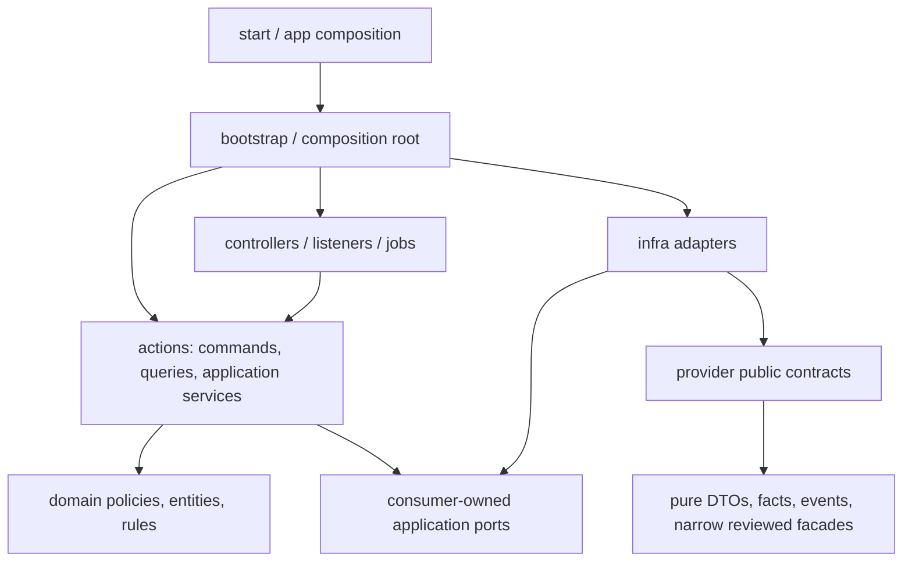

# Module Layer And Boundary Audit — 2026-07-23

| Field             | Value                                                                                              |
| ----------------- | -------------------------------------------------------------------------------------------------- |
| Status            | Repository-wide service/support reclassification implemented; layer placement guard passes at zero |
| Scope             | `app/modules/*`, architecture guards, related architecture documents                               |
| Snapshot          | 2026-07-29 12:27:45 ICT; current working tree, including uncommitted work                          |
| GitNexus snapshot | 4,108 files, 10,851 symbols; index present, with current working-tree changes measured locally     |
| Audience          | Maintainer, architect, reviewer, developer refactoring module boundaries                           |
| Policy baseline   | `docs/superpowers/specs/2026-07-07-api-and-module-boundary-design.md`                              |
| Related research  | `docs/backend-decoupling-research-v2.md`                                                           |
| Confidence        | High for measured paths and direct source inspection; recommendations are architectural judgment   |

> The working tree was changing while this audit ran. Counts below belong to the timestamped
> snapshot, not necessarily the next commit. Structural findings such as duplicated layer
> models, inverted dependency direction, and ineffective guards are not dependent on one or
> two changing imports.

## 0. Remediation update — 2026-07-27 00:39 ICT

Sections 1–14 retain the original audit snapshot so the initial evidence is not rewritten
after the fact. This section is the current remediation ledger and supersedes the old counts
when the two differ.

### 0.1 Coupling rule adopted during remediation

The migration now applies this rule:

- a consumer owns ports for replaceable behavior and consumer-specific projections;
- a provider owns only stable facts, versioned events, constants, and deliberately supported
  capabilities in `public_contracts`;
- small structural DTOs may be duplicated at a module boundary when that removes an unstable
  provider dependency;
- business rules, protocol values, persistence behavior, and large mappings are not duplicated
  merely to reduce an import count;
- a path move does not count as decoupling when the same implementation dependency is only
  hidden behind a barrel.

Examples already applied:

- `reviews` owns its minimal trust/credibility payloads instead of importing users-internal
  DTOs;
- `search` owns all eleven search ingestion/read ports instead of importing provider-owned
  ports;
- `users` owns `StoredUserSettingData`, while settings owns the structurally compatible
  public settings contract, removing the `users -> settings` compile-time edge;
- published event payloads remain single-source provider contracts and are not copied into
  every listener.

### 0.2 Guarded debt trend

| Guarded measure                              | Initial | Current | Change |
| -------------------------------------------- | ------: | ------: | -----: |
| Runtime boundary baseline                    |     649 |       0 |   -649 |
| Public-contract surface baseline             |     139 |       0 |   -139 |
| Intentional runtime allowlist entries        |       0 |       0 |      0 |
| Intentional public-surface allowlist entries |       0 |       0 |      0 |
| Foreign provider-owned application ports     |      12 |       0 |    -12 |
| Production-orphan application ports          |      15 |       0 |    -15 |
| Cross-module internal event payload imports  |      13 |       0 |    -13 |
| Feature imports of observability internals   |      32 |       0 |    -32 |
| Action-to-bootstrap imports                  |      11 |       0 |    -11 |
| Relative cross-module escapes                |      57 |       0 |    -57 |
| Same-module layer/placement findings         |     509 |       0 |   -509 |

The runtime reduction is not all physical decoupling. Twenty-seven imports into
`http/boundary` were reclassified as a valid shared HTTP transport surface after the two guards
were made consistent. A regression test proves that only `http/boundary` receives this
exception; domain-specific boundary folders remain blocked.

The original runtime debt classes are now empty. The scanner was subsequently extended to
classify feature-module imports of outer `#composition/*` as dependency inversions. All 22
ratcheted imports have now been removed:

| Debt class                               | Count |
| ---------------------------------------- | ----: |
| Relative cross-module imports            |     0 |
| Sprint action-to-bootstrap imports       |     0 |
| Foreign infra imports                    |     0 |
| Foreign top-level service imports        |     0 |
| Foreign internal type imports            |     0 |
| Foreign domain imports                   |     0 |
| Feature module imports outer composition |     0 |

The public-surface baseline is now the empty JSON array. No `public_contracts` file imports
actions, infrastructure, bootstrap, domain, top-level services, framework configuration, ORM,
or persistence technology.

Both architecture guards currently match their exact baselines with no new or stale entries.
Concurrent notification-pipeline work was repaired without normalizing its transient
violations into accepted architecture debt.

### 0.3 Cycle and fan-in measurement

After treating `public_contracts` and the shared `http/boundary` as stable seams:

- the original cross-module implementation debt classes have zero entries;
- feature-to-outer-composition inversions are now zero and guarded against regression;
- no direct cross-module internal implementation import remains in the guarded production
  scope;
- action-to-bootstrap inversions are zero;
- no non-seam cross-module strongly connected component remains;
- the guarded public surface has zero implementation leakage and no executable facade that
  re-exports a feature implementation;
- feature-to-feature executable behavior now crosses consumer-owned ports and outer composition,
  while provider `public_contracts` retain only stable facts, protocol values, and pure seams.

### 0.4 Remediation completed so far

1. Replaced the regex/fail-open architecture scanners with one AST scanner covering static
   imports, exports, side-effect imports, literal dynamic imports, import-equals, and
   `require`; missing roots and parse failures now fail closed.
2. Added exact runtime and public-surface baselines. Resolved entries become stale and cannot
   silently return. Architecture regression coverage is now 15 tests.
3. Removed business-module dependence on `http/exceptions`; application exceptions now live
   in the low-level errors public contract and HTTP maps them at the transport boundary.
4. Moved stable constants, role definitions, event payloads, observability protocols, review
   pagination, audit read contracts, settings contracts, and organization serialization to
   their provider public surfaces.
5. Moved all search reader ports into `search/application/ports`; provider adapters are
   structurally checked at search composition instead of implementing provider-owned ports.
6. Removed unused application ports and stale facade artifacts. A fresh scan reports zero
   production-orphan application ports.
7. Removed the task action-to-bootstrap dependency for task page queries by adding an
   action-owned factory and making bootstrap wrap it.
8. Removed the fake `tasks/actions/bootstrap` facade and unused
   `tasks/actions/public_api.ts`; the remaining public initializer still has a separately
   tracked transaction/framework leak.
9. Eliminated top-level `skills/support`; seed-specific helpers now live in
   `skills/infra/seed`. `support` remains allowed only as a local subfolder of an explicit
   owner layer.
10. Moved the API v1 response mapper into the shared HTTP boundary and replaced foreign task
    and notification implementation types with small boundary-owned transport shapes. This
    removed the former 24-edge presentation hub without copying business behavior.
11. Restored aggregate ownership for user skills and task self-assessments. User-skill rows
    are read through the users repository, and the self-assessment persistence model now lives
    in reviews, which owns that workflow.
12. Replaced admin imports of review repositories with an admin-owned moderation port and a
    reviews public capability. Moderation resolution now delegates to the canonical review
    command, preserving audit, rollback, and cache behavior.
13. Replaced foreign ORM-model reads in organization/admin/task projections with
    consumer-owned SQL projections. Removed orphan organization workflow/project mutation
    repositories and unused inverse Lucid relations/models.
14. Routed task-detail review data through `TaskReviewReader` and `ReviewPublicApi`; tasks no
    longer imports the reviews read repository.
15. Promoted stable audit hashing/redaction, authorization role/presentation vocabulary, and
    audit/error/notification constants to real public contracts rather than facade
    re-exports. Removed public facades that exposed users-only rules or notification
    serializer implementation.
16. Split task-status input invariants into a technology-free public contract while keeping
    workflow/edit/delete business policy internal to the task domain.
17. Removed `OrganizationUser.user` and `OrganizationUser.inviter` foreign Lucid relations.
    Organization membership and invitation reads now return organization-owned identity
    projections, eliminating the last non-seam cycle without publishing the users ORM model.
18. Removed `User.current_organization`, `User.organizations`, and
    `User.organization_users` foreign Lucid relations. Profile, `/me`, Inertia, debug, and
    authentication paths now use organization-owned membership projections or a users-owned
    consumer port; authentication no longer performs unused relationship preloads.
19. Removed the unused `ProjectMember.user` foreign Lucid relation and its two orphan preload
    queries. Active project member reads already use a projects-owned identity projection, so
    no user model or business rule was duplicated.
20. Removed organization/project table joins from the users work-history analytics repository.
    Users now owns a technology-free work-history source port; organization and project
    providers own their SQL and publish only small stable fact shapes. Organization history is
    restricted to approved memberships, non-self profile views receive only
    `ProjectVisibility.PUBLIC` projects, and the cache key is partitioned by `self`/`public`
    viewer scope.
21. Removed the `Project.organization` foreign Lucid relation and its project-detail preload.
    Project detail now reads the minimal `{ id, name, slug, logo }` organization summary
    through a projects-owned port backed by the organizations public API, preserving the
    response contract without exposing the organization ORM model.
22. Removed all direct Skills-table reads and writes from `AddUserSkillCommand`. Users now
    owns a minimal catalog port while Skills owns normalization, collision-resistant
    deterministic codes, ordering, active-collision reuse, and guarded reactivation. Ordinary
    slugs remain stable, punctuation-distinct names such as `C++`/`C#` do not collapse, and
    identical Unicode-only names reuse one catalog row. Active canonical metadata cannot be
    mutated by a user collision; inactive canonical rows are not reactivated.
23. Removed the Skills-model preload from task search indexing. Skills now publishes a pure
    `SkillSummaryFact` and one explicit bulk lookup; Tasks owns the summary shape and maps the
    provider facts through `TaskSkillReader`. The Lucid search reader preloads only Tasks-owned
    requirement rows and restores their order after one bulk call, including inactive catalog
    entries to preserve the former search semantics. The remaining `TaskRequiredSkill` foreign
    relations were deliberately not removed ahead of their other consumers.
24. Removed raw testimonial reads from featured profile reviews. Users no longer queries
    `skill_reviews`, reviewer identities, or task titles for this surface and no longer performs
    two N+1 reads per featured skill. The response shape is retained with generated aggregate
    copy, and the cache namespace was versioned so legacy payloads containing raw comments or
    identities cannot be served.
25. Serialized user-declared catalog mutations with a stable PostgreSQL transaction advisory
    lock inside Skills infra. Separate transactions resolving the same name now reuse one row,
    while concurrent distinct names receive distinct `sort_order` values. Lock, reactivation,
    allocation, and create operations now live under the write repository folder rather than
    `read/skill_queries.ts`. Writers outside this resolver must acquire the same lock before
    using `MAX(sort_order)+1`; that broader catalog invariant remains explicit debt.
26. Hardened task search indexing against missing provider facts. Required skill IDs are
    deduplicated for one bulk lookup, but the document is rebuilt in deterministic requirement
    order with duplicates preserved. A missing fact now raises an invariant violation with the
    task and missing IDs instead of silently indexing a partial document and hiding referential
    corruption.
27. Removed both repeated Users-to-Skills joins used by talent category filters. Skills now
    resolves active category members as pure ID facts in one bulk call; Users owns a minimal
    reader port and filters only its `user_skills` associations. Invalid or empty resolutions
    fail closed to an empty result, and the same resolved batch is reused across engine fallback.
    Explicit skill-ID and historical task-requirement behavior remain unchanged.
28. Closed recruiter work-history inference leaks. Task-aware talent ranking, all six
    `SearchTalentsQuery` history facets, and the same six paginated-directory facets now require
    `user_work_history.is_public = true`. Self-recommendation and authorized task-application
    review paths deliberately retain private evidence; their consent context and existing match
    semantics are different. Matrix tests cover public/private behavior for both discovery paths
    and prove private history cannot raise task match scores.
29. Scoped user-skill evidence by viewer. The owner can read public and private task evidence;
    other viewers receive only public rows, filtered in SQL before ordering and limiting. Raw
    reviewer comments and evidence URLs are no longer cached because visibility changes lack an
    authoritative cache-invalidation event. Incremental history refresh preserves existing
    `is_public`/`is_featured` consent flags; new rows and explicit full rebuilds remain private
    and non-featured by default.
30. Unified Task and profile custom-skill identity under one Skills-owned catalog service.
    Both sources now share normalization, deterministic codes within `varchar(50)`, the same
    transaction lock, lookup/reactivation policy, sort allocation, and pure result facts.
    Task-first and user-first requests converge on one active row, including concurrent calls
    and legacy random-code rows. Active canonical metadata remains immutable; inactive canonical
    rows fail closed. Legacy provenance is still inferred from two reserved description suffixes
    and should become an explicit column in a future migration.
31. Closed the profile-snapshot consent bypass. Public (including default-public) snapshots now
    copy only `user_work_history.is_public = true`; private snapshots may still include the
    owner’s private rows. Regression coverage proves public snapshots exclude a row after its
    consent is withdrawn while private snapshots retain the owner-only view.
32. Removed the last two Users analytics joins from `user_skills` to `skills`. Skill aggregation
    now reads only Users-owned counters; featured ranking reads and limits Users-owned rows first,
    then performs one bulk Skills-fact lookup through a Users-owned port. Missing catalog facts
    fail fast, inactive facts remain supported, and the generated featured response keeps its
    neutral privacy-safe shape. The hidden-SQL ledger is now 11 statements.
33. Removed four per-assignment Reviews/Skills/self-assessment reads from the Users work-history
    builder. Reviews now owns a versioned `ProfileReviewFactV1`, a fail-closed eligibility policy,
    and a fixed-size batch exporter. Users owns the fact-reader port; its bootstrap adapter
    composes Reviews facts with one bulk Skills lookup, and `start/` only performs wiring.
    Unconfirmed or non-final reviews, active disputes, `request_re_review`, draft/fraud/
    superseded ratings, and sensitive or unverified evidence are retracted through tombstones or
    exclusion. Raw comments, reviewer identity, and self-assessment narrative are never copied.
    The hidden-SQL ledger is now seven statements.
34. Moved the completed-assignment work-history source query into Tasks. Tasks now publishes a
    technology-free, versioned `CompletedAssignmentProfileFactV1` with normalized arrays, numeric
    values, and ISO timestamps through one batch query. Users owns a structurally compatible
    consumer port and maps the provider fact in its bootstrap adapter; its command no longer
    imports the analytics bucket or reads `task_assignments`/`tasks`. The app-level preload only
    wires the two Users-owned readers before review listeners run. The hidden-SQL ledger is now
    six statements.
35. Removed the Tasks join from user delivery metrics. Tasks now owns a one-query, versioned
    `AssignmentDeliveryFactV1` for every active/completed/cancelled assignment of an assignee,
    excludes soft-deleted tasks, and normalizes numbers and timestamps before export. Users owns
    the reader shape in `application/ports`; its bootstrap adapter is injected through the two
    profile page queries, leaving Users analytics to read only Users-owned skills/account data.
    The hidden-SQL ledger is now five statements.
36. Removed the final Reviews join from `UserAnalyticsRepository`. Reviews now exports a
    numeric-only, period-aware `SelfAssessmentAccuracyFactV1` after applying the same
    confirmation/dispute/finality policy as profile review facts. Users performance aggregation
    consumes the Users-owned reader and never receives self-assessment narrative. Invalid periods,
    malformed scores/dates, unconfirmed sessions, active disputes, and non-publishable outcomes
    fail closed. The hidden-SQL ledger is now four statements.
37. Removed both Tasks/Skills statements from the task-aware branch of `SearchTalentsQuery`.
    Tasks now owns an exact, versioned `TaskTalentMatchContextV1` lookup and assembles the task
    plus requirements in one batch without exposing skill names. Users owns the consumer port;
    its bootstrap adapter combines that Tasks fact with one bulk Skills summary lookup. Deleted
    tasks, invalid identifiers, wrong organization scope, ambiguous titles, malformed
    requirements, and missing skill facts fail closed. Nullable task taxonomy remains a valid
    match input, and absent organization context retains the previous unscoped lookup semantics.
    This is a replaceable synchronous composition seam, not the final Marketplace orchestration.
    The hidden-SQL ledger is now two statements.
38. Removed the final two foreign SQL statements from Users talent explainability. Reviews now
    owns `TalentExplainabilityReviewProjectionV1`, applies the same confirmation/finality policy
    as profile review publication, counts only submitted/non-fraud/non-superseded skills under an
    active dispute, and emits a versioned full-replacement event. A Users listener maps the event
    into a Users-owned JSONB projection under `trust_data`; a repeatable-read source snapshot,
    monotonic PostgreSQL transaction revision, row locking, and revision comparison make
    replacement idempotent and reject stale or malformed deliveries. Talent
    search now reads only `users` and `user_skills`. Submission, confirmation, dispute creation,
    dispute resolution, and confirmed fraud mutations refresh the projection. A bounded cursor
    command, `talent-explainability:projection-backfill`, covers historical rows and repairs
    missed in-process events without a schema migration. The known Users hidden-SQL ledger is now
    zero.
39. Removed all four `TaskRequiredSkill -> Skills` Lucid model imports and all seven foreign
    relations. Skills now publishes a versioned, plain task-requirement reference fact; Tasks
    consumes it through `TaskSkillReader` and assembles one explicit projection per result batch.
    The requirements endpoint no longer serializes Lucid models, and marketplace listing/ranking
    no longer preloads Skills models. Category filtering resolves all-status skill IDs through
    the provider port, preserving historical inactive requirements and the previous AND semantics
    with explicit skill filters; an unknown category fails closed to zero tasks. Nested
    `ProjectSkill` and rubric persistence objects are intentionally absent while their linkage IDs
    remain. The runtime baseline fell from 40 to 36 and relative persistence escapes from 17 to 13.
40. Removed the direct `FlaggedReview -> User` moderator relation. Users now publishes a
    versioned moderation identity fact containing only `id`, `username`, and nullable `email`;
    Reviews owns the consumer reader and bulk-hydrates one explicit moderation projection per
    page/detail query. Admin list/detail consume that Reviews projection, while the legacy Reviews
    page receives an explicitly assembled compatibility shape rather than a serialized foreign
    relation. Historical `reviewed_by` IDs survive a missing/deleted identity as a null moderator
    instead of crashing. The detail query no longer preloads a full User row. Runtime baseline is
    now 35 and relative persistence escapes are 12.
41. Removed both `SkillReview -> User` and `SkillReview -> Skills` Lucid relations. Moderation
    search resolves exact username-only reviewer IDs through the Users port and fails closed when
    none match; list/detail hydrate reviewer and historical all-status skill identities in one
    bulk call per provider. Review-session detail now returns an explicit Reviews projection,
    bumps its cache namespace to `review:session:v2`, and exposes only the minimal skill identity
    plus the authorized reviewer identity. The public reviewee list deliberately performs no
    reviewer lookup and therefore preserves its privacy boundary while still bulk-hydrating
    historical skill names. Skill reviews have deterministic creation/id ordering. Runtime
    baseline is now 33 and relative persistence escapes are 10.
42. Removed the `UserSkill -> Skills` Lucid relation. Users now reads its own pivot rows and
    bulk-hydrates an allowlisted skill profile projection through a Users-owned catalog port and
    a versioned Skills fact containing name, code, category, display type, and active state.
    Historical inactive skills remain visible; missing catalog facts do not crash profile,
    snapshot, removal, or search-index assembly. Profile and snapshot projections preserve row
    ordering and perform one deduplicated catalog lookup instead of relation preloads. Update
    uses only the owned scalar row, while removal resolves the skill name only for audit and
    falls back to the immutable skill ID. Tasks also stopped preloading applicant skills that
    its response never consumed. Runtime baseline is now 32 and relative persistence escapes
    are 9.
43. Removed the dead `ReverseReview -> User` reviewer relation. No production repository
    preloaded it, no action or mapper accessed it, and reverse-review list/history projections
    already resolve their own privacy-scoped data. The scalar `reviewer_id` remains the durable
    Reviews-owned reference. No replacement port was introduced because there is no consumer
    requirement to satisfy. The list query also stopped joining `users` for reviewer/target
    usernames, stopped reading `users` directly for system-role authorization, and stopped
    reading `organization_users` directly for membership authorization. Reviews now bulk-loads
    identities through its existing consumer-owned reader and uses a dedicated actor-access
    reader backed by versioned Users identity plus Organizations membership contracts. Anonymous
    organization rows do not even submit reviewer IDs to the identity provider; missing identities
    preserve the previous null/ID fallbacks. Runtime baseline is now 31 and relative persistence
    escapes are 8.
44. Removed both `TaskApplication -> User` applicant/reviewer Lucid relations. The process path
    had preloaded applicant without reading it and now uses only the durable scalar
    `applicant_id`; the reviewer relation had no loader or consumer. Task application lists read
    only Tasks-owned rows, then bulk-hydrate an allowlisted applicant identity through the
    Tasks-owned `TaskUserReader` wired by the composition factory. The provider lookup includes
    historical accounts, preserves input order, omits a missing identity as the old left relation
    did, and performs one deduplicated call per page. Runtime baseline is now 30 and relative
    persistence escapes are 7.
45. Removed all three `TaskAssignment -> User` assignee/assigner/verifier Lucid relations. Only
    the revoke-access path consumed one of them: it now locks the Tasks-owned assignment row and
    preloads the Tasks-owned task exactly as before, then resolves the assignee identity through
    `TaskUserReader` on the same transaction while the row lock remains held. The explicit
    assignment-with-task record no longer pretends a foreign identity is persistence-owned;
    missing identity fails as an invariant instead of producing a partial notification. Runtime
    baseline is now 29 and relative persistence escapes are 6.
46. Removed the `ReviewSession -> User` reviewee relation and all four reviewee preloads.
    Pending, authorized detail, and flagged moderation now hydrate one deduplicated identity batch
    through the existing Reviews-owned reader; the public reviewee list still performs no Users
    lookup and exposes no reviewer/reviewee identity. Detail no longer serializes a full User
    object containing account, profile, settings, trust, credibility, phone, or address fields;
    it emits only `id`, `username`, and nullable `email`. The detail cache moved to
    `review:session:v3` and pending logical keys to `user:pending_reviews:v2`. Missing reviewee
    identity remains omitted on pending/detail and receives a deleted-user fallback on admin
    moderation, keeping historical queues readable. Runtime baseline is now 28 and relative
    persistence escapes are 5.
47. Removed all four `Project -> User` creator/manager/owner/members relations. The members
    relation was dead; project detail now authorizes from scalar ownership IDs before one
    Projects-owned bulk username lookup, while preview and project public-policy methods do not
    load identities. Project records no longer spread serialized User models. Public marketplace
    task listing also stopped traversing `Project.owner` and stopped preloading `Task.creator`;
    it explicitly assembles username-only owner/creator projections from one Tasks-owned identity
    batch. Email, avatar, profile, and account fields are no longer present in anonymous public
    payload/cache, whose logical namespace moved from `tasks:public:v2` to `v3`. Runtime baseline
    is now 27 and relative persistence escapes are 4.
48. Removed the `Task -> Organization` Lucid relation after migrating all live read consumers.
    Public task reads, the supported my-applications flow, and task detail now collect scalar
    `organization_id` values and resolve deduplicated summaries through the Tasks-owned
    `TaskOrgReader`. Every surface explicitly assembles only `id`, `name`, and nullable `logo`;
    missing or deleted organizations produce `organization: null`. Owner, plan, custom-role,
    partner-verification, and persistence metadata can no longer enter task responses or caches.
    The direct `GetMyApplicationsQuery` constructor remains a lower-level test seam and does not
    hydrate foreign projections; the published flow is composition-root backed. The unused
    `findByIdWithWriteRelations` helper was deleted rather than preserving dead foreign preloads.
    Runtime baseline is now 26 and relative persistence escapes are 3.
49. Migrated every Tasks-owned `Task -> Project` read consumer away from Lucid preloads. Public
    marketplace, supported my-applications, task detail, and the former Organization task-list
    data consumers (whose frontend routes are now retired/redirected) resolve
    deduplicated batches through the Tasks-owned `TaskProjectReader`, backed by the versioned
    Projects summary surface. Public tasks emit only project `id`, `name`, nullable `owner_id`,
    and the already allowlisted owner identity; the other surfaces emit only `id` and `name`.
    The owner lookup remains part of the same deduplicated user-identity batch, and missing or
    deleted projects produce `project: null`. The orphan user-task query no longer preloads
    Project, and the unused `paginateOrganizationTasks` helper was deleted. The model relation
    cannot yet be removed because Reviews still constructs a nested
    `ReviewSession -> TaskAssignment -> Task -> Project` preload for pending-review projection
    and authorization. Therefore the guarded baseline intentionally remains 26 until the atomic
    ReviewSession/TaskAssignment migration described below removes that final foreign consumer.
50. Removed both the `ReviewSession -> TaskAssignment` and `Task -> Project` Lucid relations.
    Tasks now publishes a versioned, transaction-aware review-assignment fact containing scalar
    assignment fields and an explicit task allowlist; Reviews consumes it only through a
    Reviews-owned reader port. Pending-review membership resolves project IDs through the
    Projects public contract and then assignment IDs through Tasks, preserving the historical
    rule that project membership can still see a review whose task was soft-deleted. Project
    aggregates and task-status predicates use separate methods that exclude deleted tasks.
    Detail, pending, public-reviewee, and flagged-moderation projections bulk hydrate facts
    without foreign ORM preloads. Missing historical assignments become explicit unavailable
    tombstones instead of leaking provider models, and response projections omit project,
    organization, creator, and other non-contract task fields. Detail and pending cache
    namespaces moved to `review:session:v4` and `user:pending_reviews:v3`. Runtime baseline is
    now 24 and relative persistence escapes are 1.
51. Removed the final relative persistence escape by deleting the three `Task -> User` Lucid
    relations for assignee, creator, and updater. Task repositories now return task-owned scalar
    records and same-module relations only. List, Kanban, timeline, detail, and project-preview
    surfaces collect all referenced user IDs and perform one deduplicated lookup through the
    existing Tasks-owned `TaskUserReader`; no new provider contract or reverse dependency was
    introduced. List projections expose assignee `id`/`username`/nullable `email` and creator
    `id`/`username`; detail adds the same explicit allowlist for creator and updater. Missing or
    deleted identities become `null`, while scalar ownership and authorization IDs remain the
    source of truth. Runtime baseline is now 23 and relative cross-module escapes are zero.
52. Removed all three Sprints imports of the Tasks-internal `TaskRecord`. The move-task command
    now returns a Sprints-owned `SprintTaskAssignmentRecord` containing only `id`, `project_id`,
    `project_sprint_id`, and `updated_at`, and its SQL `RETURNING` clause selects exactly those
    fields instead of `*`. The Sprints controller and public facade share that stable Sprints
    contract, so they no longer inherit every future Task persistence field or relation. This is
    intentional bounded duplication of a four-field structural record in exchange for removing
    the `sprints -> tasks/types` edge. Runtime baseline is now 20 and foreign internal type
    imports are zero.
53. Removed both Admin imports of Authorization's internal
    `CustomSystemRoleService`. Authorization now publishes an explicit custom-role API whose
    records contain only role identity, description, permissions, and ISO timestamps; Lucid
    models and repository methods remain provider-internal. The permission matrix and CRUD
    controller depend only on that public surface, and system-admin policy checks reuse the same
    API instead of importing the service separately. This moves the one pre-existing
    public-facade implementation seam to the correctly named contract without increasing the
    public-surface baseline. Runtime baseline is now 18 and foreign top-level service imports
    are 1.
54. Moved the Testing module's route-safety, main-account, system-role, and environment-value
    policies out of the misleading `domain` folder and into `testing/public_contracts`.
    These functions define the application boundary for mounting dangerous testing routes and
    interpreting test-only configuration; they are not business-domain entities. Both route
    registries and the unit suite now import the declared Testing surface directly, with no
    compatibility barrel left in the old folder. Runtime baseline is now 16 and foreign domain
    imports are zero.
55. Moved production session-token issuance and refresh HTTP behavior out of
    `start/routes/auth.ts` into an Auth-owned controller. The route registry now binds transport,
    authentication, throttling, and controller methods for the legacy and canonical endpoints;
    token input parsing, response mapping, and Unauthorized translation live at the Auth HTTP
    boundary. The remaining internal imports in the route belong exclusively to the test-login
    fixture block and are not being hidden behind this controller extraction. Focused token and
    organization-boundary regressions preserve both API generations and token rotation behavior.
56. Removed the remaining test-login persistence and token orchestration from
    `start/routes/auth.ts`. Testing now owns narrow account, OAuth identity, organization fixture,
    and session-token ports plus the fixture use case and HTTP controller. Users, Auth, and
    Organizations own structurally compatible persistence adapters without importing Testing;
    `app/composition/testing_auth_composition.ts` is the only place that binds those internals
    and adapts the framework web-auth subject. Route startup now contains only the testing-route
    safety gate, registration, and middleware binding. The old conditional flow could skip OAuth
    identity creation when an existing user's system role changed; the fixture service now
    ensures both independently. OAuth test rows no longer persist fake access or refresh secrets.
    Concurrency coverage protects account, OAuth identity, organization, and membership
    idempotency. Runtime baseline is now 11: only three Notification-to-Search infra imports and
    eight Sprints action-to-bootstrap inversions remain.
57. Removed all eight Sprints action-to-bootstrap inversions. The three commands and three
    queries now require their consumer dependencies explicitly; only bootstrap factories provide
    the production project-access and board-reader adapters. Direct integration tests use those
    factories instead of relying on hidden constructor defaults. The executable
    `SprintPublicApi` singleton and class were deleted because no production caller existed;
    retaining a bootstrap-backed facade solely for its contract test would preserve an orphan
    composition artifact. The public Sprints surface is now type-only for this slice. Five unit
    and eight PostgreSQL integration cases preserve command, authorization, board, and canonical
    HTTP behavior. Runtime baseline is now three, action-to-bootstrap imports are zero, and the
    public-surface baseline fell to 104.
58. Removed the final three runtime boundary entries by correcting ownership of the shared
    Elasticsearch SDK client. The old `search/infra/search_client.ts` contained no Search domain
    behavior: it only constructed a technology client from application configuration, while
    Notifications and Search both legitimately consumed it. It now lives at
    `app/infra/search/elasticsearch_client.ts`, an explicitly technology-named platform
    infrastructure path with no feature contracts or business mappings. Search and Notifications
    retain their own document, repository, transport, alias, revision, and failure policies; only
    the connection client is shared. No barrel or Search public facade was introduced. The
    `#platform/*` alias is declared in both runtime and TypeScript resolution. Fifteen Notifications
    repository unit cases, the real Elasticsearch projection integration, Search runtime unit,
    and Project search integration preserve mapping, alias, revision, cursor, tombstone, ping, and
    indexed-query behavior. The runtime guard now scans `app/infra` and rejects every dependency
    from platform infrastructure back into a feature module, including otherwise public feature
    contracts; its regression suite is now 33 cases. Runtime baseline is now zero and
    public-surface baseline is 103.
59. Replaced the raw generic error in the new Adonis durable-domain-event dispatcher with the
    typed invariant exception required by the exception boundary. This preserves exhaustive
    dispatch failure classification instead of introducing an unclassified production error.
    A concurrent Redis cache-invalidation test cleanup callback was also made explicitly
    `Promise<void>` rather than leaking the cache deletion boolean through the test lifecycle
    contract, restoring full TypeScript verification without changing cleanup behavior.
60. Purified `search/public_contracts/search_public_api.ts`. Global-search DTOs now live in the
    technology-free `global_search_contract.ts`; the application implementation lives in
    `actions/services/search_application_facade.ts`; Search bootstrap owns its singleton; and
    `app/composition/search_public_api_composition.ts` exposes the composed capability only to
    outer HTTP, health, CLI, and integration adapters. The Search listener uses its local
    bootstrap object instead of routing back through the public contract. The public surface now
    contains only the explicit capability interface and DTO exports, with zero imports from
    Search actions/services. Sixteen unit and seven PostgreSQL/Elasticsearch integration cases
    preserve delegation, ranking, partial-source degradation, HTTP grouping, privacy, and
    organization reindex hooks. This removed eight public-surface entries.
61. Rejected a concurrently introduced Cache public barrel before it entered the baseline.
    Cache Redis vendor checks are transport health adapters, not a stable cross-module business
    contract. Their implementation now lives under
    `cache/health_checks/cache_redis_health_checks.ts`; `start/health.ts` imports that outer adapter
    directly, which is an explicitly permitted startup composition edge. The raw cache connection
    ownership regression test follows the moved adapter and remains green. Public-surface baseline
    is now 95.
62. Purified the Sprints public type surface. Create/update/move DTOs, board sprint/task
    projections, paginated list result, sprint status vocabulary, and the explicit sprint record
    now originate in `sprints/public_contracts/sprint_public_api.ts`. Commands, queries, the board
    reader port, domain transition rules, and controllers consume that contract rather than being
    re-exported back out of implementation files. The obsolete internal
    `types/project_sprint_records.ts` bucket was removed. This is one canonical protocol contract,
    not duplicated business logic; transition and input policies remain in domain/actions.
    Five unit and eight PostgreSQL integration cases preserve the full Sprints slice. Six more
    public-surface entries were removed, including the last generic `types` entry; baseline is now 89.
63. Removed the Authorization permission barrel that made a stable permission vocabulary appear to
    originate from an internal `constants` layer. Built-in permission maps, role levels, and their
    pure lookup helpers now originate in `authorization/public_contracts/permissions.ts`; custom
    system-role lookup goes through the existing Authorization public capability instead of importing
    `CustomSystemRoleService` directly. Four contract tests preserve role coverage, hierarchy, denial,
    and database-independent built-in behavior. This removes the last `constants` entry from the
    public-surface baseline, which is now 88. The existing custom-system-role public facade remains
    separately tracked application-service debt and was not disguised as resolved by this move.
64. Started the audited Marketplace-to-Tasks seam migration without a path-only shuffle.
    Marketplace now owns its application request DTO records, status/source/assignment vocabulary,
    and Vine validators. Its HTTP application request and response mappers have zero Tasks imports;
    the existing Marketplace action wrappers are the temporary adapter boundary that translates
    those records to Tasks DTOs. This is deliberate duplication of small protocol values, not
    duplicated persistence or assignment policy. Ten mapper behavior cases and nine architecture
    cases pass, including regression assertions that application HTTP mapping cannot depend on any
    Tasks path.
    This was an intentionally measured intermediate state at baseline 88. Item 66 records the
    completed port/capability/composition migration and removal of the transitional facade, so this
    entry is retained only as implementation history rather than an outstanding recommendation.
65. Removed a newly introduced Reviews-to-Events domain-internal import before it could enter the
    runtime baseline. Retryability and stable error code are part of the durable delivery protocol,
    so `DomainEventDeliveryError` now originates in the pure Events public contract rather than
    `events/domain/domain_event_outbox.ts`. The Events worker and Reviews consumer share only that
    explicit protocol. Six outbox worker unit cases, TypeScript, and the zero-entry runtime boundary
    gate pass.
66. Completed the Marketplace-to-Tasks application seam instead of preserving the transitional
    facade. Marketplace now owns a camel-case `TaskApplicationFlowPort` with only the seven
    operations and projections its UI consumes. Tasks exposes a pure, implementation-free
    `TaskApplicationCapability`; its application facade translates internal DTOs, records, scores,
    and rankings to explicit provider facts. `app/composition` owns the only adapter that knows both
    contracts and injects it into a Marketplace composition factory. Marketplace application
    actions import no Tasks path, controllers resolve the outer composition, and Marketplace owns no
    SQL or repository for `task_applications`. The impure
    `tasks/public_contracts/task_application_flow.ts` facade and the orphan Marketplace domain/
    repository/port that queried Tasks tables were removed. Twelve focused unit cases, twelve
    Marketplace architecture cases, and seven PostgreSQL application-flow cases pass. All eight
    facade violations disappeared, reducing the public-surface baseline from 88 to 80.
67. Removed a second Reviews-to-Events domain-internal edge introduced by durable dispute receipts.
    Reviews now consumes only the public `DisputeResolvedOutboxPayload` protocol and owns strict
    validation for the payload it persists; neither its public contract nor repository reaches into
    the Events domain. The runtime module baseline remains zero and the public-surface baseline
    remains 80.
68. Closed an HTTP boundary regression exposed by the Marketplace route suite. Vine validation
    failures are framework exceptions with status 422, but they are not Adonis `Exception`
    instances; the hardened exception whitelist therefore misclassified a genuine validation
    failure as an internal error. The handler now explicitly recognizes Vine `ValidationError`
    while continuing to reject plain objects that spoof `status`, `code`, and `messages`. Thirteen
    handler cases and the invalid Marketplace decision route pass. The six remaining Marketplace
    page failures occur only after reaching Inertia rendering because the local generated manifest
    lacks the user and organization entry points; generated assets were not rewritten as an
    architectural fix.
69. Removed Search indexing service locators from provider public contracts. Search already owned
    the six document/synchronization ports, but its builders and projection services still imported
    default Lucid implementations through Organizations, Projects, Skills, Users, and Tasks public
    barrels. All provider readers now stay in provider infrastructure; the sole outer composition
    root constructs them and injects them into Search builders, projection services, and the
    application facade. Search listeners resolve the same outer composition, and neither feature
    actions nor infrastructure import provider implementation barrels. Five obsolete indexing
    barrels plus the Search feature-bootstrap singleton were removed. This eliminates nine
    provider-infrastructure leaks and one Tasks bootstrap leak, reducing the public-surface baseline
    from 80 to 70 without duplicating SQL, model access, or projection policy.
70. Rebuilt the Admin-to-Reviews dispute read seam around a pure Reviews capability, an Admin-owned
    read port, and an explicit outer adapter. The old Reviews public file constructed action queries
    and leaked its internal execution context; it is now deleted. More importantly, the Admin
    controller no longer queries the Reviews-owned `ai_dispute_evaluations` table. Reviews owns the
    AI operator overview query, authorization, provider aggregation, status grouping, and queued
    dispute policy, while Admin only maps HTTP filters and renders the returned projection. A
    controller fake-port case and six PostgreSQL access/overview/aggregate cases preserve behavior.
    Three action-layer public violations disappear, reducing the public-surface baseline from 70
    to 67.
71. Rejected two concurrent verifier regressions instead of accepting them into baseline debt.
    The durable `review:submitted` payload schema now has one canonical home in an Events public
    protocol and is consumed by both Events domain validation and the Reviews receipt repository;
    Reviews no longer imports Events domain internals or duplicates the protocol rules. The
    SkillReview repository also again builds its query before awaiting it, preventing an undefined
    result in average-proficiency calculation and a double execution/declaration in historical
    high-review counting.
72. Removed the Search query service locator and completed the candidate-read seam for Projects,
    Admin, Tasks, Users, Organizations, and Skills. `search/public_contracts/search_engine.ts` is
    now a technology-free capability interface; one Search-only leaf composition owns the runtime
    and seven Search queries. Every consumer owns its minimal candidate-reader port, checks
    availability through that port, and receives an outer adapter that is the only code aware of
    both contracts. Six Search projection services likewise receive an explicit Search-owned
    runtime-status port. Feature `Engine*SearchCandidateReader` adapters and all seven exported
    `*ViaEngine` functions were removed. The active-skill and organization-directory public files
    are now pure capabilities rather than executable query factories; global Search receives both
    through composition. This preserves SQL/Elasticsearch fallback behavior without copying
    ranking or persistence policy and removes eleven public-surface violations, reducing the
    baseline from 67 to 56. TypeScript, focused lint, 21 organization/search/error unit cases,
    35 architecture cases, and 13 PostgreSQL/Elasticsearch integration cases passed.
73. Purified the two frontend telemetry entry points. Search and Observability now publish only
    their input records and narrow `record(...)` capability interfaces; event construction,
    operational/audit logging, and persistence decisions remain in their action commands.
    HTTP controllers resolve those commands through outer composition instead of executing
    provider actions through public-contract wrappers. The shared mapper types remain canonical,
    so no telemetry schema or compliance rule was duplicated. Six unit and two PostgreSQL API
    integration cases preserve redaction metadata, severity/outcome inference, transient versus
    persisted behavior, and route responses. This removes two action leaks and reduces the
    public-surface baseline from 56 to 54.
74. Removed executable Project-list and Talent-search wrappers from provider public contracts.
    Both files now contain only stable input/result records and narrow capability interfaces.
    Global Search receives the already composed Project and Users query factories explicitly at
    its outer composition root; its source registry has no provider singleton fallback and fails
    a missing production binding as a degraded source instead of silently constructing foreign
    actions. Project candidate ranking, talent cancellation, SQL fallback, and pagination remain
    in their owning actions and were not duplicated. Sixteen focused unit cases and four
    PostgreSQL global-search cases passed. This removes two more action leaks and reduces the
    public-surface baseline from 54 to 52.
75. Corrected cache invalidation composition and contract ownership. The low-level Cache module
    no longer imports Organizations, Projects, or Tasks through executable provider facades;
    `start/events.ts` loads one outer composition listener that wires the three feature-owned
    invalidators. The obsolete Cache listener and Organization/Project cache public wrappers were
    removed. Organization cache invalidation left the vague `actions/support` bucket and now has
    an explicitly named application service because it coordinates feature-owned key families
    after business mutations while depending only on the Cache capability. Cache size/TTL/prefix,
    private-key digest, and safe log-context rules now originate directly in the pure Cache public
    contract; the former domain/infra re-export sources were deleted and internal Cache code
    consumes the same canonical contract. A regression guard proves Cache cannot depend upward on
    those features and the eliminated paths cannot return. Thirty-six unit, 36 architecture, and
    19 real-Redis integration cases passed. This removes five public-surface violations and reduces
    the baseline from 52 to 47.
76. Rebuilt transactional notification staging as a consumer-owned port seam. Tasks,
    Organizations, Projects, and Users each own the minimal `stage(command, { trx, now })` port
    required by their atomic mutations; Notifications owns only the pure versioned command and
    legacy input protocols. One outer adapter is the sole implementation that knows all four
    consumer ports and the Notifications application service. Feature commands and controllers no
    longer resolve a provider singleton or depend on a provider-owned stager, and the former
    executable `notification_creator.ts` public facade plus the Tasks-local application capability
    composition were removed. Tests use the same outer composition for the real runtime and their
    own module port for failure injection. A semantic regression guard locks the pure protocol,
    eliminated paths, four-port adapter, and internal service import allowlist. TypeScript, focused
    lint, 37 architecture cases, five command-shell unit cases, all notification commit/rollback
    assertions across the four consumers, and 15 Notifications provider integration cases passed
    against `PG_TEST_DATABASE`.
    Several wider Task/Organization suites still contain unrelated stale expectations for legacy
    exception subclasses and direct cache-key deletion; those failures are recorded rather than
    misattributed to this seam. Removing the four facade leaks reduces the public-surface baseline
    from 47 to 43.
77. Purified the Project Detail cross-module surface. The former public file executed
    `GetProjectDetailQuery`, accepted an HTTP action context, and re-exported an action-owned result
    type for one Organizations controller. It now owns only the stable input/result data contract;
    the Projects query and response mapper consume that type, while one outer composition function
    owns query construction and the Organizations controller depends on that composition entry
    point. No SQL, authorization, review aggregation, or presentation mapping was duplicated. A
    semantic guard prevents HTTP/framework or Projects implementation imports from returning to the
    contract. One PostgreSQL detail-projection case and five API contract cases passed, reducing the
    public-surface baseline from 43 to 42.
78. Started dismantling the `ProjectPublicApi` god facade through real consumer-owned seams rather
    than replacing it with another aggregate interface. Organizations now owns separate ports for
    project-lifecycle deletion policy, project creation, portfolio statistics, and transactional
    member offboarding. Outer adapters are the only code in this slice that knows both those ports
    and Projects/Tasks repositories or the Projects create command. The forwarding
    `CreateCurrentOrganizationProjectCommand`, its Project DTO/constants imports, the mixed
    `OrganizationProjectTaskReaderWriter`, and its concrete multi-provider implementation inside
    `actions/ports` were removed. Organization actions/controllers now have zero imports of
    `project_public_api`; project creation maps a small Organizations-owned input at the outer
    boundary, while offboarding still performs task unassignment, project-membership removal,
    organization-membership removal, audit, and notification staging in one caller transaction.
    Five single-consumer methods were deleted from `ProjectPublicApi`, reducing it from fifteen to
    ten live methods. Regression coverage includes two request-mapper cases, six create-project
    contracts, thirteen mutation API cases, three search hooks, two deletion lifecycle cases, one
    real portfolio-count case, member-offboarding success and rollback, and two organization
    show-page cases against `PG_TEST_DATABASE`. The public-surface baseline remains 42 until the
    remaining external consumers move and the executable facade itself can be deleted.
79. Removed the direct Projects-facade escape from `RevokeTaskAccessCommand`. Tasks now owns a
    narrow project-notification-audience reader; an outer adapter performs the Projects membership
    lookup in the same transaction, and an outer composition constructs the revoke command. The
    unused Tasks-bootstrap revoke factory and the facade method were removed. A new PostgreSQL case
    proves project managers are notified while the revoking organization owner is excluded, closing
    a previously unexecuted branch; assignee delivery and fanout-failure rollback also remain green.
    `ProjectPublicApi` now has nine live methods. The remaining Tasks project and permission adapters
    already implement Tasks-owned ports, but their provider-aware implementations and singleton
    wiring still live under Tasks bootstrap; moving that composition outward is the next Tasks
    slice rather than hiding it behind another public barrel.
80. Completed the Tasks external-dependency composition move. Project, permission, organization,
    user, skill, and review implementations now live as explicit outer adapters; the six
    `MonolithTask*Reader` files, Tasks-local action/query factories, and
    `tasks/bootstrap/task_composition_root.ts` were removed. The remaining dependency factory is
    a pure outer object assembler that imports only Tasks-owned ports. The review adapter breaks
    the former `Tasks -> ReviewPublicApi -> TaskPublicApi` round trip by combining Tasks-owned
    assignment-ID queries with the Reviews-owned session repository at composition. No provider
    SQL or review policy was copied into Tasks. The orphan `findProjectSummariesV1` facade method
    was deleted. TypeScript, focused lint, 43 unit/architecture cases, two search-document
    PostgreSQL cases, and ten task deletion/sort/detail PostgreSQL cases passed. The semantic
    guard now prevents every eliminated bootstrap adapter/root from returning.
81. Removed self-routing through `ProjectPublicApi` inside Projects. The switch controller now
    uses its same-module project read repository, initial staffing uses the same-module membership
    query, and staffing authorization calls a named Projects application service shared by the
    remaining external compatibility method. The now-orphaned
    `ensureBelongsToOrganization` and `getMembershipContext` methods were deleted; together with
    item 80, `ProjectPublicApi` is down from nine to six live methods. Five project-creation
    PostgreSQL cases pass. The existing staffing-wizard HTTP case still hangs at both its default
    two-second timeout and an isolated ten-second timeout; because the replaced membership wrapper
    delegated to the exact same query and no failing assertion or exception is emitted, this is
    recorded for separate diagnosis rather than attributed to the boundary move without evidence.
82. Rebuilt Marketplace project authorization around its existing consumer-owned
    `ProjectAccessPort`. The implementation moved from Marketplace infra to outer composition and
    delegates to a named Projects application service; Marketplace bootstrap now receives the port
    instead of constructing a provider-aware adapter. The two compatibility methods and the old
    `ProjectsPublicApiProjectAccess` path were deleted, reducing `ProjectPublicApi` from six to four
    live methods. The real PostgreSQL matrix still permits public viewing, project-member viewing
    and management, and organization-admin management while denying outsiders. A semantic guard
    locks the outer adapter and prevents the old facade-backed implementation from returning.
83. Removed the Reviews pending-query dependency on the Projects façade. Reviews now owns a
    transaction-aware `ReviewProjectMembershipReader`; an outer adapter delegates to the
    Projects-owned membership query, and a dedicated composition function injects that port plus
    only the two existing Review collaborators the query consumes. `GetPendingReviewsQuery` no
    longer imports the giant default dependency object. The old `ReviewProjectReader`,
    `InfraReviewProjectReader`, and `ProjectPublicApi.listProjectIdsForMember` were deleted.
    Cursor ordering, deleted-task assignment visibility, reviewee hydration, and outsider behavior
    passed against PostgreSQL; the cache-generation unit contract also remains green.
84. Replaced the HTTP Inertia and Skills project-access façade calls with runtime-token,
    consumer-owned ports. `InertiaProjectDirectory` owns the two-field shell projection;
    `SkillProjectAccessAuthorizer` owns the exact read/write authorization request. Outer adapters
    call Projects repositories/application services, while an Adonis provider binds the abstract
    port tokens before middleware and controllers resolve. The eight Skills controllers receive an
    injected local access guard and neither HTTP nor Skills imports Projects or outer composition.
    Nine Skills v1 read/mutation contracts, two Inertia failure cases, and three guard unit cases
    passed. The corresponding two `ProjectPublicApi` methods were removed.
85. Eliminated the final Projects god façade through the Users work-history seam. The concrete
    reader and default singleton were removed from `users/actions/ports`; the existing Users-owned
    port is now a runtime token with an outer adapter over the Organizations and Projects
    work-history repositories. Work-history dependencies are mandatory through the base query,
    both profile aggregators, their local factory, and four injected controllers. Self/public
    visibility, approved-organization filtering, organization-name hydration, and reverse-review
    profile composition passed against PostgreSQL. With no remaining caller,
    `projects/actions/services/project_public_api.ts` and
    `projects/public_contracts/project_public_api.ts` were deleted. The public-surface baseline
    fell from 42 to 41; no replacement provider barrel or duplicated business rule was introduced.
86. Removed the executable UserActivity public façade instead of accepting its transient
    action/infra imports into the public-surface baseline. Auth now owns the narrow
    `AuthUserActivityWriter` input port, its session-observed listener receives a writer function,
    and outer composition adapts that port to the UserActivity application writer inside the
    existing transaction. Listener registration also moved to outer composition, so Auth no
    longer imports UserActivity and UserActivity publishes no runtime barrel for this flow. The
    runtime guard remains at zero and the public-surface baseline remains 41.
87. Eliminated `DefaultOrganizationDependencies` and its feature-local executable
    implementation. Eleven Organization commands/queries now require the consumer-owned
    `OrganizationUserReaderWriter`; outer composition binds its Users-backed adapter and propagates
    the port through controllers and local factories. HTTP debug lookup owns a separate runtime
    port, preventing the transport module from reaching into Organization actions. No user lookup,
    membership rule, or persistence behavior was duplicated. Four unit cases and 47 PostgreSQL
    Organization cases passed, including membership denial, ownership rollback, notification
    atomicity, and join-request policy behavior. The runtime baseline remains zero and the
    public-surface baseline remains 41.
88. Removed Audit read/enrichment responsibilities from the executable public façade for Tasks
    and Projects. Tasks owns `TaskAuditTrailReader`; Projects owns
    `ProjectAuditActivityReader`; outer adapters combine Audit-owned read primitives with Users
    identity lookup and return consumer-shaped projections. Task/detail/project queries no longer
    import Audit or call `auditPublicApi` reads. The obsolete façade methods and Audit-owned user
    enrichment helpers were deleted, removing the executable `Audit -> Users` edge without
    duplicating audit persistence, ordering, or identity lookup. TypeScript, the three architecture
    guards, 25 architecture cases, two adapter units, and six focused PostgreSQL cases passed.
    Audit admin search still resolves Organization/Project/Task targets through foreign tables and
    remains explicit hidden persistence debt for an Admin-owned read slice.
89. Repaired the Marketplace apply result boundary exposed by the façade work. The Tasks
    capability had reduced a successfully persisted application to `{ id, taskId }`, causing the
    compatibility response to silently lose applicant, message, portfolio, and source facts; its
    v1 parity test passed only because both missing values were `undefined`. Tasks now maps writes
    through the same explicit infra mapper used by reads and returns a stable fact projection.
    The outer Marketplace adapter copies that projection into its consumer-owned result and the
    response mapper publishes the established camel-case payload. Both compatibility routes and
    all ten auxiliary API contracts now pass without exposing a Tasks model to Marketplace.
90. Removed the misleading Skills `DefaultSkillDependencies` service locator and its executable
    implementation from the action-port folder. Active-skill lookup is an internal Skills read,
    not a cross-module dependency: `GetActiveSkillsQuery` now requires one explicit
    `ActiveSkillReader`, while `SkillPublicApi` supplies the existing Skills repository operation.
    The stable option DTO moved to a pure public contract, so the public barrel no longer imports an
    action port. The query remains independently testable, the old default paths are guarded
    against returning, and the public-surface baseline fell from 41 to 40 without adding an outer
    adapter that would only disguise same-module wiring.
91. Completed the Admin-owned audit read boundary. `ListAuditLogsQuery` now consumes runtime
    `AdminAuditEventReader` and `AdminAuditProjectionReader` ports; its controller receives both
    through an outer Adonis provider and no longer imports composition. The event adapter delegates
    to Audit-owned event reads, while organization, project, and task search/label SQL moved into
    repositories owned by those table-owning modules and is coordinated by the outer projection
    adapter. Audit no longer knows those schemas, `AuditPublicApi.listForAdmin` and the obsolete
    Admin cross-schema repository were removed, and no raw provider-table query was merely hidden
    in composition. Thirty-nine architecture cases and 26 PostgreSQL audit/coverage cases passed.
    The outer projection adapter still calls `userPublicApi` for actor lookup; that is tracked with
    the remaining Users façade debt.
92. Removed the remaining Admin controller imports of outer composition singletons. User and
    organization search candidate readers plus the Reviews dispute reader are now Admin-owned
    runtime tokens, injected into their three controllers and bound by one outer Adonis provider.
    The obsolete Admin bootstrap/search and dispute composition singleton files were deleted.
    Admin production code now has zero `#composition` imports; no search behavior, dispute policy,
    or provider persistence was copied into Admin. A dedicated boundary regression and the focused
    controller/query suite pass with eight cases.
93. Eliminated `DefaultProjectDependencies` and deleted its concrete implementation from the
    Projects action-port folder. Projects now owns narrow runtime ports for Organization, Task, and
    User facts; outer adapters and an Adonis provider supply those facts to detail, membership,
    ownership transfer, access, Marketplace, Skills, and staffing entry points. Project controllers
    no longer import outer composition, and project detail/member candidates no longer call
    `userPublicApi` directly. The existing provider rules remain provider-owned; only small
    Projects-shaped projections cross the boundary. Architecture guards, scoped lint, boundary
    gates, and focused Project PostgreSQL/contracts passed.
94. Removed both the Reviews service-locator dependency and hidden Tasks SQL from review-session
    creation. `CreateReviewSessionCommand` now requires the Reviews-owned runtime
    `ReviewCompletedAssignmentReader`; a Tasks-owned versioned fact applies the existing completion
    rule and includes the task creator, while an outer adapter copies that fact into the consumer
    projection. The controller receives the port through `ReviewConsumerPortsProvider`. No Tasks
    completion rule or persistence query was duplicated in Reviews. Ten focused boundary, adapter,
    command, and API/PostgreSQL cases passed against `suar_test`.
95. Removed every Admin production call to the executable Users façade. Admin now owns plain
    `AdminUserDirectory` and `AdminUserLifecycleWriter` runtime ports; Users owns the internal
    directory/lifecycle services, and outer adapters bind them through the existing Admin provider.
    Six actions and six controllers now receive explicit dependencies, obsolete Admin forwarding
    helpers and six façade methods were deleted, and role/status/audit policy remains in its
    original owner rather than being copied. Admin has zero `UserPublicApi` importers; repository-wide
    façade importers fell from 30 to 27 while the public baseline remains 40. Ten unit and eighteen
    PostgreSQL cases passed.
96. Removed `DefaultReviewDependencies` from all review-session, user-review, pending-review, and
    flagged-moderation projections. Reviews now owns three narrow runtime readers for assignment,
    moderator identity, and skill identity projections; outer adapters bind Tasks, Users, and
    Skills facts without copying their rules. Admin owns a runtime `ReviewModerationGateway`, its
    four actions/controllers receive that port explicitly, and the old Admin infra singleton was
    deleted. Projection and moderation paths now contain zero default dependency calls. Thirteen
    unit/semantic and nine PostgreSQL cases passed. Fifteen default calls remain explicitly scoped
    to scoring/writes and Review API assignment-reference checks.
97. Removed the Auth session and Authorization identity-read dependencies on `UserPublicApi`.
    Auth and Authorization own separate narrow identity ports; Users owns the internal identity
    service, and outer adapters plus one provider perform the binding. Authorization now has zero
    façade imports and Auth retains only its separate social-login persistence flow. Repository-wide
    production `UserPublicApi` importers fell from 27 to 25. Thirteen unit and fourteen PostgreSQL/
    testing-auth cases passed; the Auth middleware model fallback remains separate persistence debt.
98. Removed all foreign persistence and executable façade access from Projects role-staffing
    actions. A Projects-owned `ProjectRoleStaffingReader` projection now receives approved
    organization members, existing project members, Users candidate/explainability facts, and
    Skills role/proficiency facts through an outer adapter. Provider modules retain their own
    queries; Projects retains scoring, source classification, and permission policy. The temporary
    staffing method added to the generic Users façade during implementation was rejected and
    removed; composition calls a narrow Users internal read service instead. The query now has zero
    Lucid, foreign SQL, or cross-module façade imports, and its PostgreSQL contract passes two cases.
99. Removed a transient Lucid transaction type from the Users lifecycle public contract rather
    than accepting it into the public-surface baseline. Lifecycle staging already passed the
    transaction opaquely through its `UserLifecycleEventStager`; the exported functions now use the
    same technology-neutral object contract. No runtime behavior changed, scoped lint passes, and
    the public-contract baseline remains 40.
100. Established `suar-module-layer-contract.md` as the normative target and normalized all 93
     existing application/action dependency contracts under `actions/ports/outbound`. Concrete
     cache, public-API repository, external-dependency, and skill-catalog implementations moved to
     same-module infrastructure or outer composition. A new port-taxonomy guard rejects
     `application/ports`, unclassified root `actions/ports`, and concrete `_impl` files in port
     directories; the current classified port surface passes.
101. Removed direct Organization/Skills/Tasks/Reviews executable-facade calls from the audited HTTP
     identity and Users recruiting/invitation controllers. HTTP and Users now own their page/query
     shapes and outbound ports; outer adapters map provider facts without moving provider SQL or
     business policy into the consumer. The HTTP identity controllers then replaced their temporary
     outer factory imports with injected local queries registered by an outer provider, proving the
     intended `controller -> query -> outbound port` direction.
102. Repaired two blind spots in the runtime boundary enforcement. The shared AST scanner now
     records TypeScript `ImportTypeNode` references, and the Tasks ranking query replaced its hidden
     `Users/types` import with a Tasks-owned minimal trust snapshot. The runtime guard now also
     treats `module -> #composition` as an inversion. Eighty-three existing imports are tracked as
     ratcheted migration debt rather than silently accepted; a regression probe prevents a new
     occurrence.
103. Moved the talent-directory page SQL, filtering, sorting, bookmark lookup, count, and pagination
     out of `users/bootstrap/user_query_factory.ts` into
     `infra/repositories/read/postgres_talent_directory_page_reader.ts`. The Users query owns a
     technology-neutral `TalentDirectoryPageReader` port and resolves Skills category codes through
     its separate consumer port before invoking the repository. Bootstrap is again object-graph
     construction for this slice. The focused unit case and all twelve PostgreSQL directory access,
     ranking, privacy, pagination, explainability, and category-filter cases pass.
104. Resolved four disconnected DDD repository strands in Organizations, Projects, Reviews, and
     Tasks. Their domain repository interfaces and Lucid implementations only referenced each
     other (plus generated README inventories), were never wired into a production use case, and
     duplicated the live CQRS read/write repositories. Those eight ceremonial files were removed
     while their domain entities, mappers, and live persistence code were retained. The analogous
     Users pair remains because its implementation still participates in an explicit database
     failure-semantics test; lack of a production importer alone was not treated as proof of trash.
105. Eliminated the executable `tasks/public_contracts/public_task_listing.ts` facade. Marketplace
     now owns a public-task listing reader and Search owns a separate task-source function contract;
     outer composition maps both to `GetPublicTasksQuery`. The abandoned Marketplace
     `TaskReaderPort`/adapter/test scaffold was removed only after proving it had no production
     consumer and its visibility behavior remained covered by route, public-search, and Tasks
     marketplace/detail suites. The runtime inversion baseline fell from 83 to 82 and the impure
     public-surface baseline from 40 to 39. Fourteen Search unit cases, four Search API cases, and
     both public marketplace/listing integrations passed.
106. Removed all eight Marketplace controller imports of the outer composition singleton. A
     module-local `MarketplaceActionFactory` is registered by an outer Adonis provider and injected
     into the controllers. Recommended-sort authorization and the active Skills catalog moved out
     of controller support into Marketplace queries backed by Marketplace-owned Organization and
     Skills ports. Marketplace production now imports neither outer composition nor
     Organizations/Skills/Tasks implementation facades; the inversion baseline fell from 82 to 74.
     Seven focused mapper/query cases, typecheck, route-container boot, and the canonical
     architecture suite pass. The Marketplace integration architecture file remains blocked by the
     enforced missing Elasticsearch test-isolation configuration; no unsafe bypass was enabled.
107. Reclassified the three concrete Observability sinks from the generic top-level `services`
     bucket to `observability/infra/loggers`. Operational, audit, and workflow logger behavior did
     not change; the workflow failure-isolation unit cases pass. The still-impure
     `platform_observability` public runtime barrel is deliberately retained in the 39-entry surface
     baseline until consumers receive explicit sink ports; moving the files was not misreported as
     completing that dependency inversion.
108. Removed the last feature-to-outer-composition imports from Errors, Skills, and Search.
     Errors now owns a required-organization reader port, its query is injected into the HTTP
     controller, and an outer adapter performs the Organization mapping. The Skills controller
     receives its module-local active-catalog application service from a provider. Search listener
     event registration and concrete public-search/UI-event dependencies moved to outer
     composition while listener handlers require explicit dependencies and retain fail-closed
     fenced-delivery behavior. The inversion baseline fell from 74 to 71. TypeScript, all four
     architecture guards, the two Errors query cases, and all five durable talent-listener cases
     pass.
109. Removed all six feature-to-outer-composition imports from the HTTP module. Organization
     members and global search are now HTTP-owned queries over HTTP-owned read ports; search and
     platform telemetry are HTTP-owned commands over separate writer ports. Controllers perform
     request/response adaptation and inject those commands/queries. Search health remains an
     inbound technical adapter and receives explicit search-health and operational-event ports
     from `start/health`; it no longer defaults to runtime singletons. Provider-specific mapping
     and wiring live in outer adapters/providers. The inversion baseline fell from 71 to 65 and
     the classified port count rose from 102 to 108. Ten focused unit cases, TypeScript,
     route/container boot, and all architecture guards pass. Three endpoint integration files
     remain safely blocked because a dedicated Elasticsearch test target is not configured; no
     unsafe datastore override was used.
110. Removed all five feature-to-outer-composition imports from Reviews. Four HTTP controllers
     now inject a module-local `ReviewActionFactory` whose only role is to construct
     request-context-bound commands/queries from injected Review outbound capabilities; it contains
     no business policy and no adapter lookup. The outer provider supplies the concrete dependency
     graph, while the compatibility factory used by existing tests and composition delegates to
     the same implementation. The Review listener no longer imports emitter, the outer factory,
     logger singleton, or cache adapter. It exports explicit handlers; outer composition owns event
     registration and concrete dependencies. Failure telemetry remains best-effort and cannot
     replace durable-processing errors. The inversion baseline fell from 65 to 60. Seven focused
     controller/listener unit cases, route/container boot, and all architecture guards pass. Full
     TypeScript was green immediately before unrelated untracked Search benchmark scripts appeared;
     it is now blocked only by their generic variance and duplicate-property errors, which this
     remediation did not modify.
111. Removed the Review HTTP boundary's type-only dependency on its application query. The
     transport scope metadata now owns the small `'me' | 'org' | 'admin'` union while the query
     retains its structurally compatible application scope. No policy or mapping was copied. The
     public-surface baseline fell from 39 to 38, and all four reverse-review controller alias/page
     cases pass.
112. Made `http/public_contracts/http_action_context.ts` the pure owner of the shared execution
     context shapes and system-context constructor. The old action-layer path is now only a
     compatibility re-export pointing outward to the public contract, so existing internal imports
     need not be rewritten in one risky batch. The public-surface baseline fell from 38 to 37; five
     HTTP context-adapter cases and three HTTP feature-action cases pass.
113. Moved the executable HTTP-context mapper from the internal `adapters` folder to the explicit
     shared `http/boundary` transport seam and removed its misleading `public_contracts` runtime
     facade. All 219 callers now import the boundary directly; the four function implementations
     are unchanged. The public-surface baseline fell from 37 to 36 and no `adapters`-layer surface
     violation remains. Eight focused HTTP cases, module-boundary guard, and route/container boot
     pass.
114. Removed ten Organizations controller imports of outer composition for search, project
     creation, and portfolio reads. The three search capabilities and project creation are
     consumer-owned runtime ports bound by the outer provider. Portfolio detail/show/index use a
     module-local `OrganizationPortfolioQueryFactory`; it stores only immutable ports and creates
     a fresh context-bound query for each request. The controllers retain request/response mapping,
     while commands and queries retain orchestration. The runtime inversion baseline fell from 60
     to 50. TypeScript, route/container boot, focused organization read/search tests, and the
     architecture guard pass.
115. Removed the final six Organizations controller imports of outer composition. Organization
     creation, invitations/join requests, member administration, and deletion use four narrow
     module-local command factories registered by `OrganizationConsumerPortsProvider`; no
     organization-wide action factory was introduced. Invitation controllers do not receive
     project offboarding, and member-removal controllers do not receive the user directory. The
     project-offboarding adapter moved out of read-only portfolio composition and into membership
     wiring. Existing outer factory functions remain as compatibility seams for integration tests
     and non-controller callers. Organizations production now has zero `#composition` imports, and
     the runtime inversion baseline fell from 50 to 44. Four command-factory unit cases, lint,
     route/container boot, and all four architecture guards pass.
116. Moved the accept/reject-my-invitation HTTP controllers from Users to Organizations without
     changing their `/api/v1/me/invitations/:organizationId/{accept|reject}` URLs or route names.
     They now inject the Organizations-owned invitation factory instead of reaching through outer
     composition. This removes the misplaced Users ownership and two more inversions, lowering the
     runtime baseline from 44 to 42. Route/container boot, lint, the focused factory suite, and all
     architecture guards pass. Full TypeScript is currently blocked only by concurrent
     `search_bulk_indexer.spec.ts` assertions reading result fields from a now-`void` return; that
     unrelated file was not modified by this slice.
117. Removed six Users controller imports of invitation/recruiting outer composition. The
     stateless `GetMyInvitationsPageQuery`, `RecruitingDirectoryAccessQuery`, and
     `GetTalentDirectoryOptionsQuery` are now singleton inbound use cases registered by the outer
     `UserApplicationProvider`; controllers inject only the query they invoke. No factory was added
     for these stateless use cases. Existing composition functions delegate to the same instances
     for compatibility. The runtime inversion baseline fell from 42 to 36. Three focused query
     cases, full TypeScript, lint, route/container boot, and all four architecture guards pass.
118. Removed five Users profile controller imports of the outer user action factory. A module-local
     `UserProfileActionFactory` now creates fresh context-bound profile edit/add/remove/update/
     snapshot use cases from three immutable consumer-owned ports, and the outer provider supplies
     the instance. Commands and the edit query still own business orchestration; the factory owns
     no policy, transaction, or adapter lookup. Existing composition functions delegate to the
     same factory for compatibility. The runtime inversion baseline fell from 36 to 31. The fresh
     instance regression case, full TypeScript, lint, route/container boot, and all four
     architecture guards pass.
119. Removed five Users administration read-controller imports of the outer user action factory.
     A module-local `UserAdministrationQueryFactory` creates fresh context-bound user-list queries,
     while the stateless pending-approval query is registered and injected directly. The write-side
     `ApproveUserCommand` was deliberately not hidden behind another Users factory: it mutates
     Organizations-owned membership state and remains an explicit ownership-remediation item. The
     runtime inversion baseline fell from 31 to 26. Two focused administration-query cases, full
     TypeScript, lint, route/container boot, and all four architecture guards pass.
120. Removed the Users search-controller composition imports and the inward dependency from
     `bootstrap/user_query_factory.ts`; that mixed bootstrap factory was deleted. Profile-page and
     talent-directory construction now live in separate module-local factories with explicit
     outbound capabilities. Four former `Monolith*` adapters that call Skills/Tasks public
     capabilities moved from Users bootstrap to outer composition and received role-based names;
     the concrete Postgres talent page reader is also constructed only in outer composition.
     Profile/talent controllers inject the factories, while compatibility integration entry points
     live in `user_query_composition.ts`. The runtime inversion baseline fell from 26 to 23. Two
     factory cases, four focused talent-query behavior cases, full TypeScript, lint,
     route/container boot, and all four architecture guards pass.
121. Moved the pending-member approval HTTP controller from Users to Organizations without
     changing its routes or 204 response contract. To avoid silently changing authorization,
     audit, and `user:approved` event behavior, an Organizations-owned command currently calls a
     consumer-owned approval gateway; the outer adapter delegates to the legacy Users command.
     This is an explicit anti-corruption seam, not the final membership implementation. Users
     production now has zero `#composition` imports, the classified port count is 109, and the
     runtime inversion baseline fell from 23 to 22; all remaining entries belong to Tasks. Two
     focused command cases, full TypeScript, lint, route/container boot, and all four architecture
     guards pass. The endpoint integration contract remains safely blocked because no dedicated
     Elasticsearch test target is configured; no unsafe override was enabled.
122. Removed all 22 remaining Tasks feature-to-outer-composition inversions. Four module-local
     capability factories now separate lifecycle commands, status-workflow commands, detail/form
     queries, and collection/board queries. They store only immutable Tasks-owned ports and create
     fresh request-context-bound use cases; command/query classes remain the orchestration units.
     `CheckTaskCreatePermissionQuery` is now an injected instance over `TaskPermissionReader`
     instead of exposing that outbound port through a controller service locator. The requirement
     projection query is injected directly, and the unused controller-layer
     `task_command_initializers.ts` re-export barrel was deleted. One outer provider owns concrete
     cache, notification, event, search, and adapter wiring. Tasks production now has zero
     `#composition` imports, so the runtime boundary baseline reached zero from its original 649.
     Five factory/provider cases, three search-boundary cases, two requirement-projection cases,
     full TypeScript, focused lint, route/container boot, and all four architecture guards pass.
123. Corrected one same-module application-to-infrastructure reversal in the requirement slice.
     `ListTaskRequirementProjectionsQuery` now depends on the consumer-owned
     `TaskRequirementProjectionReader`; a Lucid adapter delegates to the existing Tasks repository
     and outer composition supplies it. Requirement projection assembly and Skills fact hydration
     remain application behavior; SQL/Lucid selection remains infrastructure behavior. This raises
     the classified port count from 109 to 112 without creating a provider-owned or executable
     port.
124. Removed the executable Tasks workflow-initializer public contract. Organizations already
     owned the correct `OrganizationTaskWorkflowInitializer` port; its provider-aware adapter moved
     from Organizations infrastructure to outer composition and now invokes the Tasks command
     directly. `CreateOrganizationCommand` and its module-local factory require that port instead
     of default-constructing a foreign adapter. The organization creation transaction still seeds
     statuses and transitions atomically. Two framework/action public-surface leaks disappeared,
     reducing the surface baseline from 36 to 34. Four factory cases, full TypeScript, focused
     lint, route boot, and architecture guards pass; the PostgreSQL integration suite remains
     safely blocked by missing isolated Elasticsearch test configuration.
125. Removed the executable Task cache invalidation public facade. Tasks status-definition commands
     now receive `TaskCachePort`; Projects owns a one-method
     `ProjectTaskCacheInvalidator`, implemented only by an outer adapter over the Tasks cache
     invalidator. Project create/update/delete commands are produced by a module-local lifecycle
     factory whose concrete permission, organization, actor, event, audit, task-stat, and cache
     dependencies are wired outside the module. Controllers and the Organizations project-creator
     adapter receive that factory. No cache key or invalidation policy was duplicated. The surface
     baseline fell from 34 to 33 and the classified port count rose from 112 to 113.
126. Recorded the remaining `TaskPublicApi` decomposition by actual consumer rather than accepting
     it as one public capability. Organizations requires three narrow task page/detail/status
     ports; Projects can use its existing task detail/stats/assignment seams; Reviews and Users
     already own the necessary fact/projection ports. Outer adapters can call existing Tasks
     commands, queries, and repositories directly. The 23-method mutable facade, its generic
     repository port, and `configureExternalDependencies()` singleton ordering are therefore
     migration debt, not target architecture.
127. Split Task status-definition creation/update/delete from the broader status-workflow factory,
     registered the dedicated factory in the Tasks application provider, and narrowed deletion's
     Reviews dependency to a one-method `TaskStatusReviewReader`. Projects application wiring also
     moved to its own provider and unused lifecycle event-publisher constructor dependencies were
     removed. The classified port count reached 115 before the later consumer-port additions.
128. Migrated all Users consumers away from `TaskPublicApi`. Users retains assignment-delivery,
     completed-assignment, talent-match-context, and directory-option ports; outer adapters now
     invoke the corresponding Tasks queries/repositories directly and map provider facts into
     Users-owned projections. TypeScript, focused lint, nine Users unit cases, and 490-route boot
     passed before an unrelated in-progress Search path deletion appeared in the worktree.
129. Migrated Reviews and Projects away from `TaskPublicApi`. Reviews' live narrow assignment
     projection/completed-assignment adapters now call Tasks query/repository capabilities directly;
     its dead combined `ReviewTaskAssignmentReader`, task-specific mega-dependency property, and
     duplicate task-assignment projection types were removed. Projects task reads/stats/mutations now
     use narrow Tasks functions, task-stat reads consistently share the caller transaction, and the
     member-removal assignment invariant moved from Projects infra to outer composition behind a
     module-local command factory. The command no longer constructs foreign adapters by default.
130. Replaced Organizations' three `TaskPublicApi` calls with consumer-owned index, detail, and
     status-creation ports bound by outer composition. Organization context is now authoritative:
     request mappers cannot inject an organization ID, and the detail adapter rejects a task from a
     different organization with 404 before audit/review hydration. After migrating the remaining
     Tasks/Reviews exporter tests to direct capabilities, the 23-method mutable `TaskPublicApi`, its
     public barrel, generic repository port/implementation, and runtime configuration side effect
     were deleted. The public-surface baseline fell from 33 to 31 and the classified port count is 118. Focused lint and architecture side-effect/port checks pass; full TypeScript, route boot,
     and Japa currently stop on the unrelated deleted
     `app/modules/search/domain/search_index_names.ts` path in active Search work.
131. Extracted two provider-owned pure data surfaces from executable/internal implementations.
     Cache invalidation backlog, operational status, and replay selector now live in a leaf public
     type contract while domain retains validation/normalization behavior. Reverse-review target
     statistics and person-summary DTOs now live in a leaf Reviews contract and derive their target
     vocabulary from the existing public enum. No SQL, worker, replay, or calculation behavior was
     duplicated. Two public-surface violations were resolved, reducing the baseline from 31 to 29.
132. Audited all remaining module-root `services` files by behavior rather than name. There is no
     longer an `app/services` folder; the 34 remaining module-root files classify as 22 application
     collaborators, six worker/runtime helpers, five outer integration/CLI helpers, and one concrete
     infrastructure cache. The five lowest-risk path corrections were applied: two retention-audit
     helpers and two worker signal/poll helpers moved to root `commands/support`, while the custom
     system-role permission cache moved to `authorization/infra/cache`. These helpers were preserved
     because they have live callers/tests; they were misplaced, not dead code. The next higher-risk
     slices are Sprints bootstrap extraction, Users profile aggregate adapters, Tasks support I/O,
     concrete defaults in Tasks support, and observability singleton decomposition.
133. Removed the Sprints feature-local `bootstrap` composition root. Sprints now owns two
     application-layer factories under `actions/services`; outer composition owns the Projects SQL
     access adapter, Postgres board reader, object graph, and DI provider. Six HTTP controllers
     inject the relevant factory instead of importing bootstrap functions, and Sprints tests use
     the same outer-composed factories. The old bootstrap factory/root files and `Monolith*` adapter
     name were deleted without changing sprint access policy or transaction semantics.
134. Removed the remaining Users `bootstrap` folder. Profile-review and self-assessment fact readers
     moved to outer composition with role-based names; they invoke the narrow Reviews fact queries
     directly, and the profile-review adapter resolves Skills facts through the provider repository
     before mapping into Users-owned projections. Startup keeps the existing aggregate-reader
     registration behavior, but Users no longer contains or exposes monolith composition adapters.

The work-history provider adapters are deliberately replaceable intermediate seams, not the
final projection architecture. The new Reviews fact flow removes foreign SQL and centralizes
publication policy, but it is still synchronously invoked from the composition adapter. A future
transactional outbox and Users-owned source projection can replace that adapter without changing
the Users command or its consumer-owned port.

### 0.5 Deliberately deferred or blocked by active work

- Cache, logger, audit, notification runtime, and observability seams have been classified and
  moved or composed without accepting implementation leakage into the public baseline.
- Relative cross-module persistence imports are now zero. Future model relations must stay
  module-local; cross-module identity and summary reads use consumer-owned ports plus provider
  public contracts instead of exporting ORM models.
- Import guards still cannot see ownership violations hidden inside raw SQL, so the dedicated
  ownership scan remains required even though its known Users ledger is now zero.
- Talent explainability events are currently in-process rather than transactionally durable.
  The idempotent backfill repairs gaps, but the generic integration outbox remains required
  before treating delivery as guaranteed.
- Public runtime facade debt is closed. Organization, Skills, Users, and Reviews consumers now
  depend on consumer-owned ports; the remaining pure platform seams are registered by providers
  and do not import their concrete implementations.
- Test migration history is not currently reproducible. A clean run first encounters calls to a
  missing canonical `create_updated_at_trigger(text)` helper; the repository recovery ledger says
  the supposed trigger-removal migration artifact is itself missing, so silently skipping trigger
  creation was rejected and the temporary experiment was fully reverted. The dedicated `suar_test`
  database also has `skill_reviews.is_fraud` but no matching `adonis_schema` row, proving schema/
  ledger drift. The authorized safe-run attempt recorded the three preceding migrations in batch 46
  before reaching that drift; it was not rolled back because their `down()` methods may drop
  baseline tables. `domain_event_outbox` and `review_confirmed_processing_receipts` remain absent,
  so durable Review confirmation integration tests require recovery of the authoritative migration
  history and reprovisioning of the dedicated test database. No development database, manual ledger
  edit, or unsafe datastore bypass was used.

### 0.6 Hidden SQL ownership audit

The import graph is necessary but not sufficient: it cannot see SQL strings that reach across
module-owned tables. A dedicated scan of `app/modules/users` found 23 such statements before
the affiliation-history and skill-catalog remediations: 21 reads and two writes across Skills,
Tasks, Reviews, Organizations, and Projects. Those two slices removed six statements, including
both cross-owner writes. The featured-review privacy slice removed two more foreign reads, the
active-category resolver removed two repeated Skills joins, the Users analytics slice removed
two `user_skills -> skills` joins, the profile-review-fact slice removed four per-assignment
foreign reads, the completed-assignment fact removed one Tasks read, the assignment-delivery fact
removed the remaining delivery-metrics Tasks join, and the self-assessment fact removed the final
Reviews analytics join. The task-match fact then removed the Tasks lookup and requirement/Skills
join from `SearchTalentsQuery`. The event-fed talent-explainability projection removed the final
two Reviews reads; no known foreign SQL statement remains in the audited Users production scope.

There is no remaining group in this scoped ledger. New raw SQL must still be classified by table
owner during review because import guards cannot enforce this boundary.

Two constraints apply to these migrations:

- cross-owner writes are prohibited unless delegated to the owning provider capability;
- when a provider already depends on Users, adding a reverse Users-to-provider runtime facade
  turns hidden coupling into a public cycle. For read-heavy profile data, prefer small
  users-owned event projections or orchestration outside Users. Skills is currently a safe
  one-way dependency and can use a normal consumer port.

### 0.7 Task-required-skill boundary decision

The four `TaskRequiredSkill -> Skills` Lucid imports are real coupling, but relation-first
deletion is unsafe. The relations currently create an implicit wire contract for task
requirements, marketplace task cards/ranking, and search indexing through preloads and generic
`model.serialize()`. Three additional Tasks queries join the `skills` table directly, so merely
removing decorators would hide rather than remove the dependency.

Ownership is:

- Tasks owns the selected requirement row, task-specific IDs/provenance, mandatory/importance/
  weight/source/notes, category-mix policy, and persisted snapshots;
- Skills owns skill catalog facts, category/active state, project-skill selectability,
  proficiency codes/ordinal/range mapping, and rubric ownership/status/content.

The required migration order is:

1. Lock the existing nested API shape with an exact Tasks-owned
   `TaskRequiredSkillProjection` contract test.
2. Add explicit Skills-owned **plain fact** DTOs and bulk methods for skills, project skills,
   proficiency levels, rubric versions, and category-to-skill IDs. Existing public methods
   whose return type is inferred from a Lucid repository are not acceptable substitutes.
3. Add a Tasks-owned `TaskSkillReader` bulk reference-fact request and map provider facts in
   the Tasks adapter.
4. Hydrate raw Tasks-owned requirement rows with a pure bulk assembler; do not issue N+1
   provider calls.
5. Migrate requirement/category validation, marketplace projection/filtering, search indexing,
   and application match/ranking SQL in that order.
6. Only after no foreign preload, relation access, or direct `skills` SQL remains, remove the
   seven foreign relations and four imports from `TaskRequiredSkill`, then delete all four
   runtime baseline entries together.

The `TaskRequiredSkill` slice is now complete. The explicit contract exposes Tasks-owned
requirement semantics, a minimal skill identity, and minimum/target/ceiling badges; it keeps
`project_skill_id` and `rubric_version_id` as linkage identifiers but deliberately does not expose
provider persistence objects. Both the requirements endpoint and marketplace hydrate all rows in
one provider call, preserve requirement order, and fail closed on missing reference facts.
Search indexing continues to use the smaller skill-summary fact. Remaining Skills coupling in
other Tasks persistence models/queries is tracked as a separate slice rather than being hidden
behind this completed contract.

### 0.8 Featured-review and talent-explainability boundary decision

The removed raw featured-review query was both an ownership violation and a privacy risk. It
selected the latest review without requiring a submitted review, a completed eligible session,
non-fraud state, or the absence of an active dispute. It also exposed reviewer name, comment, and
task title even though `skill_reviews` has no explicit publication, consent, or anonymization
field. No additional `WHERE` clause can create a visibility rule that the product model does not
contain, so public featured cards now use only generated aggregate copy.

Talent explainability now follows that target boundary. Reviews owns the pure eligibility
decision and versioned snapshot; Users owns persistence and the search-facing read. Confidence
requires a submitted, non-fraud, non-superseded rating in an eligible final session. An active
dispute retracts confidence and counts distinct publishable skills under dispute. Event payloads
contain only counts, an enum, user ID, revision, and timestamps—never comments, reviewer identity,
evidence, or self-assessment text.

Delivery is intentionally fail-safe but not yet durable. Users rejects stale revisions under a
row lock, and a paged backfill can reconstruct every projection from Reviews source data. The
remaining infrastructure step is a transactional integration outbox with retry/DLQ semantics;
until then, a process crash between commit and in-process publication can temporarily leave a
projection stale. Raw testimonials remain unpublished until an explicit
visibility/consent/anonymity contract exists.

### 0.9 Talent-search ownership, privacy, and scaling decision

The task-aware talent path previously contained four cross-owner SQL statements:

- Users resolves a task by ID or title and duplicates deleted/organization selection rules;
- Users reads `task_required_skills` and joins Skills to build the match context;
- `SearchTalentsQuery` and the paginated directory factory each duplicate a category join from
  `user_skills` into `skills`.

The category-join slice is complete. Skills resolves active category IDs in one bulk call, while
Users filters only its own `user_skills.skill_id` values. The old joins did not filter
`skills.is_active`, so this migration intentionally excludes inactive catalog entries from
browsing. Historical task requirements remain different: search and matching preserve inactive
skills attached to an existing task.

The task lookup and requirement join are now also removed. Tasks publishes a technology-free
`TaskTalentMatchContextV1`; a Users-owned port and bootstrap adapter combine it with bulk Skills
facts. This centralizes task deletion, organization, exact lookup, ambiguity, and requirement
assembly rules without letting Users import Tasks/Skills implementation. It intentionally
preserves a synchronous runtime fan-out as an intermediate migration seam; moving bounded
shortlist orchestration out of Users remains necessary to eliminate that reverse dependency
instead of merely hiding it behind a facade. The target split remains:

- Tasks owns a plain `TaskTalentMatchContext`, task visibility/organization/deletion rules,
  requirement assembly, and the canonical applicant-match policy;
- Users owns searchable candidate identity, user-skill evidence, and consented work-history
  evidence;
- Marketplace or application composition orchestrates the shortlist and pagination;
- Search owns only event-fed candidate documents, retrieval, and facets.

The recruiter inference leak is now closed: discovery facets and task-aware talent ranking use
only work-history rows explicitly marked public. Self-recommendation and authorized application
review are separate consent contexts and were not filtered by this change.

One scaling defect remains: the `task_id` path loads all searchable users, explainability,
skills, and history, sorts in
memory, and only then paginates. It also resolves an invalid task after candidate work, while
the search engine over-fetches a fixed top-N before applying SQL facets and can miss valid
lower-ranked candidates.

The remaining order is: Marketplace-owned bounded shortlist orchestration; then event-fed Search
facets with idempotent reindex events for work-history projection changes.

### 0.10 Work-history projection decision

The work-history builder was not a simple repository-placement problem. Before item 33, a
reviewed assignment executed roughly `6N+5` SQL statements inside a Users-owned transaction for
`N` assignments (about 605 statements for 100 rows, including the four-statement audit write),
reading Tasks, Reviews, Skills, and evidence tables one assignment at a time.

The source rules are also not owned by Users:

- Tasks decides assignment completion, reopen/delete validity, task visibility, and whether a
  task fact is publishable;
- Reviews decides quorum versus reviewee confirmation, terminal dispute outcomes, fraud,
  supersession/invalidation, and safe evidence export;
- Skills supplies labels and proficiency facts.

The completed Reviews fact slice now owns those finality and publication predicates. It exports
only submitted, non-fraud, non-superseded ratings and verified non-sensitive evidence, requires
reviewee confirmation or an allowed resolved-dispute decision, and fails closed for every unknown
or non-final state. Self-assessment narrative has no publication contract and is therefore no
longer copied. With a reviewed assignment and a Skills label lookup, the builder is now roughly
`2N+10` statements (about 210 for 100 rows): four Reviews queries and one Skills query are fixed
per batch, while the remaining `2N` is the Users-owned upsert path.

The migration target is provider-owned full-replacement facts and tombstones delivered through a
generic transactional integration outbox. Reviews and Tasks emit versioned technology-free
facts; a composition-root consumer writes idempotent Users source projections keyed by assignment/
session and source revision, preserving `is_public`/`is_featured`. Users then rebuilds its
materialized row from those projections, without calling Reviews or Tasks synchronously. A
paged provider-owned backfill and checksum/shadow phase must precede reader cutover.

The pure Reviews eligibility matrix, `ProfileReviewFactV1`, and batch snapshot exporter are now
implemented and covered for unconfirmed/active-dispute/request-re-review, adjusted outcomes,
submitted versus draft/superseded, fraud, sensitive/unverified evidence, and absence of raw
comments/reviewer identity/self-assessment. Users consumes the batch through an
`application/ports` contract wired by a bootstrap adapter. Tasks now likewise owns and exports
the completed-assignment profile fact in one normalized batch query, and Reviews exports the
numeric self-assessment accuracy fact for performance aggregation, so Users contains no direct
Tasks/Reviews/Skills SQL in these surfaces. These are safe synchronous cuts, not the final event
projection: out-of-order dedupe, source revisions, backfill, and shadow parity still belong to
the generic transactional-outbox phase.

### 0.11 Verification — 2026-07-26 08:51 ICT

- Current-schema integration checks were run against `PG_TEST_DATABASE=suar_test`: the prior
  aggregate suite passed 16/16 across Reviews/Tasks facts, work-history materialization,
  snapshots, performance stats, and profile composition. The task-match boundary suite then
  passed 16/16 across the Tasks exporter and Users task-aware search/directory paths.
- Eligibility unit checks passed 8/8; task-search unit checks passed 2/2.
- The explainability slice passed 16/16 integration checks across the Reviews exporter, Users
  idempotent consumer, and full talent-directory regression; confirm/dispute/flagged-review
  lifecycle regressions passed 10/10. Exporter parity checks passed 6/6. The backfill command
  started against `suar_test` and completed cleanly with an empty bounded page.
- TypeScript, targeted ESLint, `git diff --check`, module-domain, side-effect, exception, and
  public-contract guards passed. The latest GitNexus `detect-changes` invocation reported
  `changed: 17`, `new: 0`, `deleted: 0`; this is the CLI's indexed graph delta, not a complete
  count of the very large dirty working tree.
- The repository safe bootstrap remains blocked before assertions by divergent migration history:
  `31 completed`, `14 pending`, `2 corrupt`, `25 squashed`; the first pending migration references
  the removed `create_updated_at_trigger`. Direct targeted tests prove current-schema behavior
  only, not clean-bootstrap reproducibility. No migration ledger rows were altered.

## 1. Executive conclusion

Suar is a modular monolith with a recognizable controller/action/domain/infra core, but the
non-core folders do not yet form one coherent architecture. Two architecture models currently
coexist:

1. The established model uses `actions/` as the real application/use-case layer and exposes
   runtime singleton facades through `actions/public_api.ts` or `public_contracts/*`.
2. The newer model introduces consumer ports, composition roots, stable contracts, and
   adapters through `application/ports/`, `bootstrap/`, and `public_contracts/`.

The second model is the stated target, but the repository has only partially migrated to it.
The result is not simply “many folders”. The main issue is that the same responsibility can
currently live in several places:

- application orchestration: `actions/`, `application/`, or top-level `services/`
- dependency declaration: `application/ports/` or `actions/ports/`
- dependency implementation: `infra/adapters/`, `bootstrap/adapters/`, or
  `actions/ports/*_impl.ts`
- public module API: `actions/public_api.ts`, `actions/services/*_public_api.ts`, or
  `public_contracts/*`
- shared helper or business logic: `support/`, `actions/support/`, `domain/`, or `services/`
- observability contract and implementation: `observability/contracts/`,
  `observability/services/`, `observability/public_contracts/`, and each feature's
  `observability/`

The architecture decision should therefore be:

- keep `actions/` as the canonical application/use-case layer during the current migration;
- restrict `application/` to consumer-owned ports and pure application contracts until a
  deliberate repository-wide rename is approved;
- make `bootstrap/` composition-only and forbid imports from actions/domain/public contracts
  back into bootstrap;
- make provider `public_contracts/` thin and technology-agnostic;
- eliminate top-level generic `support/` and `services/` as catch-all destinations;
- expose platform concerns such as HTTP errors and observability through explicit public
  contracts/ports, not their implementation folders.

## 2. Evidence and method

### 2.1 Tools used

- GitNexus CLI was refreshed and used for repository status, concept search, and symbol
  context.
- Current source was inspected read-only with `rg`, `find`, `git`, and small in-memory
  dependency calculations.
- The local Understand Anything graph was used only as a secondary screening source.
- Architecture scripts and the targeted boundary test were executed directly.

No GitNexus MCP resource was used.

### 2.2 GitNexus and Understand Anything limits

GitNexus concept queries for the folder taxonomy returned sparse results, so exact import and
folder measurements required local source inspection. GitNexus context did confirm concrete
symbol placement and usage, for example:

- `DefaultProjectDependencies` is imported directly by project actions and the project public
  API service.
- `SkillSearchSyncReader` is defined by `skills`, implemented by `skills/infra`, and consumed
  by `search`.

The Understand Anything artifact is not current enough to be authoritative:

| Measure                     |                                      Value |
| --------------------------- | -----------------------------------------: |
| Last analyzed               |                   2026-07-19T06:04:50.648Z |
| Indexed commit              | `a58709bbad92f4f607c85ac6961472c1e9ee2c38` |
| Commits behind audit `HEAD` |                                      1,255 |
| Scanner                     |     `understand-anything-light-file-graph` |
| Nodes                       |                                      3,646 |
| Edges                       |                                      4,671 |
| `contains` edges            |                                      3,611 |
| `imports` edges             |                                      1,060 |

It is useful for broad file-graph screening, but every dependency claim in this document was
rechecked against the current working tree.

### 2.3 What the counts mean

- “Cross import” means one production TypeScript module path reference from one module to
  another.
- Tests, `*.spec.ts`, and `*.test.ts` are excluded.
- “Stable seam” means the target is `public_contracts/*` or `application/ports/*`.
- “Non-seam” means every other target path.
- Alias counts use `#modules/<module>/...`.
- Relative escapes resolve paths such as
  `../../../users/infra/models/user.js` across module roots.
- Counts are occurrences, not unique files or unique module pairs.

## 3. Intended architecture versus actual architecture

The design specification states:

- module-to-module communication is port-first;
- the consumer owns the required interface in its own `application/ports/*`;
- the provider supplies an adapter;
- provider-owned `public_contracts/*` is reserved for intentionally stable facts, events,
  rules, DTOs, or small facades;
- a consumer must not import another module's `actions`, `controllers`, `infra`, `domain`, or
  internal support files;
- `public_contracts/*` is not a second service layer.

The current general development guide still says cross-module access goes through
`app/modules/*/actions/public_api.ts`. That contradicts the newer port-first decision and
explains part of the mixed implementation.

The code currently implements all three patterns:

1. direct provider singleton/facade use;
2. provider-owned ports imported by consumers;
3. consumer-owned ports wired through adapters.

Only the third is the default target. A thin provider public contract is an explicit exception,
not the default substitute for dependency inversion.

## 4. Current topology

### 4.1 Module and layer inventory

There are 25 top-level module directories and 1,508 production TypeScript files in the
snapshot.

The table counts TypeScript files under direct top-level layer folders. Files directly under a
module root, such as `app/modules/events/event_dispatcher.ts`, are not included in a layer row.

| Folder             | Files | Modules using it |
| ------------------ | ----: | ---------------: |
| `actions`          |   496 |               19 |
| `controllers`      |   334 |               15 |
| `infra`            |   264 |               18 |
| `domain`           |    95 |               17 |
| `public_contracts` |    95 |               19 |
| `application`      |    53 |                9 |
| `middleware`       |    23 |                6 |
| `constants`        |    20 |               14 |
| `services`         |    20 |                5 |
| `bootstrap`        |    16 |                5 |
| `validators`       |    14 |                5 |
| `types`            |    11 |                7 |
| `exceptions`       |    10 |                2 |
| `listeners`        |     9 |                8 |
| `observability`    |     9 |                8 |
| `boundary`         |     8 |                4 |
| `events`           |     8 |                8 |
| `errors`           |     5 |                1 |
| `health_checks`    |     3 |                1 |
| `support`          |     3 |                1 |
| `contracts`        |     2 |                1 |
| `adapters`         |     1 |                1 |
| `api_v1`           |     1 |                1 |

This distribution confirms that `application`, `bootstrap`, `support`, `observability`, and
`services` are optional patterns, not universally implemented layers.

### 4.2 What `application/` actually contains

The 53 `application` files are:

- 40 port declarations;
- 5 actor-context types;
- 8 DTO/pagination files.

There are no use cases in `application/`. Commands, queries, and orchestration remain in
`actions/`. Therefore, in the current codebase, `application/` is a contract-support folder,
not the application layer itself.

By contrast, `actions/` includes:

- 132 command files;
- 128 query files;
- 45 DTO files;
- 30 port files;
- 29 support files;
- 22 service files;
- 10 `public_api.ts` files;
- base commands, base queries, contexts, mappers, and feature-specific subtrees.

The practical application layer is still `actions/`.

### 4.3 Cross-module import surface

| Measure                             | Occurrences |
| ----------------------------------- | ----------: |
| Alias cross-module imports          |       1,742 |
| Relative cross-module escapes       |          57 |
| Total observed cross-module imports |       1,799 |
| Stable-seam imports                 |       1,185 |
| Non-seam imports                    |         614 |
| Stable-seam share                   |       65.9% |
| Non-seam share                      |       34.1% |

Alias target distribution:

| Target layer                                    | Occurrences |
| ----------------------------------------------- | ----------: |
| `public_contracts`                              |       1,173 |
| `http/exceptions`                               |         421 |
| `http/boundary`                                 |          25 |
| `observability/contracts` and other `contracts` |          24 |
| `http/api_v1`                                   |          21 |
| `types`                                         |          17 |
| `constants`                                     |          14 |
| `events`                                        |          13 |
| `application/ports`                             |          12 |
| `services`                                      |          10 |
| `infra`                                         |           4 |
| `actions`                                       |           3 |
| `domain`                                        |           2 |
| other single-occurrence internal paths          |           4 |

The 57 relative escapes are especially important:

- 55 target another module's `infra`;
- 1 targets another module's `domain`;
- 1 targets another module's `types`.

Most are Lucid model relationships or repositories reaching into foreign models. One is a
business-layer escape:

`users/actions/queries/search_talents_query.ts` imports
`tasks/domain/match_formulas.ts` through a relative path.

The current alias-only guard cannot see any of these 57 imports.

### 4.4 Dependency cycles

Even when only alias imports are considered, the module graph contains one strongly connected
component of 16 modules:

`audit`, `authorization`, `cache`, `errors`, `http`, `logger`, `notifications`,
`observability`, `organizations`, `projects`, `reviews`, `search`, `settings`, `skills`,
`tasks`, and `users`.

When stable seams are removed and only alias non-seam edges are retained, a ten-module strongly
connected component still remains:

`authorization`, `http`, `organizations`, `projects`, `reviews`, `search`, `settings`,
`skills`, `tasks`, and `users`.

The largest non-seam edges are:

| Edge                    | Occurrences |
| ----------------------- | ----------: |
| `reviews -> http`       |         133 |
| `tasks -> http`         |         106 |
| `organizations -> http` |          85 |
| `users -> http`         |          43 |
| `projects -> http`      |          31 |
| `sprints -> http`       |          13 |
| `skills -> http`        |          10 |
| `settings -> http`      |          10 |

The `http` module is simultaneously:

- a shared transport/error dependency imported by business modules; and
- an orchestration shell that imports business modules for controllers, middleware, and health
  checks.

That dual role makes cycles structurally likely. The same, smaller issue exists in `logger`,
`audit`, `observability`, and `notifications`, where platform modules also subscribe to or
directly understand feature internals.

### 4.5 Outgoing dependency debt by module

“Relative” is already included in “Total” and “Non-seam”.

| Module          | Total | Stable seam | Non-seam | Relative |
| --------------- | ----: | ----------: | -------: | -------: |
| `reviews`       |   331 |         175 |      156 |       10 |
| `tasks`         |   350 |         215 |      135 |       18 |
| `organizations` |   342 |         240 |      102 |        9 |
| `users`         |   189 |         127 |       62 |        8 |
| `projects`      |   131 |          88 |       43 |        5 |
| `admin`         |    87 |          67 |       20 |        3 |
| `sprints`       |    26 |          10 |       16 |        0 |
| `notifications` |    34 |          20 |       14 |        0 |
| `skills`        |    34 |          21 |       13 |        3 |
| `auth`          |    40 |          28 |       12 |        0 |
| `settings`      |    20 |           8 |       12 |        0 |
| `search`        |    63 |          56 |        7 |        0 |
| `authorization` |    13 |           6 |        7 |        0 |
| `http`          |    60 |          55 |        5 |        0 |
| `marketplace`   |    36 |          33 |        3 |        0 |
| `audit`         |    11 |           8 |        3 |        1 |
| `logger`        |     2 |           0 |        2 |        0 |
| `user_activity` |     7 |           6 |        1 |        0 |
| `errors`        |     4 |           3 |        1 |        0 |
| `cache`         |    10 |          10 |        0 |        0 |
| `observability` |     9 |           9 |        0 |        0 |
| `contracts`     |     0 |           0 |        0 |        0 |
| `events`        |     0 |           0 |        0 |        0 |
| `pagination`    |     0 |           0 |        0 |        0 |
| `testing`       |     0 |           0 |        0 |        0 |

This table should be treated as prioritization, not a quality score. A high total may reflect a
large module. The actionable value is the non-seam column and the type of dependency.

## 5. Deep audit of the questioned folders

### 5.1 `application/`

#### Intended responsibility

`application/` should contain technology-agnostic contracts needed by use cases:

- consumer-owned ports;
- application input/output contracts when they are shared across multiple use cases;
- transaction-neutral orchestration types.

It may become the home of use cases only after a deliberate migration from `actions/`.

#### Current reality

- It exists in only 9 of 25 modules.
- It contains no use cases.
- Its actor-context subtree is disconnected from runtime controllers/actions.
- Some DTOs import HTTP exceptions.
- Some ports expose Lucid transaction types.
- Several ports are duplicated by `actions/ports`.

#### Port adoption

There are 40 `application/ports` files.

Fifteen have no production use beyond an optional root-module type re-export:

1. `organizations/application/ports/organization_actor_lookup.ts`
2. `organizations/application/ports/organization_membership_reader.ts`
3. `organizations/application/ports/organization_project_invariant.ts`
4. `organizations/application/ports/organization_task_invariant.ts`
5. `projects/application/ports/project_member_activity_reader.ts`
6. `reviews/application/ports/review_event_publisher.ts`
7. `reviews/application/ports/review_organization_relationship_reader.ts`
8. `reviews/application/ports/review_task_assignment_reader.ts`
9. `reviews/application/ports/review_user_profile_projection.ts`
10. `tasks/application/ports/task_actor_lookup.ts`
11. `tasks/application/ports/task_organization_membership.ts`
12. `tasks/application/ports/task_project_access.ts`
13. `tasks/application/ports/task_review_session_creator.ts`
14. `users/application/ports/user_account_reader.ts`
15. `users/application/ports/user_profile_projection_writer.ts`

The five module-root `index.ts` files re-exporting some of these ports have no production
importers.

Eleven of the 40 application ports import `TransactionClientContract` or another Lucid type.
That makes them framework-aware and weakens portability to another runtime or persistence
mechanism.

#### Port ownership inversion

There are 12 cross-module imports into `application/ports`. Every one originates in `search`
and imports a port owned by the provider module:

- organization search readers from `organizations`;
- project search readers from `projects`;
- skill search readers from `skills`;
- task search readers from `tasks`;
- user/talent search readers from `users`.

For example:

- `skills` declares `SkillSearchSyncReader`;
- `skills/infra` implements it;
- `skills/public_contracts/skill_search_indexing.ts` instantiates it;
- `search/actions/services/skill_search_projection_service.ts` imports the interface and
  singleton.

This is provider-owned interface publication, not consumer-owned dependency inversion. Under
the agreed policy, `search` should own the reader ports it needs, and composition should bind
provider adapters to those ports.

#### Duplicate interfaces

Two interface names exist in both application ports and action ports:

- `ProjectPermissionReader`
- `ReviewTaskAssignmentReader`

This creates two plausible canonical contracts for the same capability.

#### Decision

For the current migration:

- `actions/` remains the canonical application layer;
- `application/ports/` is the only canonical port location for new cross-module dependencies;
- local action-only ports may temporarily remain in `actions/ports`, but cannot duplicate an
  application port;
- application DTOs must not throw HTTP exceptions;
- port signatures must not expose Lucid types;
- every port must have a production consumer, adapter, and composition path or be removed.

### 5.2 `bootstrap/`

#### Intended responsibility

`bootstrap/` is the composition root:

- construct commands/queries/services;
- bind consumer ports to adapters;
- configure runtime singletons if a singleton is unavoidable;
- contain no business rules;
- be imported by startup/composition or outer adapters, never by actions/domain.

#### Current reality

There are 16 top-level bootstrap files across 5 modules. The implementations range from proper
factories/adapters to misplaced data access:

| File/pattern                                            | Finding                                           |
| ------------------------------------------------------- | ------------------------------------------------- |
| `tasks/bootstrap/adapters/monolith_*`                   | Valid transitional module adapters                |
| `marketplace/bootstrap/marketplace_composition_root.ts` | Valid composition intent                          |
| `tasks/bootstrap/task_action_factory.ts`                | Factory intent, but large at 161 lines            |
| `users/bootstrap/user_query_factory.ts`                 | 240 lines and contains SQL/query-builder logic    |
| `projects/bootstrap/project_public_api_factory.ts`      | No production references                          |
| `tasks/bootstrap/task_composition_root.ts`              | Configures a singleton through import side effect |
| `tasks/actions/bootstrap/org_task_bootstrap.ts`         | A facade inside `actions`, not a composition root |

There are eleven production action-to-bootstrap import occurrences across ten action files:

- six sprint commands/queries import `sprint_composition_root`;
- sprint public API service imports bootstrap factories;
- two task page queries and the task public API import `task_query_factory`;
- other task/sprint runtime paths depend on bootstrap wiring.

This reverses the intended direction. Bootstrap should depend on actions to construct them;
actions should not depend on bootstrap to obtain dependencies.

`users/bootstrap/user_query_factory.ts` directly builds a large Lucid query, filters talent
data, fetches bookmarks, counts rows, and maps persistence records. That code belongs in a
repository/read adapter. The factory should only construct the query with that adapter.

`tasks/public_contracts/task_public_api.ts` imports
`tasks/bootstrap/task_composition_root.ts` only for side effects. Importing a public contract
therefore mutates global runtime configuration, making test order and import order observable.

#### Decision

- Bootstrap may import actions, domain contracts, infra adapters, and provider public
  contracts.
- No action, domain, public contract, or module-local pure helper may import bootstrap.
- SQL and query-builder bodies move to `infra/repositories/read` or an infra adapter.
- Bootstrap adapters may remain during the monolith migration, but their interfaces must be
  consumer-owned.
- Side-effect configuration on public-contract import is forbidden.
- Orphan factories are removed or connected through one explicit startup composition path.

### 5.3 `support/`

#### Intended responsibility

`support` is not an architectural layer. It may be a local organizational subfolder inside an
owning layer when the files are clearly subordinate to that layer.

Examples:

- `controllers/support` may contain synchronous, framework-neutral response/value formatting;
- `controllers/mappers/request` owns framework-aware request extraction and mapping;
- `actions/support` may contain only synchronous, side-effect-free normalization, validation,
  mapping, formatting, or construction of an already-owned value;
- `infra/.../support` may contain synchronous, layer-local persistence value/query construction,
  but never execute I/O or coordinate a workflow.

#### Current reality

Only `skills` has a top-level `support/` folder, with 3 files. Across all nested support
folders there are 45 production files and 5,140 lines.

The largest support files are:

| File                                                                   | Lines |
| ---------------------------------------------------------------------- | ----: |
| `reviews/actions/support/review_dispute_case_file_builder.ts`          |   506 |
| `reviews/actions/support/review_session_reviewer_assignments.ts`       |   388 |
| `tasks/actions/support/update_task_persistence_support.ts`             |   324 |
| `reviews/actions/support/reverse_review_target_stats.ts`               |   248 |
| `reviews/actions/support/review_session_actor_access.ts`               |   238 |
| `skills/controllers/support/build_proficiency_framework_descriptor.ts` |   196 |
| `skills/support/proficiency_level_catalog.ts`                          |   171 |

Several of these are not helpers. They perform business decisions, persistence orchestration,
or complete workflow slices. The word “support” hides their role and makes dependency review
harder.

There is also a direction violation:

`skills/support/proficiency_level_catalog.ts` imports
`skills/controllers/support/build_proficiency_framework_descriptor.ts`.

A module-level helper must not depend inward on presentation code.

#### Decision

- Do not create new top-level `support/`.
- Keep local support folders only under an explicit owner layer.
- Support never owns transaction, authorization, I/O, cross-module enrichment, or business
  workflow orchestration.
- A support file above roughly 150 lines receives a placement review.
- Business rules move to named domain policies/services.
- Externally driven orchestration moves to a command/query; reusable I/O sub-operations move to a
  named application service behind technology-neutral outbound ports.
- Persistence workflows move to repositories/adapters.
- Reusable use-case collaborators move to a specifically named action service or collaborator,
  not generic support.
- Presentation mapping remains under controller support and must not be imported by lower
  layers.

### 5.4 `observability/`

#### Intended responsibility

Feature-local `observability/` should translate feature facts into platform telemetry:

- event factories;
- safe field projection/redaction metadata;
- feature-specific event names when not globally published.

It should depend only on a stable observability contract or a consumer-owned logging port.

The central `observability` module should separate:

- pure event/trace contracts;
- application-facing telemetry ports;
- concrete logger/audit implementations;
- composition.

#### Current reality

Feature-local observability is generally meaningful. Eight modules have nine files, mostly
event factories. The placement is understandable.

The dependency surface is not clean:

- feature factories import `observability/contracts/*` directly;
- feature code imports `observability/services/*` directly;
- there are 24 cross-module imports to `contracts` and 10 to `services`;
- `observability/public_contracts/platform_observability.ts` re-exports contracts, concrete
  classes, singleton instances, trace builders, and redaction implementation;
- `observability/public_contracts/platform_ui_events.ts` invokes an internal command;
- observability services themselves depend on audit, HTTP action contexts, and logger
  singletons.

The public contract is therefore a barrel over implementation, not an independent stable
surface.

#### Decision

- Keep feature-local event factories.
- Move platform event types and event-name contracts to
  `observability/public_contracts/*`.
- Define an application-facing `OperationalEventSink`/`AuditEventSink` port.
- Move concrete logger/audit implementations to `observability/infra`.
- Wire sinks in composition.
- Feature modules import only public observability contracts or their own consumer port.
- Do not export concrete singleton loggers from public contracts.

### 5.5 `public_contracts/`

#### Intended responsibility

Provider-owned stable surface:

- immutable DTOs and result types;
- stable constants/enums;
- versioned domain facts/events;
- technology-agnostic interfaces;
- very small, deliberately supported facades when direct provider access is justified.

#### Current reality

There are 95 public-contract files. Fifty-five import `actions`, `infra`, `services`,
`bootstrap`, or `domain`; that is 57.9% of the surface.

Heavy files by module:

| Module          | Heavy public-contract files |
| --------------- | --------------------------: |
| `tasks`         |                           8 |
| `users`         |                           6 |
| `organizations` |                           5 |
| `projects`      |                           5 |
| `reviews`       |                           5 |
| `authorization` |                           4 |
| `skills`        |                           4 |
| `cache`         |                           3 |
| `search`        |                           3 |
| `audit`         |                           2 |
| `logger`        |                           2 |
| `notifications` |                           2 |
| `observability` |                           2 |
| other modules   |                           4 |

Twenty-one public-contract files both import internal implementation and export executable
classes/functions/constants. These are runtime wrappers or service locators rather than pure
contracts.

Seven public-contract files expose Lucid, transaction, Adonis HTTP, or HTTP-exception concerns.

Common patterns include:

- `actions/public_api.ts` re-exports `actions/services/*_public_api.ts`;
- `public_contracts/*_public_api.ts` imports the same action service;
- callers import the public-contract wrapper;
- the wrapper exposes a globally initialized implementation.

This three-hop shape exists in organizations, projects, reviews, skills, tasks, and users.
It adds files without creating an independent boundary.

#### Decision

Classify every public-contract file into one of:

1. pure type/DTO/constant;
2. versioned event/fact;
3. technology-agnostic interface;
4. reviewed facade exception.

Pure categories cannot import `actions`, `infra`, `services`, `bootstrap`, `domain`, HTTP
exceptions, or Lucid.

A facade exception must:

- have a documented reason direct provider access is more stable than a consumer port;
- expose a narrow capability;
- avoid raw models and transaction clients;
- avoid import-time construction/configuration;
- have contract tests independent of the implementation barrel.

### 5.6 Top-level `services/`

#### Intended responsibility

`services` alone does not identify a layer. Service placement must communicate whether the
service is domain, application, infrastructure, runtime worker, or composition.

#### Current reality

Twenty files across five modules use top-level `services/`:

- `auth`: Redis-backed session token service;
- `authorization`: permission cache and custom-role orchestration tied to repositories/models;
- `cache`: authorization, outbox replay, and outbox worker;
- `notifications`: acceptance, projection, read, runtime, replay, worker, and unread services;
- `observability`: trace, redaction, operational logging, audit logging, and workflow logging.

These files represent at least four different architectural roles. The folder cannot provide a
reliable dependency rule.

#### Decision

Do not add new generic top-level services. Reclassify by role:

| Role                             | Canonical location                                     |
| -------------------------------- | ------------------------------------------------------ |
| Use-case orchestration           | `actions/services` or named command/query collaborator |
| Pure business policy/calculation | `domain/services` or named domain policy               |
| Persistence/external technology  | `infra/services` or `infra/adapters`                   |
| Worker/replay/projection runtime | `infra/workers`, `infra/projections`, or `jobs`        |
| Object graph/runtime setup       | `bootstrap` or application-wide composition            |

Existing files can move incrementally after callers are protected by ports/contracts.

## 6. Secondary folder audit

| Folder                   | Judgment                                                                            | Rule                                                                                                                              |
| ------------------------ | ----------------------------------------------------------------------------------- | --------------------------------------------------------------------------------------------------------------------------------- |
| `boundary/`              | Valid transport seam, but currently treated as public without being declared public | Keep transport mapping here; cross-module use must move to `http/public_contracts` or be explicitly allowed as a platform surface |
| `contracts/`             | Duplicates the meaning of `public_contracts` in observability                       | Pure cross-module contracts move to `public_contracts`; internal contracts colocate with their owner                              |
| `types/`                 | Organizational bucket, not a layer                                                  | Stable cross-module types move to `public_contracts`; persistence records stay in infra; domain value types stay in domain        |
| `events/`                | Valid internal event registry                                                       | Cross-module consumers use versioned published events in `public_contracts`, not feature-internal event files                     |
| `listeners/`             | Valid inbound adapter                                                               | Listener translates an event into a local action; it must not become a cross-feature orchestration service                        |
| `middleware/`            | Valid Adonis transport layer                                                        | Depends on public/application capabilities, not foreign infra/domain                                                              |
| `validators/`            | Valid transport/input layer                                                         | Validation schema may map to application input; business invariants remain in domain/actions                                      |
| `api_v1/`                | Valid versioned presenter/transport mapping                                         | Business modules should not import it as a general helper                                                                         |
| `health_checks/`         | Valid operational adapter                                                           | Depend on provider health contracts/ports, not private implementations                                                            |
| `errors/` under HTTP     | Explicit legacy utility subtree                                                     | Migrate business errors away from HTTP; keep only transport extraction/reporting/mapping                                          |
| `exceptions/` under HTTP | Correct for HTTP exception mapping, incorrect as business-module base error API     | Actions/domain emit application/domain errors; HTTP controller/handler maps them                                                  |
| root `events` module     | Event bus concern lacks a declared public seam                                      | Expose an event publisher/subscriber contract and keep runtime implementation internal                                            |
| module-root `index.ts`   | Currently unused type barrels                                                       | Remove unused barrels or define one documented import policy; do not create a third public surface                                |

### 6.1 HTTP exception gravity

Business modules make 421 cross-module imports into `http/exceptions`. The largest exception
surfaces across production code are:

- `UnauthorizedException`: 132 imports;
- `BusinessLogicException`: 108;
- `NotFoundException`: 86;
- `ValidationException`: 51;
- `ForbiddenException`: 50.

These classes may be behaviorally useful, but their placement makes the application layer
depend on the transport module. This is the largest single source of non-seam coupling.

Recommended split:

- application/domain errors and stable error codes in `errors/public_contracts`;
- HTTP status and response translation in `http/exceptions` or the central exception handler;
- transitional HTTP exception classes may wrap the new application errors, not the reverse.

### 6.2 Relative ORM coupling

Fifty-five relative cross-module infra imports are mainly Lucid relationships between user,
organization, project, task, review, and skill models.

This is not equivalent to an action importing a foreign repository, but it means persistence
boundaries are shared even when application boundaries look separate. The repository should
choose and document one model:

1. **Strict persistence ownership:** foreign modules use IDs and query ports; cross-module
   Lucid model relationships are removed.
2. **Shared relational persistence context:** cross-model relationships are explicitly
   allowlisted as persistence integration, while application/domain imports remain forbidden.

The current state implicitly uses option 2 without documenting or guarding it.

## 7. Concrete misplaced, duplicate, or disconnected artifacts

### 7.1 Implementations inside port folders

Seven concrete implementations live under `actions/ports`:

1. `organizations/actions/ports/organization_external_dependencies_impl.ts`
2. `projects/actions/ports/project_external_dependencies_impl.ts`
3. `reviews/actions/ports/review_cache_port_impl.ts`
4. `reviews/actions/ports/review_external_dependencies_impl.ts`
5. `skills/actions/ports/skill_external_dependencies_impl.ts`
6. `tasks/actions/ports/task_public_api_repository_port_impl.ts`
7. `users/actions/ports/user_external_dependencies_impl.ts`

Thirty-four production files import these implementation/default dependency paths. This turns
ports into service locators and bypasses bootstrap composition.

### 7.2 Disconnected actor context migration

Five `application/context` types and five controller actor-context mappers reference one
another, but have no production consumers outside those two folders:

- organizations;
- projects;
- reviews;
- tasks;
- users.

Runtime code continues to use `actions/*_action_context.ts`. These ten files are an incomplete
migration slice and should either be connected through a planned change or removed.

### 7.3 Orphan composition artifact

`projects/bootstrap/project_public_api_factory.ts` has no production reference.

### 7.4 Duplicate public API surfaces

Ten modules have `actions/public_api.ts`, while nine public-contract files are named
`*_public_api.ts`. Six core feature modules expose the same runtime service through both paths.

The canonical external import must be `public_contracts/*`; the action barrel should become
same-module-only during migration and then be removed if redundant.

## 8. Guardrail audit

### 8.1 Direct command results

At final validation time, after additional concurrent worktree changes:

| Command                                          | Result                                                |
| ------------------------------------------------ | ----------------------------------------------------- |
| `node scripts/check_module_domain_boundary.mjs`  | Failed with 13 runtime cross-module internal imports  |
| `node scripts/check_public_contract_surface.mjs` | Passed after direct re-export violations were removed |
| targeted `boundary_guards.spec.ts`               | Passed 11/11                                          |

Representative runtime violations include:

- users action importing a reviews action query;
- admin infra importing audit actions;
- tasks action importing reviews infra;
- notifications service importing audit actions;
- notifications infra importing search infra;
- start routes importing module domain files.

The public-surface script passing does not establish contract purity. Fifty-five of the 95
public-contract files still import actions, infra, services, bootstrap, or domain. The current
script recognizes only a narrow direct re-export form, so wrapper-based implementation
exposure is invisible to it.

### 8.2 Why the green test is a false pass

`app/modules/http/tests/backend/architecture/boundary_guards.spec.ts` constructs `rg` output
with:

`--replace '$path:$line:$1'`

Actual output contains empty separators such as:

`16:::#modules/sprints/bootstrap/sprint_composition_root`

The scanner then executes:

`const [file, lineNumber, specifier] = line.split(':')`

`specifier` becomes empty, so the violation is discarded. Both scanner functions also catch
all command/parser errors and return `[]`. A missing path such as `app/modules/core` therefore
produces a passing test instead of a failed scan.

This explains how the test named “actions do not import module bootstrap composition roots”
passes while ten production action files currently contain eleven bootstrap imports.

### 8.3 Script coverage gaps

`check_module_domain_boundary.mjs`:

- matches only single-quoted static `from '#modules/...'`;
- does not resolve relative imports;
- ignores double quotes, dynamic imports, and import forms without `from`;
- blocks only `actions`, `controllers`, `infra`, `domain`, and `support`;
- allows `services`, `bootstrap`, HTTP implementation paths, `types`, `events`, and other
  undeclared surfaces;
- automatically treats every `application/ports` path as allowed without checking consumer
  ownership.

`check_public_contract_surface.mjs`:

- checks only re-export statements;
- does not reject ordinary imports followed by wrapper exports;
- does not block `domain`;
- does not check Lucid/HTTP technology leakage;
- therefore passes while 55 public-contract files still import internal layers.

### 8.4 Guard decision

Guard repair is P0. Before counting down architecture debt, CI must reliably:

1. parse static imports, exports, side-effect imports, and literal dynamic imports;
2. resolve relative paths to owning modules;
3. fail on scanner/tool errors and missing scan roots;
4. distinguish same-module imports from cross-module imports;
5. recognize explicit composition paths;
6. enforce public-contract purity;
7. validate port ownership or maintain a reviewed exception list;
8. run one canonical scanner from both scripts and tests.

## 9. Canonical target architecture



Dependency rules:

| Source                       | May depend on                                                         | Must not depend on                                                |
| ---------------------------- | --------------------------------------------------------------------- | ----------------------------------------------------------------- |
| `domain`                     | same-module domain and pure shared facts                              | controllers, actions, infra, bootstrap, HTTP                      |
| `actions`                    | same-module domain, consumer ports, pure provider public contracts    | foreign internals, controllers, bootstrap, concrete adapters      |
| `controllers/listeners/jobs` | local actions and transport contracts                                 | foreign infra/domain/controllers                                  |
| `infra`                      | local ports/domain plus reviewed provider public contracts            | foreign action implementation by default                          |
| `bootstrap`                  | all local construction targets and reviewed provider public contracts | business logic and SQL bodies                                     |
| `public_contracts`           | pure language/runtime types and other explicitly public contracts     | actions, infra, services, bootstrap, raw ORM, HTTP implementation |
| local `observability`        | local facts plus observability public contract/port                   | observability implementation services/contracts                   |

### 9.1 Cross-module decision tree

When module A needs module B:

1. Is the dependency only a stable fact, DTO, event, constant, or intentionally supported
   capability?
   - Yes: use B's thin `public_contracts`.
2. Does A need a subset behavior, independent test double, or replaceable implementation?
   - Yes: A defines the port in A's `application/ports`.
3. B or a composition adapter implements the port using B's supported surface.
4. Bootstrap wires the adapter into A.
5. If neither path fits, record an architecture decision instead of importing B's internals.

## 10. Module-by-module disposition

| Module          | Main non-core observation                                                               | Disposition                                                                  |
| --------------- | --------------------------------------------------------------------------------------- | ---------------------------------------------------------------------------- |
| `admin`         | Cross-feature reporting and HTTP/error imports; one application pagination file         | Treat as orchestration/presentation module; use provider read contracts      |
| `audit`         | Public writer facade plus listeners/repositories; platform module imports feature facts | Make audit writer a stable port/public capability; publish feature facts     |
| `auth`          | Top-level Redis session service imports feature facades and HTTP exception              | Move runtime implementation to infra; action consumes session/user/org ports |
| `authorization` | Top-level services tied to models/repos; policy exception subtree                       | Separate pure access policy from persistence/cache adapters                  |
| `cache`         | Public contracts expose worker/repository implementations                               | Keep cache contract pure; workers/replay/repositories internal               |
| `contracts`     | One generic optional-payload public contract                                            | Consider shared kernel naming; keep pure and dependency-free                 |
| `errors`        | Emerging application error module still points back into HTTP/feature concerns          | Make it a low-level leaf contract; HTTP maps it outward                      |
| `events`        | Root event dispatcher without public-contract boundary                                  | Publish event bus interfaces; keep implementation internal                   |
| `http`          | Transport kernel and cross-feature shell combined                                       | Split public transport/error contracts from feature orchestration            |
| `logger`        | Public singleton and feature lifecycle listeners                                        | Logger is low-level; listeners belong to feature integration/composition     |
| `marketplace`   | Has application ports and bootstrap, closest to target shape                            | Use as a pilot after validating port ownership and wiring                    |
| `notifications` | Nine runtime services with projection, outbox, search, audit coupling                   | Separate actions, projections/workers, infra, and composition                |
| `observability` | Contracts/services/public barrel overlap                                                | Public event/sink contract plus internal infra implementations               |
| `organizations` | Large action module; mixed ports, default dependencies, relative ORM coupling           | Prioritize default dependency removal and persistence-boundary decision      |
| `pagination`    | Pure public utility surface                                                             | Acceptable shared kernel if kept dependency-free                             |
| `projects`      | Duplicate ports, default singleton dependencies, orphan bootstrap factory               | Consolidate ports and connect explicit composition                           |
| `reviews`       | Highest non-seam debt; large support workflows; default dependencies                    | Split workflows into named collaborators and replace foreign internals       |
| `search`        | Imports provider-owned search ports and provider singletons                             | Make search own search ingestion/read ports                                  |
| `settings`      | Generic types consumed across modules; HTTP cycle                                       | Publish stable settings contract or consumer ports                           |
| `skills`        | Top-level support depends on controllers; search provider ports                         | Remove reverse presentation dependency; invert search ports                  |
| `sprints`       | Actions import composition root/factories                                               | Inject dependencies through constructors/factories from outside              |
| `tasks`         | Highest total dependencies; bootstrap side effects; large support/persistence helpers   | Primary pilot for composition cleanup after guard repair                     |
| `testing`       | Domain-named route safety/tooling files                                                 | Rename as test platform policy and expose a narrow startup contract          |
| `user_activity` | Listener-driven small module using action public API                                    | Replace self barrel if unnecessary; publish event inputs                     |
| `users`         | Default dependency singleton, dead ports/context, relative ORM hub                      | Consolidate user contracts and extract provider adapters                     |

## 11. Risk register

| Priority | Risk                                            | Evidence                                                                            | Impact                                         |
| -------- | ----------------------------------------------- | ----------------------------------------------------------------------------------- | ---------------------------------------------- |
| P0       | Boundary tests falsely pass                     | 11/11 green while the runtime boundary script fails and actions import bootstrap    | CI cannot prevent regression                   |
| P0       | Policy documentation conflicts                  | Port-first spec versus action-public-API guideline                                  | Developers create different layer patterns     |
| P1       | HTTP implementation is the largest coupling hub | 421 exception imports plus boundary/API imports                                     | Transport changes affect most business modules |
| P1       | Public contracts are implementation barrels     | 55/95 heavy; 21 executable internal wrappers                                        | “Stable” surface changes with internals        |
| P1       | Hidden relative module escapes                  | 57, including 55 foreign infra imports                                              | Alias guards understate coupling               |
| P1       | Non-seam cyclic core                            | Ten-module SCC                                                                      | Refactors have broad blast radius              |
| P1       | Port ownership is inconsistent                  | All 12 foreign application-port imports are provider-owned search ports             | Dependency inversion goal is not achieved      |
| P1       | Composition direction is inverted               | Eleven imports across ten action files target bootstrap                             | Use cases depend on wiring/global state        |
| P2       | Port duplication and dead migration artifacts   | 15 unused/re-export-only ports; duplicate interfaces; 10 disconnected context files | Multiple canonical APIs and maintenance noise  |
| P2       | Generic support/services hide roles             | 45 support files/5,140 lines; 20 heterogeneous top-level services                   | Review and placement rules are unreliable      |
| P2       | Framework types leak into contracts             | 11 application ports, 16 action ports, 7 public contracts                           | Harder persistence/runtime migration           |

## 12. Remediation plan

### Phase 0 — Make architecture evidence trustworthy

1. Replace duplicated regex scanners with one import scanner.
2. Resolve aliases and relative paths.
3. Fail on missing paths and command errors.
4. Add regression fixtures for:
   - single and double quotes;
   - side-effect import;
   - dynamic import;
   - multiline import/export;
   - relative module escape;
   - action importing bootstrap;
   - public wrapper importing infra then exporting a function.
5. Make the targeted test execute the same scanner used by CI scripts.
6. Align `development-guidelines.md` with the port-first specification.

Acceptance:

- the eleven current action-to-bootstrap imports are reported;
- all 57 relative cross-module escapes are classified;
- scanner failure makes the test fail;
- direct scripts and Japa test report the same violation set.

### Phase 1 — Stop new debt

1. Define module categories: feature, platform/shared kernel, composition/testing.
2. Define explicit public surfaces for HTTP, errors, events, logging, observability, pagination,
   and cache.
3. Block new imports to foreign internals.
4. Baseline existing debt by exact source path and target path.
5. Reject new generic top-level `support`, `services`, `types`, or `contracts` folders without
   an architecture review.

Acceptance:

- no new violation can enter without an explicit reviewed allowlist entry;
- allowlist entries include owner, reason, and removal target.

### Phase 2 — Normalize ports and composition

1. Delete or connect the 15 unused/re-export-only ports.
2. Merge the two duplicate interface pairs.
3. Move seven `*_impl.ts` files out of port declaration folders.
4. Replace 34 direct imports of default implementation dependencies with constructor/factory
   injection.
5. Move search reader interfaces into `search/application/ports`.
6. Implement provider adapters in composition/infra.
7. Remove Lucid transaction types from application-facing ports.
8. Remove action imports of bootstrap.

Acceptance:

- every port has a consumer, implementation, composition binding, and isolated test;
- no file under `actions` or `domain` imports `bootstrap` or a concrete port implementation;
- no application port imports Lucid.

### Phase 3 — Purify public contracts

1. Label all 95 files by contract category.
2. Split public types/events from runtime facades.
3. Remove import-time singleton construction/configuration.
4. Collapse redundant action/public-contract public API chains.
5. Move internal domain types back to domain and publish only stable projections.
6. Add a purity guard that scans imports, not only re-exports.

Acceptance:

- pure public contracts have zero imports from actions/infra/services/bootstrap/domain;
- zero public contracts expose Lucid or HTTP exception implementation;
- every remaining facade exception has an architecture note and contract test.

### Phase 4 — Resolve platform hubs

1. Introduce application/domain errors independent of HTTP.
2. Map them to HTTP responses at the exception handler/controller boundary.
3. Publish observability event and sink contracts.
4. Move observability implementations to infra and composition.
5. Move feature-specific listeners out of low-level logger/audit infrastructure when they make
   those modules depend upward.

Acceptance:

- business actions do not import `http/exceptions`;
- feature observability does not import `observability/services` or internal contracts;
- platform/shared-kernel modules do not depend on feature internals.

### Phase 5 — Reclassify support, services, and persistence integration

1. Break large support workflows into named application/domain/infra collaborators.
2. Reclassify all 20 top-level services.
3. Move SQL out of `users/bootstrap/user_query_factory.ts`.
4. Decide strict versus shared relational persistence ownership.
5. Remove or explicitly allowlist each foreign Lucid relationship.

Acceptance:

- top-level generic support is empty;
- service placement communicates its layer;
- all remaining support is synchronous and side-effect-free;
- controllers do not call application services or outbound ports as endpoint handlers;
- no service constructs, executes, or returns commands/queries;
- bootstrap contains wiring, not data access;
- relative cross-module persistence imports match the documented persistence decision.

### 0.18 Observability locator slice — 2026-07-27

`RemoveProjectMemberCommand` now depends on the consumer-owned
`ProjectMembershipObservability` port. The concrete operational/workflow logger bridge lives
in `app/composition/adapters/project_membership_observability_adapter.ts`; the command no
longer imports the executable `observability/public_contracts/platform_observability` locator.
This preserves `checkpointSafely` failure isolation and keeps composition responsible for
wiring concrete sinks.

**Superseded by §0.50.** The earlier conclusion that `actions/support` may legitimately own
transaction orchestration or invariant-coordination workflows was too permissive. Preconditions
that are pure value checks may remain subordinate helpers; transaction ordering, authorization,
I/O, and externally driven workflow coordination belong to commands/queries or named
application/domain collaborators in their actual layer. The narrow skill resolver/writer ports,
explicit creation dependencies, and active-assignment reader remain useful boundary work, but
they do not justify keeping orchestration under `support`.

### 0.19 Review metrics boundary — 2026-07-27

The two review metrics reads used only while assembling a user profile are now wired through
`app/composition/user_external_dependencies_composition.ts`, where the composition layer
adapts `ReviewMetricsRepository` directly. The executable `reviews/public_contracts/review_metrics_reader.ts`
facade was removed; this keeps Users from depending on a Reviews public surface that exposed
Lucid and the Reviews read repository. The public-contract baseline dropped by two entries.

### 0.20 Task required-skill persistence boundary — 2026-07-27

`actions/support/task_required_skill_persistence.ts` no longer resolves Skills through the
Skills facade or writes through the concrete Tasks repository. It consumes the
`TaskRequiredSkillResolver` and `TaskRequiredSkillWriter` ports owned by Tasks. Their concrete
implementations are wired in `app/composition/adapters/task_required_skill_persistence_adapter.ts`
and supplied through `TaskExternalDependencies`. The support workflow remains responsible for
validation and category invariants, while provider and persistence knowledge moves outward.

### 0.21 Task creation dependency direction — 2026-07-27

Task creation preconditions and status resolution no longer carry default concrete identity/status
repositories inside `actions/support`. The required capabilities are supplied through
`TaskExternalDependencies` by outer composition, and the persistence support fails explicitly
when production wiring is incomplete. This removes hidden fallback behavior while preserving the
existing command transaction boundary.

### 0.22 Task permission assignment seam — 2026-07-27

`task_permission_context_builder.ts` no longer imports the concrete assignment repository. The
consumer-owned `TaskActiveAssignmentReader` port and composition adapter provide only the active
assignee fact needed by permission policy. `TaskPermissionReader` remains limited to role/access
facts, preserving interface segregation while all task permission callers receive the same
consumer-owned capability.

### 0.23 Guard probe residue cleanup — 2026-07-27

Removed the orphaned generated `app/modules/__architecture_guard_probe/controllers/probe.ts`.
It was created by an architecture boundary test, had no composition counterpart, and remained
in the working tree after the test cleanup path was interrupted. The module-domain guard now
measures production sources without that artificial cross-module violation.

### 0.24 Notification realtime revoker placement — 2026-07-27

Moved `NotificationRealtimeSessionRevoker` from module-level `services` to
`notifications/infra/adapters`. Its responsibility is transport integration (Redis publish,
realtime gateway close, and logger reporting), not application orchestration. Listener/bootstrap
callers and the existing unit tests now import the infra adapter path; runtime behavior and
failure isolation are unchanged.

### 0.25 Notification realtime projection placement — 2026-07-27

Moved `NotificationRealtimeProjectionNotifier` from `notifications/services` to
`notifications/infra/adapters`. The implementation decorates an outbox handler and publishes
Redis/realtime invalidation events; it is transport/projection infrastructure, not a reusable
application service. The command entrypoint and unit test now use the infra path. GitNexus found
no live feature caller beyond the command/test boundary, so no business dependency was changed.

### 0.26 Notification feed runtime follow-up — 2026-07-27

The module-level `services` count is now 27 after the two realtime adapter moves. A remaining
runtime locator is `notifications/services/notification_feed_runtime.ts`: it constructs the
feed/unread read services and is imported by `GetUserNotifications`. It is intentionally not
renamed blindly; the next refactor must introduce a Notifications-owned inbound capability or
factory and wire it through bootstrap/DI so the action no longer depends on a service locator.

### 0.27 Notification feed composition and application-service placement — 2026-07-27

Removed `notifications/services/notification_feed_runtime.ts`. `GetUserNotifications` now receives
the feed and unread-count readers through explicit constructor dependencies, while the Notifications
bootstrap owns their singleton object graph and exposes the inbound `makeGetUserNotifications`
factory to controllers and integration callers. The feed and unread-count collaborators moved to
`actions/services`; their Redis, PostgreSQL, Elasticsearch, cursor, telemetry, and configuration
implementations remain outside the action and are composed only in bootstrap. Targeted import scans
find no old locator/path caller, the architecture guards pass, and 17 feed/unread/controller unit
tests pass. The guarded integration attempt stopped before datastore access because
`ELASTICSEARCH_TEST_NODE` is not configured. The module-level `services` count is now 24.

### 0.28 Notification projection consumer placement — 2026-07-27

Moved the feed-search and unread-cache outbox handlers from generic Notifications `services` to
`infra/projections`. Both classes consume durable outbox jobs and update technology-specific
Elasticsearch/Redis projections; they are infrastructure projection adapters rather than reusable
application collaborators. The worker command and contract/integration imports now use the role-
specific paths. Four unread-handler contract tests and all architecture guards pass; the module-
level `services` count is now 22.

### 0.29 Notification worker placement — 2026-07-27

Moved the durable notification outbox and fanout polling/retry loops from generic module-level
`services` to `notifications/infra/workers`. Their Ace command entrypoints and integration suites
now import the role-specific worker paths; no legacy path reference remains. GitNexus classified
both worker changes as MEDIUM risk with only command/test callers. The module-level `services`
count is now 20. Integration execution remains deferred until the guarded Elasticsearch test
endpoint is configured.

### 0.30 Generic module-level services eliminated — 2026-07-27

Classified the remaining module-root service files by behavior and moved every application
collaborator to `actions/services`, every polling/retry loop to `infra/workers`, and the Adonis
domain-event dispatcher to `events/infra/adapters`. Auth session-token orchestration, Cache replay,
Errors/Events retention and administration, and Notifications acceptance/fanout/replay/projection/
retention collaborators now use the canonical paths. Targeted GitNexus impact was LOW/MEDIUM for
every moved symbol; no HIGH/CRITICAL slice was changed. There are now zero TypeScript files under a
generic module-level `services` folder.

### 0.31 Cache operator and health composition boundary — 2026-07-27

Deleted the impure Cache outbox public runtime facade. Ace commands now construct the Cache-owned
application service, repository, or worker directly as outer drivers; the HTTP health check receives
a consumer-owned backlog reader supplied through an outer composition adapter. Cache replay
operator authorization no longer queries the Users table: Cache owns principal/permission ports and
an application authorization service, while composition maps the Users identity capability and
Authorization permission decision. Isolated unit coverage proves the fail-closed operator policy.

### 0.32 Custom system-role runtime boundary — 2026-07-27

Admin now owns `AdminCustomSystemRoleGateway`; its permission matrix and custom-role controllers use
constructor injection, and the outer Authorization adapter maps provider models to Admin-owned plain
records. `CustomSystemRoleService` moved to `authorization/actions/services`. The provider public
surface is technology-neutral and its concrete repository/cache wiring is registered from outer
composition. Public-surface baseline debt fell from 27 to 22, full TypeScript passes, and the Admin
optional-payload exactness regressions were removed.

### 0.33 Ace command-support auto-discovery repair — 2026-07-27

Moved four non-command signal/poll and retention-audit helpers out of `commands/support` into
`app/composition/command_support`. Ace recursively auto-loads every TypeScript module below
`commands` and requires a default command export; the former placement prevented every Ace command
from booting. Runtime and architecture tests now use the outer support paths, and the migration-ledger
CLI security regression again reaches the intended command without exposing its untrusted connection
flag. The previously failing 75-test boundary/regression subset now passes.

### 0.34 Review task-comment mention boundary — 2026-07-27

Removed the Tasks public facade that re-exported persistence helpers from `actions/support`.
Reviews now owns the narrow `ReviewTaskCommentMentionReader` outbound port; its query and dispute
controller receive that capability through constructor injection. The outer
`TaskReviewCommentMentionReaderAdapter` is the only cross-module bridge and delegates to the
Tasks-owned implementation, with the binding registered by `ReviewConsumerPortsProvider`.
GitNexus classified the touched symbols as MEDIUM risk with no affected execution process. The
public-contract baseline fell from 22 to 21, TypeScript passes, and the module-domain,
port-taxonomy, side-effect, exception, and public-contract guards remain green.

### 0.35 Project permission composition boundary — 2026-07-27

Moved the Projects permission adapter out of `projects/infra/adapters` and into outer composition
as `AuthorizationProjectPermissionReaderAdapter`. It now bridges the Projects-owned
`ProjectPermissionReader` port to Authorization and Users only at the composition boundary.
`CreateProjectCommand` no longer constructs that concrete cross-module adapter as a default;
the lifecycle factory supplies the required port explicitly, and direct integration construction
does the same. The Authorization public permission facade no longer re-exports the executable
cross-module checker, reducing the public-contract baseline from 21 to 20. GitNexus reported
MEDIUM risk and no affected execution process for the command, adapter, checker, and provider;
TypeScript and all architecture guards pass.

### 0.36 System-user admin authorization boundary — 2026-07-27

Removed the remaining executable `authorization/public_contracts/permission_checker.ts` facade
and the unused Users compatibility query alias. Users now owns
`SystemUserAdminAccessAuthorizer`; its four system/pending-approval controllers pass the injected
capability to their shared HTTP support helper. `AuthorizationSystemUserAdminAccessAdapter` lives
in outer composition and is registered by `UserApplicationProvider`, while the Authorization-owned
controller imports its own application query directly. This eliminates both executable exports
that had been hidden behind the facade and lowers public-contract debt from 20 to 19. GitNexus
classified all touched helpers, controllers, and the provider as MEDIUM risk with no affected
execution process. TypeScript and all architecture guards pass.

### 0.37 Transitional application folder retirement — 2026-07-27

Retired the remaining seven TypeScript files below module-level `application/` folders. The Admin,
Notifications, Organizations, Projects, Tasks, and Users pagination policies, plus the Users action
DTOs, now live under their canonical `actions/dtos/common` paths. All production and test imports
were updated mechanically after GitNexus classified every exported symbol as MEDIUM risk with no
affected execution process. A current-state scan finds zero TypeScript files below
`app/modules/*/application`, TypeScript passes, and the module-domain, port-taxonomy, side-effect,
exception, and public-contract guards remain green.

### 0.38 HTTP error-event reporting boundary — 2026-07-27

Removed `errors/public_contracts/error_event_repository.ts`, which had re-exported the concrete
bounded reporter and PostgreSQL writer. HTTP now owns the narrow `HttpErrorEventReporter` outbound
port, and the exception handler receives it through framework DI. The outer
`ErrorHttpErrorEventReporterAdapter` delegates to the Errors repository; the existing lifecycle
provider registers that adapter and calls the Errors start/drain lifecycle directly. Errors tests
now exercise the owning implementation rather than the deleted public facade. GitNexus classified
all reporter, handler, and provider symbols as MEDIUM risk with no affected execution process.
TypeScript, 20 focused reporter/handler tests, and all architecture guards pass; public-contract
debt fell from 19 to 18.

### 0.39 Task submission review-governance boundary — 2026-07-27

Removed `reviews/public_contracts/review_session_governance.ts`, which had exposed Reviews
actions support and infra through an executable public facade. Tasks now owns the narrow
`TaskSubmissionReviewGovernance` outbound port for task-submission handoff, and outer composition
binds it to `ReviewsTaskSubmissionReviewGovernanceAdapter`. `SubmitTaskSubmissionCommand` delegates
session creation and notification-audience lookup through that port, so Tasks no longer imports
Reviews internals or a Reviews public facade for this workflow. The controller receives only the
Tasks-owned port via DI, while notification fanout remains the existing public notification surface.
The task-submission review-handoff diagrams were updated to show the port/adapter boundary and the
current behavior that opens review without moving the board status. GitNexus classified all touched
symbols as MEDIUM risk with no affected execution process. TypeScript and the module-domain,
port-taxonomy, side-effect, exception, and public-contract guards pass; public-contract debt fell
from 18 to 14.

### 0.40 Users model public-facade removal — 2026-07-27

Removed `users/public_contracts/user_model.ts`, the last public-contract facade that exposed the
Users Lucid model. Auth now owns `AuthWebSessionUserReader` for session fallback reads, with
`AuthWebSessionUserReaderAdapter` in outer composition returning the real Users auth model to the
web guard. `SocialWebSessionLoginAdapter` also imports the Users model directly from composition,
where cross-module wiring belongs. Reviews no longer imports the Users model for reviewer-assignment
relations; pending-review reads enrich reviewer identity through the existing Reviews-owned
moderator identity port instead of a Lucid preload. GitNexus classified Auth middleware, the
identity provider, the social session adapter, Reviews reviewer assignment model, repository reads,
and pending-review query as MEDIUM risk with no affected execution process. TypeScript, six focused
Auth/pending-review unit cases, and the module-domain, port-taxonomy, side-effect, exception, and
public-contract guards pass; public-contract debt fell from 14 to 13.

### 0.41 Auth social-logger ownership — 2026-07-27

Removed `logger/public_contracts/auth_logger.ts`, which had exposed a Logger infra singleton as
an executable public-contract facade for Auth-only OAuth diagnostics. Auth now owns the
OAuth-specific `auth_log_context` sanitizers and `AuthLogger` in `auth/observability`; the default
sink depends only on the generic Logger public seam instead of Adonis logger infra. Auth callers now
import their own observability helper, and the logger privacy/sanitization tests moved with the
owned behavior into Auth tests. GitNexus classified `authLogger`, `AuthLogger`, and the moved
auth-log context helpers as MEDIUM risk with no affected execution process. TypeScript passes, and
the public-contract baseline fell from 13 to 12.

### 0.42 Audit log DTO public-contract split — 2026-07-27

Moved the technology-agnostic `AuditLogData` DTO out of `audit/actions/create_audit_log.ts` and
into `audit/public_contracts/audit_log_write_data.ts`. The executable `audit_log_writer` facade now
re-exports only that pure DTO plus the still-tracked `auditPublicApi` runtime seam; the Lucid-backed
`AuditLogWriteOptions` type remains internal to Audit actions where transaction handling belongs.
GitNexus classified `AuditLogData`, `AuditLogWriteOptions`, and `AuditPublicApi` as MEDIUM risk
with no affected execution process. TypeScript passes, and public-contract debt fell from 12 to 11.

### 0.43 Logger public seam self-ownership — 2026-07-27

Moved the logger implementation into its self-owned public seam and removed the old Logger infra
shell plus the now-unused logger domain helpers. The later executable-role pass renamed the
generic surface to `logger/public_contracts/application_logger.ts`, the implementation to
`SanitizingLogger`, and its configuration entry point to `configureApplicationLogger`. The public
logger seam owns its log-level policy and object-summary helpers without importing Logger infra or
domain internals. GitNexus classified the logger boundary as MEDIUM risk with no affected
execution process. TypeScript and the focused logger unit tests pass, and the public-contract
baseline fell from 11 to 10.

### 0.44 Logger sink registration boundary — 2026-07-28

Split the generic logger contract from the Adonis implementation. The public logger surface now
accepts a technology-neutral `LoggerSink`; `AdonisLoggerSink` and its provider live in
infrastructure/composition and are registered during application boot. Public imports no longer
construct or import the framework logger. This resolved three implementation-surface entries and
reduced the public-contract baseline from 10 to 7. Focused logger tests prove sink registration,
sanitization, threshold handling, and failure isolation.

### 0.45 Cache and Audit provider registration seams — 2026-07-28

Replaced the concrete Cache and Audit public facades with pure contracts plus explicit provider
registration. Cache owns technology-neutral store, single-flight, generation, and metrics shapes;
its Redis-backed implementation is supplied by `CacheStoreProvider`. Audit owns its write DTOs and
`AuditLogWriter` contract; the Lucid-backed action implementation is supplied by
`AuditLogWriterProvider`. Unregistered or conflicting registration is now a classified invariant
violation rather than a raw error. The two slices reduced public-contract debt from 7 to 4, and
their focused unit suites plus the exception boundary guard pass.

### 0.46 Reviews executable facade removal — 2026-07-28

Deleted the Reviews public executable facade. Organizations, Projects, Users, and Tasks now own
the specific review ports and projections they consume; outer composition adapters delegate to
Reviews commands, queries, and action factories. Pending-review and dispute reads use injected
consumer factories, review lifecycle processing refreshes Users through a Reviews-owned outbound
port, and no feature controller imports a Reviews implementation. This reduced the public-contract
baseline from 4 to 3 while preserving focused review/controller behavior.

### 0.47 Final Organization, Skills, and Users facade convergence — 2026-07-28

Deleted the three remaining broad executable public facades:

- `organizations/public_contracts/organization_public_api.ts`;
- `skills/public_contracts/skill_public_api.ts`;
- `users/public_contracts/user_public_api.ts`.

Every cross-feature caller was reassigned to a consumer-owned outbound port. The replacement
adapters live under `app/composition/adapters`, and providers/factories bind them at the outer
composition root. This includes Admin skill/organization gateways; Auth and Authorization
membership readers; HTTP organization identity reads; Organization user writes; Project
organization, actor, staffing, and role-catalog capabilities; Review organization/skill/user
dependencies; Settings user persistence; Task organization/skill/user dependencies; and Users
skill-catalog reads. Generic HTTP alias/camelization/error helpers were also moved from the Tasks
controller tree into the shared `http/boundary`.

The final public-contract baseline fell from 3 to 0. A concurrent runtime scan exposed twelve
direct feature-internal imports; each was moved through the same consumer-port/composition rule
rather than added to the baseline, so the runtime baseline also remains 0. Both generated baseline
files now contain empty arrays. The module-domain, public-contract, port-taxonomy, side-effect, and
exception guards pass with zero intentional allowlist entries.

The final recheck caught a later concurrent Organization member-candidate controller importing
both a Users application factory and a Users transport mapper. That path now consumes the
Organization-owned `OrganizationMemberCandidateReader`; the Users DTO/query translation lives in
an outer composition adapter, and pagination/search parsing lives beside the Organization
controller. The controller also reuses the shared required-organization HTTP boundary instead of
adding another generic business exception. Two focused adapter/mapper cases lock this ownership
decision, and neither violation was added to a baseline.

### 0.48 Historical verification claim — 2026-07-28

> Superseded by section 0.49. These commands verified the then-measured cross-module/public
> surfaces, but the guard set did not prove same-module layer direction. The architecture goal was
> therefore reopened.

- `pnpm run typecheck` passes: backend TypeScript and Svelte report zero errors and zero warnings.
- `pnpm run build` completes the production Adonis/Vite build.
- The final sequential full backend unit suite passes 1,205 cases with one intentionally skipped
  Redis-path case; the dedicated architecture suite passes all 48 cases.
- The module-domain, public-contract, port-taxonomy, side-effect, and exception guards pass. The
  runtime and public-surface guards each report zero transitional violations and zero intentional
  allowlist entries.
- Targeted ESLint passes for all of `app/composition` and the backend/frontend files changed by
  this final boundary slice. `git diff --check` passes.
- The 31-case UI subset covering the changed Admin, Organization, Review, Task, User, and Work
  surfaces passes. A full UI attempt passed 662 cases and exposed 13 unrelated dirty-worktree
  regressions; the one changed Project route expectation was corrected and passed in the targeted
  rerun, leaving twelve pre-existing UI failures outside this architecture slice.
- Full-repository lint remains blocked by broad pre-existing dirty-worktree debt across files not
  changed by this slice. No repository-wide auto-fix was applied because it would rewrite unrelated
  user work.
- Final GitNexus CLI change detection reports `changed: 346`, `new: 52`, `deleted: 45`. The Rust
  CLI currently reports aggregate indexed delta rather than a per-flow list; all pre-edit impact
  checks for changed production symbols were LOW or MEDIUM, with no HIGH/CRITICAL result and no
  affected execution process.

### 0.49 Auth layer correction and repository-wide audit reopening — 2026-07-28

The earlier completion statement was incorrect. `auth/domain` exposed the blind spot: executable
landing policy had been moved into `public_contracts` to satisfy a surface guard, while OAuth,
session-token, logout, and durable evidence behavior still mixed business rules, framework
services, Redis/Lua, Lucid transactions, and cross-module persistence inside Auth actions or
infrastructure constructors. The existing guards proved cross-module and public-surface
constraints but did not reject wrong direction between layers of the same module.

Auth is now the first corrected reference slice:

- `auth/domain` owns provider support, social-identity normalization, semantic landing selection,
  active-session/organization binding, and privacy-safe session evidence;
- Auth commands and application services depend on technology-neutral Auth-owned outbound ports;
- OAuth SDK access, OAuth persistence, Redis token storage/atomic rotation, durable receipts, and
  Lucid transactions live in Auth infra or outer composition adapters;
- Users, Organizations, Authorization, Audit, User Activity, Adonis session/event, and event
  identity capabilities are wired only in `app/composition`;
- Auth listeners are thin inbound adapters and no longer own DB/audit/activity persistence;
- the old executable landing public contract, Lucid-leaking activity port, durable DB helper, and
  action-layer logging wrapper were removed;
- the Redis adapter resolves the Adonis Redis service lazily after application boot, avoiding an
  undefined service captured during module evaluation;
- `app/modules/auth/README.md` records the actual ownership model.

`check_auth_layer_boundary.mjs` now fails when required Auth domain policies disappear, Auth
actions import framework/infrastructure, listeners take infrastructure work, controllers bypass
the application boundary, or Auth public contracts expose implementation. CI now runs this gate
plus all five existing backend architecture gates.

Current evidence for the Auth slice:

- backend TypeScript and targeted ESLint pass;
- all 36 Auth unit cases pass;
- 54 current Auth integration cases pass against guarded PostgreSQL/Redis/Elasticsearch test
  targets;
- all six existing architecture gates plus the Auth layer gate pass.

One stale Auth integration case for `/api/v1/me/reverse-reviews` was removed because the Reviews
route/controller/query were intentionally retired and realm-separation tests explicitly require
that route to remain absent. It was not an Auth token regression.

Repository completion is **not** asserted. A fresh AST inventory still finds 426 same-module
`actions -> infra` imports and 40 application-port imports of Lucid types outside Auth. Those are
now active remediation inventory, not accepted target architecture. Module-local `BaseCommand`,
`BaseQuery`, result, and action-context duplication remains intentional: each module owns its own
base abstractions, and this audit must not centralize them merely to remove repeated code.

### 0.50 Command/query orchestration, service/support, and controller audit — 2026-07-29

The repository-wide audit was expanded after challenging the earlier assumption that a file is
correctly placed merely because it lives below `actions/services` or `actions/support`. The
normative decision is now stricter. This section supersedes every earlier remediation note that
allowed `support` or controller-called services to coordinate a business workflow:

- a command or query owns each externally driven business intent;
- controllers call one command, query, or explicit inbound port per endpoint intent;
- controllers do not inject action services or outbound ports;
- application services are reusable sub-operations called by commands/queries, never a second
  use-case layer;
- command/query factories and executable facades belong to composition, not
  `actions/services`;
- `support` is synchronous, side-effect-free owner-layer mapping/validation only.

`scripts/check_module_layer_placement.mjs` now scans same-module dependency direction plus the
semantic placement of service/support files. `scripts/module_layer_placement_reviews.json`
records all files that are not intrinsically rejected by a static factory/facade/async/I/O rule.
Invalid reviewed roles remain failures; a review entry is evidence, not an allowlist.

Snapshot at 2026-07-29 00:07 ICT:

| Measure                                                                   | Count |
| ------------------------------------------------------------------------- | ----: |
| Production `actions/services` files                                       |    82 |
| Production owner-layer `support` files                                    |    25 |
| Service/support placement files with explicit review                      |    85 |
| Intrinsically invalid service/support files not eligible for approval     |    22 |
| Total current module-layer placement findings                             |   509 |
| Controller imports of action services or outbound ports                   |   195 |
| Service-to-command/query factory/facade import findings                   |    99 |
| Factory/facade/public-API service placement findings                      |    38 |
| Action imports of framework/runtime technology                            |    88 |
| Action imports of same-module infrastructure                              |    60 |
| Support I/O/runtime dependency findings                                   |    13 |
| Asynchronous support workflow findings                                    |     7 |
| Reviewed services explicitly classified as misplaced provider/layer seams |     8 |

The counts are scanner findings, not unique-file counts: one misplaced factory can contribute a
placement finding plus several command/query import findings. This is intentional diagnostic
detail and must not be described as hundreds of independent workflows.

Auth exposed a concrete false completion in the earlier reference slice:

- `SocialAuthController.callback()` called a callback command and then separately performed web
  session login, organization-session binding, durable login observation, and workflow
  settlement;
- `LogoutController` revoked the web session itself, then used an
  `actions/services/AuthActionFactory` only for post-revocation effects;
- both controllers therefore split one business intent between transport and application code,
  despite the old Auth import gate passing.

The corrected Auth slice now has:

- `ProcessSocialAuthCallbackCommand` owning callback processing, social-login execution, web
  session establishment, active-organization binding, event identity, and durable session
  observation;
- `LogoutUserCommand` owning web-session revocation ordering plus durable/realtime post-logout
  effects;
- controllers limited to transport handles, request/context mapping, presentation telemetry, and
  response mapping;
- the obsolete `AuthSessionObservationRecorder` and `AuthActionFactory` services removed;
- the callback source shape moved from an outbound port into an application request DTO;
- the Auth guard rejecting controller imports of `actions/services` and
  `actions/ports/outbound`, while allowing controller-owned transport ports.

Focused ESLint passes, the Auth layer guard passes, and a full TypeScript diagnostic filter reports
no error in the touched Auth/composition files. The new unit cases could not boot because concurrent
Organization restructuring currently imports the missing
`organizations/directory/infra/repositories/organization_user_repository/read/listing_queries.js`;
the full TypeScript run is also blocked by existing Organization path moves and unrelated adapter/
test constructor mismatches. These blockers were not hidden or normalized into this slice.

The next remediation order is:

1. replace controller-owned assembly of outbound ports with commands/queries, starting with Admin
   and the newly split Organization submodules;
2. move action factories to bootstrap/outer composition and inject direct commands, queries, or
   inbound factory contracts;
3. replace executable `*Facade`/`*PublicApi` services with explicit commands/queries;
4. split asynchronous/I/O support workflows into query/command orchestration plus pure mappers or
   named reusable collaborators;
5. replace services called only by outer adapters or infrastructure with provider-owned
   commands/queries and correct inverted adapter imports;
6. continue the existing action-to-infra and Lucid-port remediation after the executable entry
   direction is correct.

### 0.51 Reviews command/query and persistence reference slice — 2026-07-29

Reviews now demonstrates the application-layer ownership required by section 0.50. This was not
implemented by renaming the old workflow services. The workflow moved into commands and queries,
while persistence/runtime details moved behind application-owned ports:

- 45 executable Reviews controllers inject the inbound `ReviewActionFactory`, select one
  request-scoped command/query, and invoke that one use case. The remaining legacy
  `SubmitReverseReviewController` is a transport-only disabled-feature redirect. No Reviews
  controller imports an action service, outbound port, concrete infrastructure, or constructs a
  command/query dependency graph.
- `ReviewActionFactory` is an inbound construction contract. `ComposedReviewActionFactory` and
  `app/composition/review_action_factory.ts` own the concrete graph. The controller supplies only
  request context and input; it does not supply repositories, caches, event publishers, or
  cross-module adapters.
- Commands own authentication/policy decisions, validation, operation ordering, quorum and state
  transitions, event payload decisions, post-commit behavior, and final results. Queries own
  authorization, filtering, projection selection, and read-workflow orchestration.
- Atomic workflows now use consumer-owned unit-of-work ports for review submission, session
  creation, session evidence/self-assessment, confirmation/dispute, dispute case files and
  resolution, task-review workflow, sprint package/lifecycle/reverse-review workflow, flagged
  moderation, and AI dispute persistence. Lucid adapters own transactions, SQL/repositories,
  audit writes, outbox staging, and technology conversion.
- `ReviewTransaction` is opaque. `BaseCommand` no longer imports Lucid and requires an injected
  `ReviewTransactionRunner`; standalone commands use a workflow-specific unit of work where that
  contract communicates the atomic operation more clearly.
- Read workflows use Reviews-owned read-model/reader ports, including admin disputes, task and
  sprint boards, dispute artifacts, organization insights, metrics, projection enrichment, and
  workflow navigation. Query code no longer imports concrete read repositories merely to
  orchestrate a response.
- Reviews projection assemblers now live under `actions/mappers`; request and redirect helpers
  live under `controllers/mappers/request|response`. Shared command mechanics moved to
  `BaseCommand`, while standalone commands visibly own their own post-commit failure containment.
  Reader testing identified the test-only
  `task_review_notification_stager.ts` as a production orphan, and it was removed rather than
  retained merely because its folder placement was legal.
- Event handlers live at `app/modules/reviews/listeners/*`. Emitter registration and concrete
  dependencies live at `app/composition/review_listener_composition.ts`. The old
  action-layer listener path is not a compatibility layer and documentation references were
  corrected. Reader testing also found that `handleReviewSkillScoreUpdated()` bypassed a local
  action; it now delegates to `InvalidateUserReviewCacheCommand`, while composition alone binds
  that command to the concrete cache adapter.

The repository-wide module-layer guard now reports:

```text
[module-layer-placement][OK] Checked 2141 production TypeScript files
[module-layer-placement][OK] Reviewed 7 service/support files
[module-layer-placement] PASSED
```

This closes the 509-finding snapshot from section 0.50 without adding an allowlist for invalid
roles. The reviewed-service ledger remains classification evidence: intrinsically invalid
factory/facade, controller-called service, async support, I/O support, framework-in-action, and
action-to-infra patterns still fail. The guard does not currently prove production reachability,
listener-to-local-action delegation, or SQL table ownership; the reader-test and manual source
checks above remain necessary. CI now runs
`pnpm run check:arch:backend:module-layers` beside the other backend architecture gates.

Focused submission, case-file, evidence/self-assessment, confirmation/dispute, task-acceptance,
and rollback/concurrency tests passed during the Reviews slices. The layer guard is structural,
not proof of business equivalence, so the next ledger work is:

1. keep targeted integration coverage for each unit-of-work boundary and its rollback/outbox
   behavior;
2. audit adapter SQL by table owner because import placement cannot detect cross-owner SQL;
3. repeat production-reachability and listener-delegation checks because the placement guard does
   not infer runtime callers;
4. extend the same command/query orchestration review to modules not exercised by the Reviews
   reference tests.

### 0.52 Repository-wide service/support second pass — 2026-07-29

The Reviews reference slice was not sufficient evidence for repository completion. A second pass
therefore enumerated every production path containing `/services/` or `/support/`, traced its
production consumers, and applied the application-service necessity test to behavior rather than
the ledger description.

The previous 41-file reviewed baseline fell to five:

| Classification                                           | Before | Current |
| -------------------------------------------------------- | -----: | ------: |
| Production service/support files reviewed by the gate    |     41 |       5 |
| Production `support` files                               |     15 |       0 |
| Auth and Notifications `actions/services`                |      8 |       0 |
| Organization directory/invitation/member service/support |      8 |       0 |
| Generic `*_service.ts` application collaborators         |      8 |       0 |
| One-production-use-case application service              |      1 |       0 |

The important changes were behavioral, not directory-only renames:

- Auth landing, session access, and post-commit flows moved into their owning commands/queries.
- Notification acceptance, fanout, feed fallback, unread cache-aside, and projection
  reconciliation now terminate at commands/queries; search/cache/reconciliation mechanics live
  behind precise outbound ports and infrastructure adapters.
- Organization cache invalidation uses an outbound invalidator implemented in composition, while
  commands decide commit and invalidation order. Repeated post-commit service wrappers were
  removed.
- Reviews, Users, Projects, and Organizations moved shared command mechanics to module
  `BaseCommand` behavior or made the owning standalone command's failure semantics explicit.
- One-caller custom-skill and required-skill persistence helpers were absorbed by the owning
  command/unit-of-work boundary.
- Pure projection, response, route, timestamp, validator, and version-snapshot helpers moved from
  vague `support` buckets to `actions/mappers`, `controllers/mappers`, `validators`, or the owning
  adapter.

The five retained files and their production use-case consumers are:

| Application collaborator                                     | Command/Query consumers | Narrow subordinate role                               |
| ------------------------------------------------------------ | ----------------------: | ----------------------------------------------------- |
| `tasks/actions/services/task_application_review_access.ts`   |                       5 | Translate role facts into review capability           |
| `tasks/actions/services/task_assignment_synchronizer.ts`     |                       2 | Synchronize assignment state in caller's unit of work |
| `tasks/actions/services/task_completion_access_resolver.ts`  |                      13 | Load and authorize completion-package resources       |
| `tasks/actions/services/task_permission_context_resolver.ts` |                      16 | Build Task domain-policy input                        |
| `tasks/actions/services/task_post_commit_effect_settler.ts`  |                      15 | Settle already-selected best-effort effects           |

Each retained collaborator has at least two production command/query consumers, is called only
below a use-case boundary, has a role-specific name, does not construct or execute another use
case, and leaves transaction ordering and the final business result visible in the caller. The
Task post-commit settler receives already-selected independent effects; it only performs
best-effort settlement and structured failure reporting.

The placement gate now rejects:

- an `actions/services` file with fewer than two production command/query consumers;
- generic `*_service.ts`, factory, facade, or public-API service names;
- services consumed outside commands/queries;
- support with async, I/O, persistence, or use-case construction;
- every unreviewed new service/support file.

The review ledger is no longer evidence that a large bucket is acceptable: it contains exactly
the five residual collaborators above. Production currently contains no `support` directory.

### 0.53 Executable service/facade second pass — 2026-07-29

The path-only pass still left behavior that used service-like naming or construction outside a
`services` folder. A second semantic inventory therefore scanned every production filename and
declaration ending in `Service`/`Support`, every action facade/factory/public-API barrel, and every
module-layer `new Command`/`new Query` site.

The pass removed or reclassified the remaining executable ambiguity:

- `AuditLogReadService` became three independent read use cases:
  `ListAuditLogsByEntityQuery`, `ListAdminAuditLogsQuery`, and
  `GetLastAuditActivityByUsersQuery`.
- Audit creation and authenticated/anonymous writes became explicit Commands; redaction, scope
  derivation, and persistence-data construction moved to a pure action mapper.
- Auth provider and social-login persistence implementations now use `*Adapter` names. Cache
  runtime behavior now uses `redisCacheStore` and `inProcessSingleFlightExecutor`. Logger now uses
  `SanitizingLogger` and `application_logger.ts`.
- The unused `CreateNotification` compatibility action was deleted. Invitation/member
  one-consumer DTO builders were absorbed into their owning Commands, the task-list Query factory
  moved out of Actions, the profile-completeness utility became a domain policy, and the unused
  HTTP cache action public-API barrel was removed.
- `OrganizationPublicApi` and `actions/facades` were deleted. Organization-aware middleware now
  receives the minimal inbound `OrganizationRouteAccessReader`; cross-module consumers use
  precise composition adapters instead of a broad executable facade.
- Projects/Reviews outbound ports no longer import DTO types from Command/Query implementations.
  Review infrastructure no longer constructs Commands/Queries: composition supplies the command
  callback, while a pure mapper is shared for talent-explainability projections.

The resulting semantic baseline is:

| Classification                                                                  | Current |
| ------------------------------------------------------------------------------- | ------: |
| Reviewed production `actions/services` collaborators                            |       5 |
| Production `support` files/directories                                          |       0 |
| Production executable declarations ending in `Service` or `Support`             |       0 |
| Generic production `_service.ts`, `_support.ts`, action facade/factory/API file |       0 |
| Security contracts whose filename contains the standard term `ServicePrincipal` |       4 |

`ServicePrincipal` is an identity/security term in those four contracts, not an executable
application service: the files only validate and brand non-human runtime principals.

The placement gate now additionally rejects:

- generic `_service.ts`/`_support.ts` filenames or `*Service`/`*Support` declarations in any
  production layer;
- `actions/facades`, `actions/factories`, and action/controller `public_api.ts` files;
- action helpers that import or construct a Command/Query outside an owning use case;
- infrastructure or other module code that constructs a Command/Query instead of receiving a
  composition-owned capability.

### 0.54 Serializer/helper/factory clarification — 2026-07-29

The follow-up folder audit confirmed that
`organizations/invitations/actions/builders`, `users/actions/utils`, and every production
`actions/factories` directory are absent. The remaining Notification serializer was HTTP-only:
three controllers used it to normalize timestamps and the public response shape. It therefore
moved from `notifications/actions/serializers` to
`notifications/controllers/mappers/response/notification_response_mapper.ts`; the old
`actions/serializers` directory was removed.

`app/composition/factories` is intentionally retained. Those classes implement
`actions/ports/inbound/*Factory` driving contracts and are the permitted object-graph boundary
that constructs context-bound Commands/Queries with their outbound adapters. They do not replace
the use case or own workflow execution. The similarly named roles now have an explicit contract:
Actions declares the inbound factory interface, composition implements construction, and the
controller invokes exactly one returned Command/Query.

### 0.55 User-activity ownership finding — 2026-07-29

Before retirement, `user_activity` did not contain a Lucid `UserActivity` model. It was a raw
PostgreSQL append-only log over `user_activity_events`. Production had exactly one writer: the
Auth durable-session evidence adapter recorded login/logout. There was no production activity
page/query. The former
offset/cursor repository methods, cursor window, singleton provider, and their isolated tests had
no production consumer and were removed.

The same Auth observation is already written to Audit in the same transaction with an event
family, correlation key, security retention class, actor/target identity, IP address, and user
agent. The activity row is therefore a second persistence representation of the same evidence,
not User aggregate state.

Moving the current storage into `users` is not recommended:

- Users owns account/profile lifecycle and business projections, not cross-feature operational
  logs;
- activity rows may originate from Auth, Tasks, Reviews, Organizations, or other modules;
- IP/user-agent evidence has security retention and privacy requirements that do not follow the
  User aggregate lifecycle;
- merging the table would make Users a cross-cutting dependency and duplicate Audit ownership.

The name currently overloads three different concepts:

| Concept                                 | Actual owner                                                | Current evidence                   |
| --------------------------------------- | ----------------------------------------------------------- | ---------------------------------- |
| Login/security history                  | Auth observation plus Audit evidence                        | implemented                        |
| User-facing personal evidence history   | Audit Query plus redacted read model                        | `/settings/audit-logs` implemented |
| Generic cross-feature activity timeline | a consumer Query plus curated read model                    | not implemented                    |
| Behavioral telemetry/analytics          | Observability/analytics pipeline with consent and retention | not implemented                    |

Seed rows such as `view_marketplace`, `apply_task`, and `view_profile` show an earlier product
aspiration, not live producers. A generic `action_type` plus JSON payload is not by itself a
bounded context and must not become a mandate to track every user action.

Suar already has a real user-facing personal evidence ledger at `/settings/audit-logs`. Its
controller scopes the Audit query to the authenticated actor, and its read repository uses
`audit_events`/`audit_event_scopes`; it does not read `user_activity_events`. This existing Audit
projection already covers the implemented “what I did/what affected my account” product surface.

The verdict is therefore: `user_activity` is **not an independently justified module**. Its
duplicate runtime was retired; the live personal history belongs to the richer Audit projection.
A future standalone `account_timeline` or
`contribution_timeline` module is justified only after all of these exist:

1. at least one production Query/controller/page or API that consumes the timeline;
2. two or more independent producer modules and an explicit allow-listed event taxonomy;
3. documented visibility, redaction, retention, deletion, and privacy rules;
4. stable ordering, event identity, idempotency/deduplication, and projection/replay behavior;
5. ownership that is independent from the User aggregate lifecycle.

The implemented architectural decision is to use Audit as the durable Auth evidence and timeline
source. If a separate curated contribution/feed timeline is later required, its owning surface may define a
consumer-owned Query and reader port, while composition reads typed source projections or a
dedicated activity read model. The raw operational log still does not become a User model.

The retirement preserves both timestamp meanings. `audit_events.occurred_at` remains the
database-assigned monotonic record/hash-chain order. The nullable
`audit_events.source_occurred_at` records the producer-observed event time; new Auth evidence is
schema v3 and seals that field into `event_hash`. Existing Auth rows are backfilled from the
former activity row or durable receipt when possible without rewriting their schema-v2 hashes.

The forward migration renames the former table to `retired_user_activity_events`, marks it as a
read-only archive with a mutation-rejection trigger, and keeps a guarded reversible `down()`.
Runtime code, composition, tests, seeds, and cleanup paths no longer read or write the archive.

### 0.56 Auth-session evidence orchestration correction — 2026-07-29

The durable Auth consumer previously inverted the intended Command/adapter responsibilities:
`ProcessAuthSessionObservedCommand` delegated one call, while a composition adapter opened the
transaction, claimed the idempotency receipt, built evidence, and ordered the Audit/activity
writes. That adapter was executing the application workflow.

The Command now owns that choreography through three narrow Auth-owned outbound capabilities:
transaction runner, receipt store, and Audit evidence writer. Composition supplies technology and
cross-module adapters, each limited to one I/O role. The
PostgreSQL receipt repository implements the Auth-owned receipt port, and the old executable
`AuthSessionEvidenceWriter` whole-workflow port and orchestrating adapter were removed.

`RecordUserActivityCommand`, its repository port/adapter, the UserActivity composition root, and
the Auth-to-UserActivity adapter were retired rather than expanded into a generic tracking
workflow.

### 0.57 Task-completion transition orchestration correction — 2026-07-29

`task_completion_event_stager.ts` was shared by three status Commands, but its behavior was a
complete ordered mutation: complete active assignments, ensure the review workflow, then persist
one durable completion event for each assignment. Reuse alone did not make that workflow an
application collaborator, and its old `make*Dependencies` function also performed hidden
runtime wiring inside Actions.

The workflow now belongs to the subordinate `CompleteTaskAssignmentsCommand`. Each parent status
Command still owns the surrounding transaction and visibly decides whether entering DONE invokes
the subordinate use case; it passes the same caller-owned transaction into that Command, so task,
assignment, review-workflow, and outbox changes remain atomic.

The new Tasks-owned `TaskAssignmentCompletionEventWriter` outbound port persists exactly one typed
event and makes no workflow decision. Outer composition constructs the subordinate Command and
maps the typed event to the Events domain-outbox contract through
`DomainEventTaskAssignmentCompletionEventWriterAdapter`. The former action service and its
placement-ledger exception were removed.

### 0.58 Project-access Query ownership correction — 2026-07-29

`projects/actions/services/project_access_resolver.ts` was not a reusable sub-operation. Its
exported function loaded the project, enforced organization scope, resolved actor roles, applied
the Project access policy, and returned the complete authorization result. That is a complete
read/application intent even though multiple outer paths needed the decision.

The workflow now belongs to `GetUserProjectAccessQuery`. `GetRoleStaffingCandidatesQuery` invokes
that subordinate Query before loading the staffing projection, so the caller still visibly owns
the read workflow and final result. `ComposedProjectQueryFactory` constructs both Queries and
injects the access Query; it does not execute either one. The former service and its review-ledger
entry were removed.

The Skills access adapter still crosses the module boundary through a Skills-owned authorization
port and outer composition. Three project-access guard cases and two staffing API contract cases
pass, including the project-update permission denial.

### 0.59 Composition-factory execution and size corrections — 2026-07-29

The composition inventory found one factory that crossed from construction into execution:
`ComposedUserTalentQueryFactory` supplied an async callback that constructed
`SearchTalentsQuery` and immediately called `.handle()`. `GetTalentDirectoryPageQuery` now receives
the subordinate Query capability and invokes it itself; the factory only constructs and injects
the instance.

The module-layer gate now scans every `app/composition` factory and rejects async/Promise-based
workflow, `.handle()`, or `.execute()` calls. It also prevents `actions/factories`: Actions may
declare an inbound factory contract, but concrete construction remains in composition.

The 760-line `ComposedReviewActionFactory` was then split by bounded use-case family while
preserving the existing 56-method `ReviewActionFactory` contract:

1. sprint/reverse-review workflows;
2. task/session workflows;
3. dispute/moderation workflows;
4. AI-dispute workflows;
5. event-processing workflows.

The façade is now 251 lines. Each collaborator is composition-only and contains dependency guards
plus `new Command/Query` construction, with no execution, transaction, or I/O. The construction
smoke case and 31 focused Review controller/workflow/read cases pass.

### 0.60 `/work` surface and controller-IoC correction — 2026-07-29

`GET /work` is the authenticated user's personal, cross-organization assigned-work list. It
renders active assignments from approved marketplace applications and directly assigned tasks;
it is not an organization task board or an activity-tracking page.

The reported HTTP 500 was caused by `inject()(ListMyWorkController)` being called after the class
declaration. TypeScript had already compiled the class, so constructor type metadata for
`GetUserTasksQuery` was absent even though the query had a valid container binding. The controller
now uses `@inject()`. The same latent pattern was corrected in the two task-status and two workflow
controllers, including their v1 variants.

The controller-resolution regression test now asks the real Adonis container to construct all
five controllers. The placement gate also rejects post-class `inject()(ControllerClass)`, so this
failure cannot be reintroduced by passing only TypeScript compilation.

### 0.61 Ace autoload/support correction — 2026-07-29

Repository-root `commands/support/search_index_operation.ts` was a pure audit-context/diagnostic
helper. Adonis Ace recursively loads every module under `commands/**`, so it treated that helper as
a command and failed before migration commands could run because the file had no default
`BaseCommand` export.

The pure functions now live in
`search/controllers/mappers/search_index_operation_mapper.ts`, and the cleanup/rollback Ace
commands import that owner-layer mapper. No dummy command export or loader exception was added.
The layer gate now requires every file under `commands/` to be a top-level default-exported Ace
command and rejects nested helper folders. `ace list`, migration help, both search command help
surfaces, two mapper cases, TypeScript, and the placement gate pass.

### 0.62 Completion snapshot for this remediation scope — 2026-07-29

The final production inventory for the requested service/support/helper/factory scope is:

| Inventory                                                           | Final |
| ------------------------------------------------------------------- | ----: |
| Reviewed `actions/services` application collaborators               |     5 |
| Production files under a `support` directory                        |     0 |
| Production module files under `serializers`, `builders`, or `utils` |     0 |
| Production `actions/factories` files                                |     0 |
| Composition factory files, restricted to synchronous construction   |    35 |
| Top-level Ace command files accepted by the autoload guard          |    30 |
| Post-class `inject()(ControllerClass)` patterns                     |     0 |
| Runtime `user_activity` module                                      |     0 |

The module-layer gate checked 2,137 production TypeScript files and the five service review
entries. Side-effect, Auth layer, module boundary, port taxonomy, public-contract surface, and
exception-boundary gates all pass with zero tracked transitional module/public-surface
violations. TypeScript and diff hygiene pass.

Focused regression evidence includes:

- real-container construction of all five corrected Task controllers: 6/6 factory/provider cases;
- Task completion orchestration: 4/4 unit cases and 17/17 status integration cases;
- Project access/staffing: 3/3 guard cases and 2/2 API contract cases;
- Users talent factory/page Query: 4/4 cases;
- Review factory construction plus focused workflows: 32/32 cases;
- canonical Auth evidence: 3/3 integration cases;
- retired activity archive mutation guard: 1/1 integration case;
- migration ledger contract: 11/11 cases;
- architecture boundary regression suite: 48/48 cases.

The new migration passed a test-database `up -> down -> up` rehearsal. The development release
verifier correctly remains blocked until the new migration is applied there and the existing
candidate schema dump receives database-owner/release-owner approval; this audit did not mutate
the development or production database to hide those release controls.

### 0.63 Generic services hard ban — 2026-08-01

This update supersedes the five-collaborator inventory in section 0.62. Production now contains
zero `services` folders/files. The former Tasks exceptions were reclassified without changing
their behavior:

| Former role                             | Precise owner now                 |
| --------------------------------------- | --------------------------------- |
| Application review role resolution      | precise file at `tasks/actions`   |
| Completion-package access               | precise file at `tasks/actions`   |
| Task permission-context hydration       | precise file at `tasks/actions`   |
| Transaction-bound assignment sync       | `tasks/actions/commands/internal` |
| Best-effort post-commit effect settling | `tasks/actions/commands/internal` |

The placement review allowlist is empty. The module-layer guard now rejects every `services`
path segment under `app/modules` and rejects the existence of top-level `app/services`, including
an empty directory. The unused `#services/*` import alias was removed so configuration no longer
advertises the retired bucket. Planned Filtering outputs were also reclassified as query-internal
or explicit Commands before implementation.

The `actions/` root is also closed to drift. The gate accepts only standard CQRS primitives plus
the three exact shared Tasks files above; a fourth root collaborator fails until its ownership is
made explicit or the canonical contract is deliberately amended.

Focused verification passed 22 cases covering post-commit settlement, completion-package access,
assignment synchronization, and application review/process access. Focused ESLint passed and no
production `/services/` path or old Tasks service import remains. The repository-wide module-layer
gate is currently blocked by ten pre-existing Filtering/Taxonomy findings, and full TypeScript is
blocked by concurrent Filtering, Skills, and Task-detail work; neither failure reports a relocated
collaborator or missing import from this slice.

## 13. Folder creation checklist

Before adding a new folder under a module:

1. Which architectural layer owns the code?
2. What may import it?
3. What may it import?
4. Is it internal or a stable cross-module surface?
5. Does an existing canonical folder already own the responsibility?
6. Can a guard enforce the intended rule?
7. Is the name a role (`repository`, `policy`, `adapter`, `worker`) or a vague bucket
   (`support`, `services`, `utils`)?

If these questions do not have clear answers, do not create the folder yet.

## 14. Audit commands

Primary commands used:

```text
gitnexus status
gitnexus analyze
gitnexus query "public contracts"
gitnexus query "bootstrap composition root"
gitnexus context DefaultProjectDependencies
gitnexus context SkillSearchSyncReader
rg -n -o "#modules/[A-Za-z0-9_./-]+" app/modules ...
find app/modules -type f -name "*.ts" ...
node scripts/check_module_domain_boundary.mjs
node scripts/check_public_contract_surface.mjs
pnpm exec node --import=@poppinss/ts-exec bin/test.ts unit \
  --files app/modules/http/tests/backend/architecture/boundary_guards.spec.ts
```

The original audit snapshot did not modify source. The remediation ledger in section 0 records
the subsequent source, guard, and contract changes while preserving the original evidence
below it.
