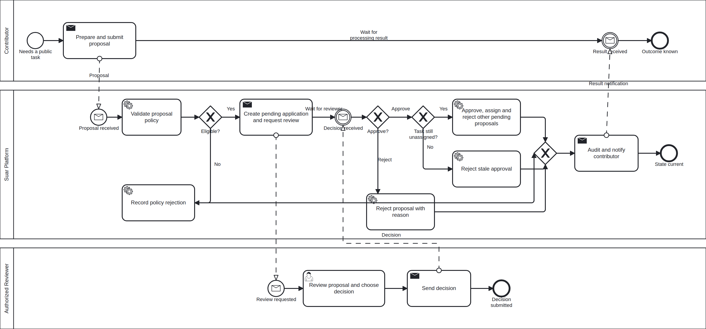
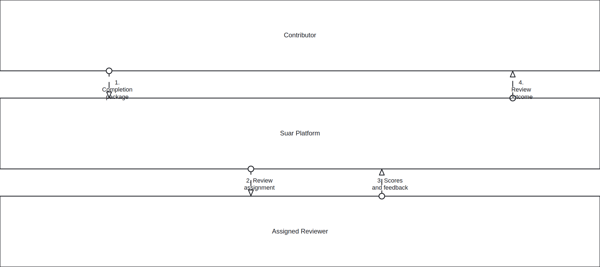
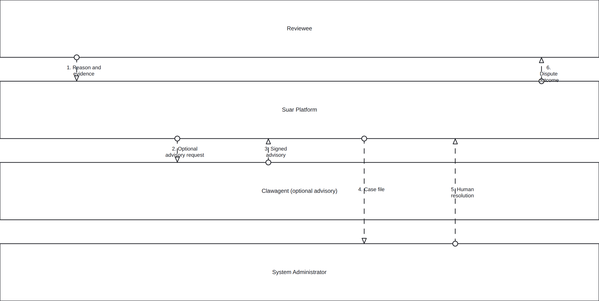

# BPMN Diagram Gallery

Source of truth là BPMN 2.0 XML `.bpmn`; preview `.png` có cùng basename để xem trực tiếp. Không sửa PNG thủ công.

## Chuẩn đọc

BPMN được dùng khi boundary giữa participant là một phần của câu hỏi nghiệp vụ. Sequence flow nối các bước trong cùng participant; message flow chỉ truyền thông tin giữa các participant. Activity (`Action/`) vẫn là lựa chọn gọn hơn cho control flow nằm trong một responsibility boundary.

Các diagram hiện tại là descriptive collaboration, không phải executable workflow definition. Marketplace có process detail với `isExecutable="false"`; task-review và dispute dùng black-box pools cùng numbered message flows để giữ overview dễ đọc. Control-flow chi tiết nằm trong Activity và Sequence tương ứng.

## Render

Render bằng `bpmn.io/bpmn-to-image` 0.10.0:

```bash
pnpm dlx bpmn-to-image@0.10.0 \
  --no-title \
  --no-footer \
  --scale=2 \
  docs/11-diagrams/BPMN/01-marketplace/high-level/bpmn_01_marketplace_proposal_assignment.bpmn:docs/11-diagrams/BPMN/01-marketplace/high-level/bpmn_01_marketplace_proposal_assignment.png
```

## 01 — Marketplace

### `bpmn_01_marketplace_proposal_assignment`



## 02 — Task Delivery Review

### `bpmn_02_task_delivery_review`



## 03 — Review Dispute

### `bpmn_03_review_dispute_resolution`


