# Communication Diagram Gallery

Mỗi diagram có `.mmd` làm source of truth và `.png` cùng basename để xem trực tiếp.

Ảnh được render bằng Mermaid CLI `11.16.0`, theme `neutral`, nền trắng, scale `2`. Không sửa PNG thủ công; sửa MMD rồi render lại.

Domain dùng ba tầng thống nhất. `high-level/` chứa scenario nghiệp vụ chính; `low-level/` chứa governance, callback hoặc hậu xử lý cần đọc sâu. Mỗi diagram dùng object/collaborator rõ, message đánh số theo UML Communication (`1`, `1.1`, `1.1.1`).

## 01-business-workflows

### `comm_01_task_assignment`

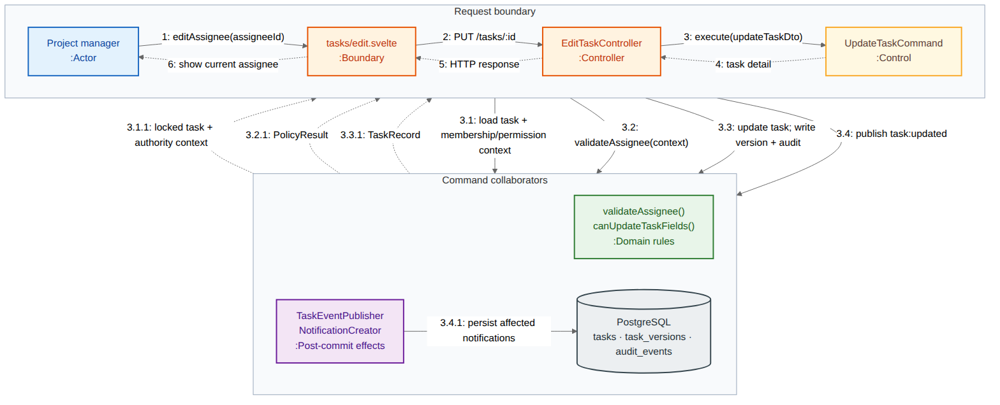

### `comm_02_marketplace_apply`

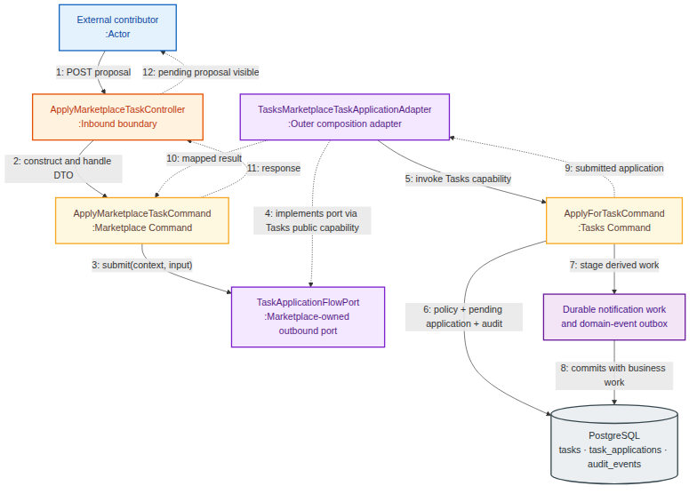

### `comm_03_review_process`

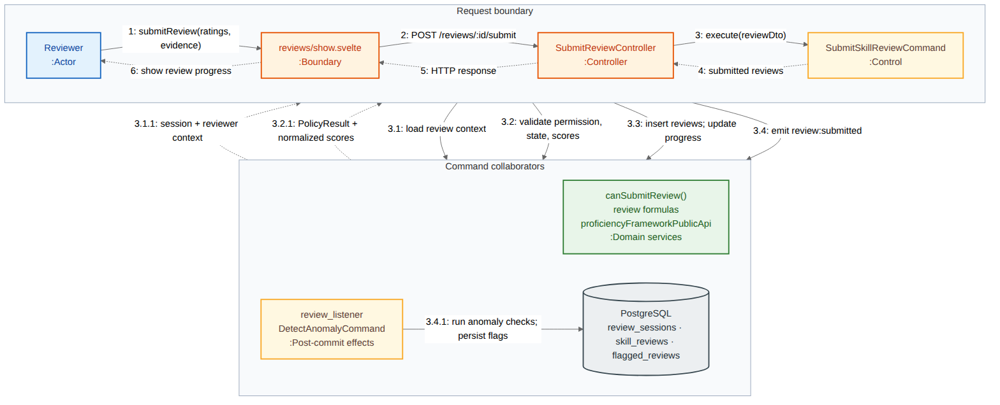

### `comm_04_oauth_social_login_session`

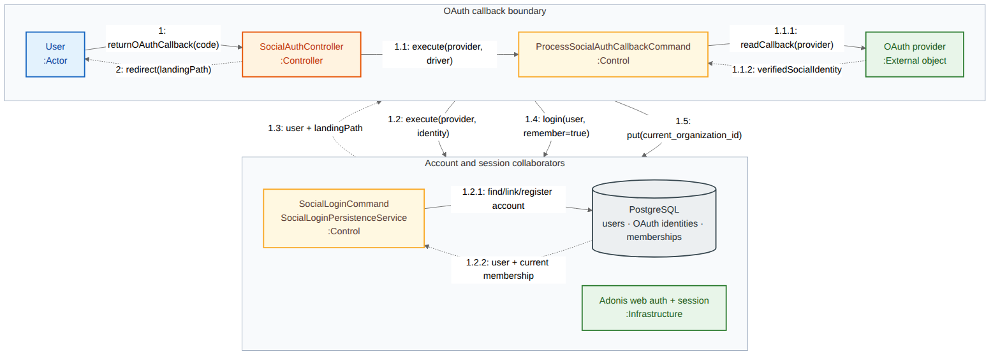

### `comm_05_organization_invitation_acceptance`

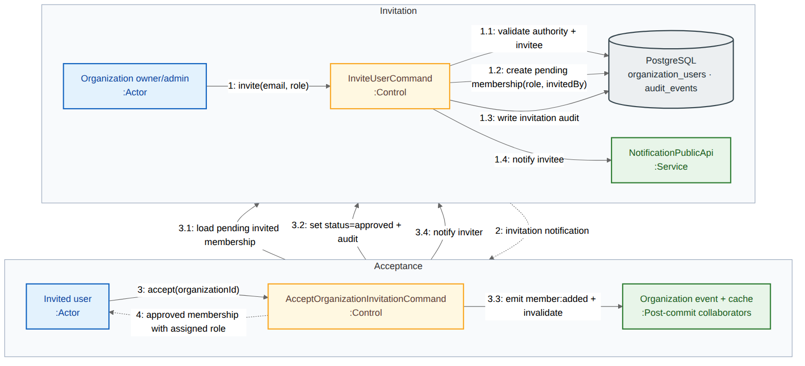

### `comm_06_project_creation_initial_staffing`

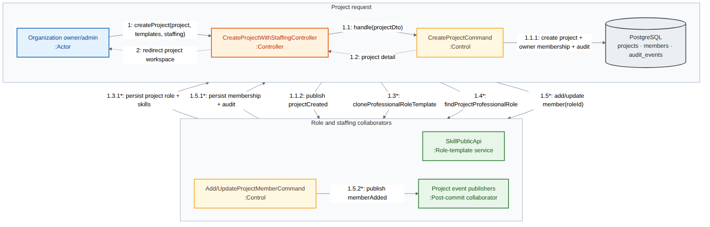

### `comm_07_task_submission_review_handoff`

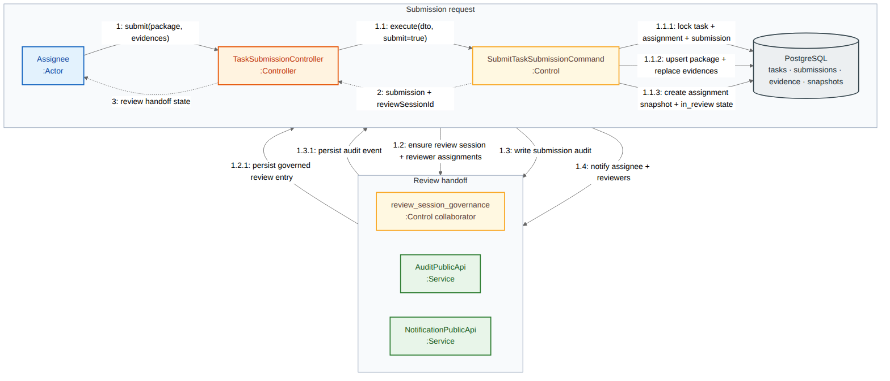

### `comm_10_global_search_authorized_fallback`

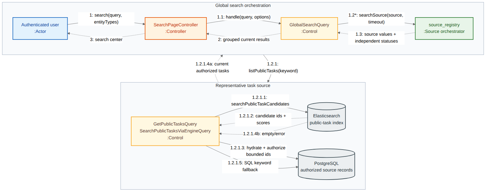

### Low-level governance and publication

### `comm_08_review_dispute_ai_resolution`

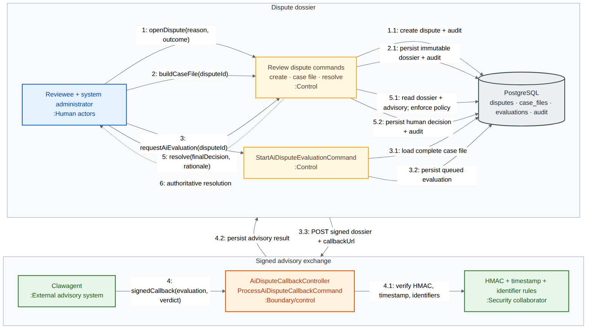

### `comm_09_profile_aggregation_snapshot_share`

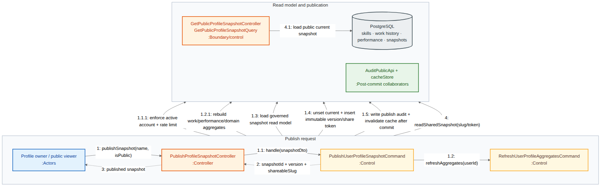

### `comm_11_governed_member_role_mutation`

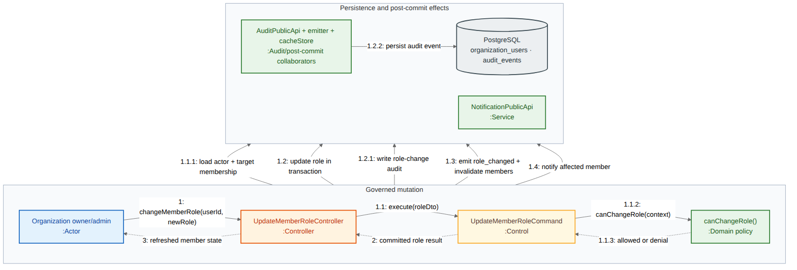
