# UML Component Diagram Gallery

Source of truth là PlantUML `.puml`; preview `.png` có cùng basename để xem trực tiếp. Family này dùng UML component semantics để mô tả ranh giới module, interface và dependency tĩnh. Nó không thay cho runtime flow trong `Sequence/` hoặc topology trong `Deployment/`.

Coverage của family được chia theo bốn câu hỏi khác nhau, không coi một hình overview là đủ:

1. toàn hệ thống có những logical component nào;
2. core capability phụ thuộc public contract nào;
3. platform capability cung cấp interface nào và phản ứng event ra sao;
4. consumer-owned port và composition factory giữ dependency direction như thế nào.

Các source dùng ELK layout để ưu tiên connector vuông góc, đủ lề và ổn định khi render. Render bằng PlantUML `1.2026.3`:

```bash
java -Djava.awt.headless=true \
  -jar /path/to/plantuml-1.2026.3.jar \
  -tpng \
  docs/11-diagrams/Component/01-system-structure/{overview,high-level,low-level}/*.puml
```

## 01 — System Structure

### `component_01_modular_monolith`

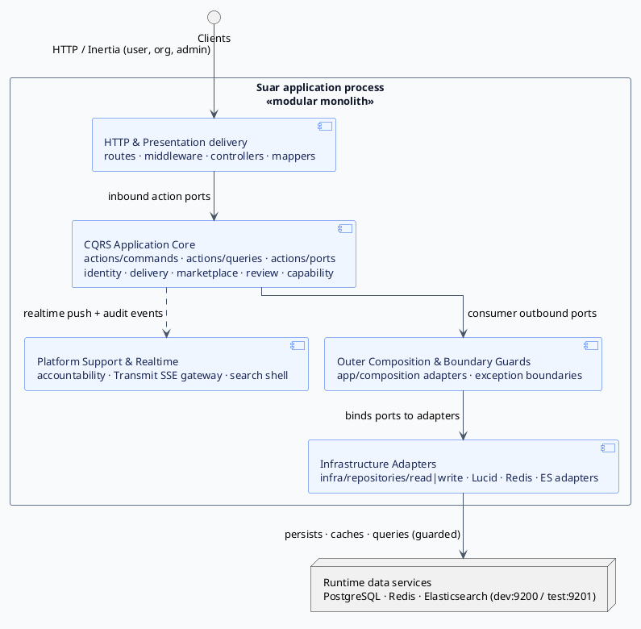

### `component_02_core_domain_dependencies`

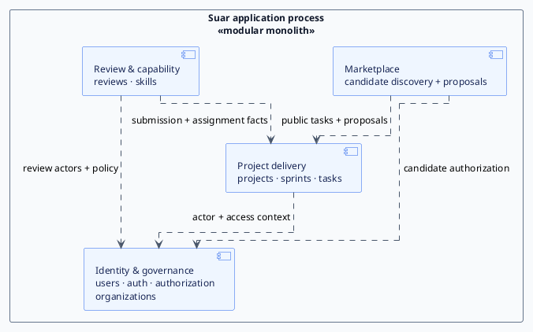

#### `component_02a_project_sprint_dependencies`

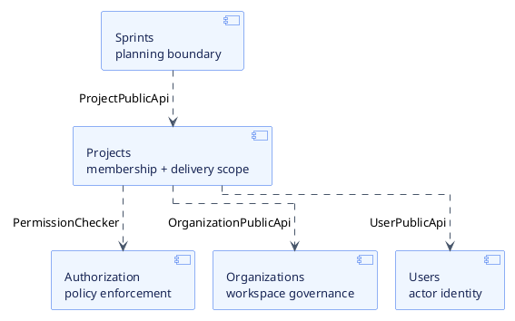

#### `component_02b_task_dependencies`

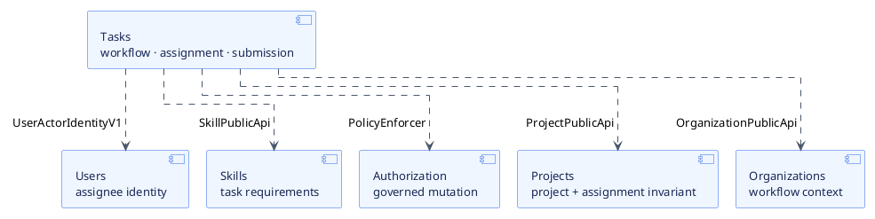

#### `component_02c_marketplace_dependencies`

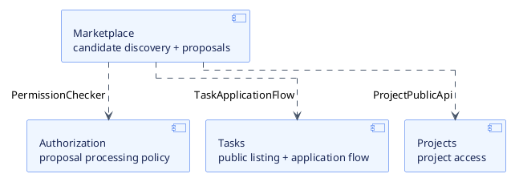

#### `component_02d_review_dependencies`

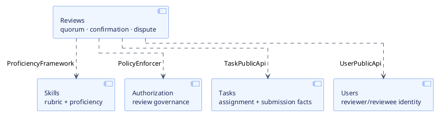

### `component_03_platform_services`

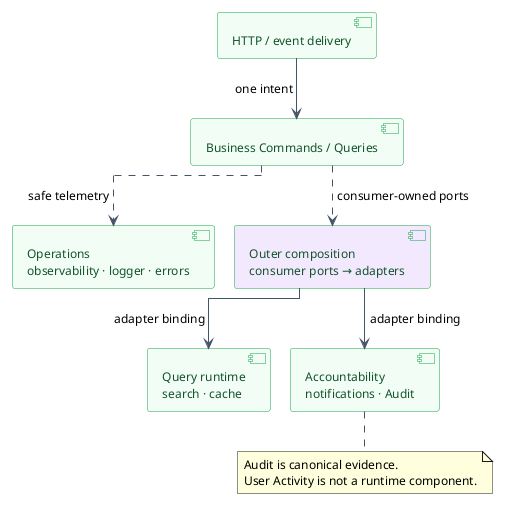

### `component_03a_domain_event_reactions`

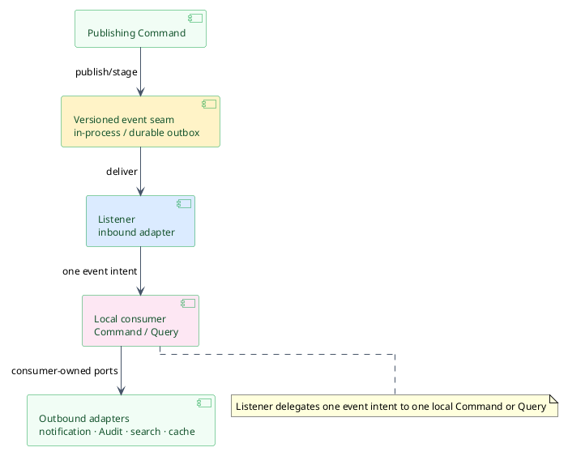

#### `component_03a1_domain_event_publishers`

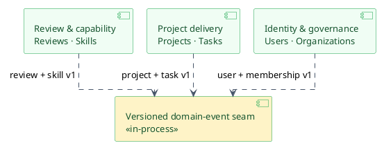

#### `component_03a2_domain_event_consumers`

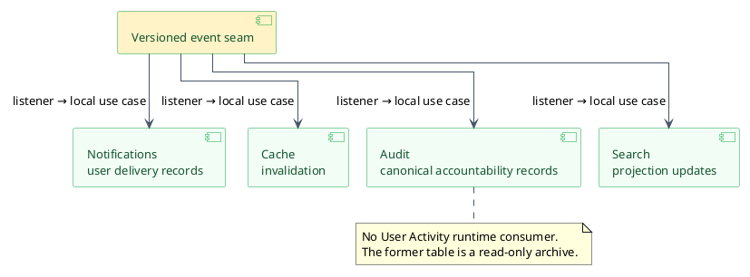

#### `component_03b_accountability_services`

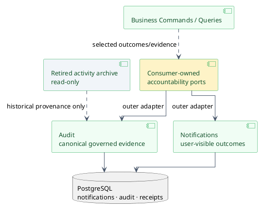

#### `component_03c_query_runtime`

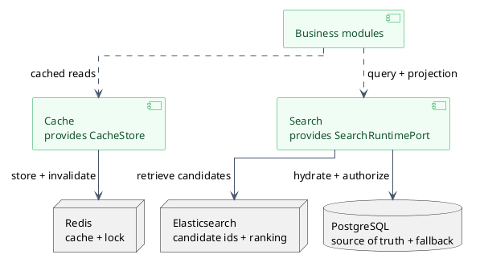

#### `component_03d_operational_context`

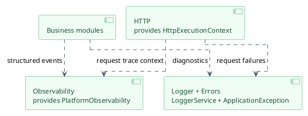

### `component_04_integration_seams`

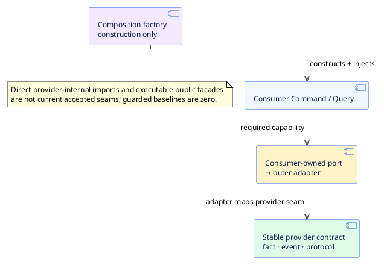

#### `component_04a_consumer_owned_port`

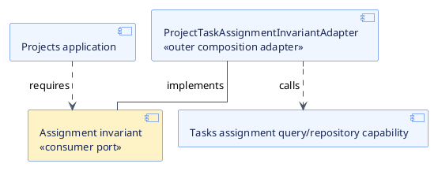

#### `component_04b_versioned_contract_event`

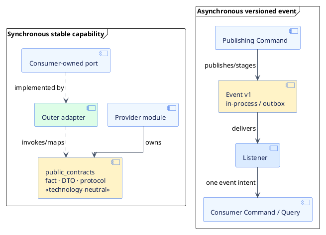

#### `component_04c_composition_factory_boundary`

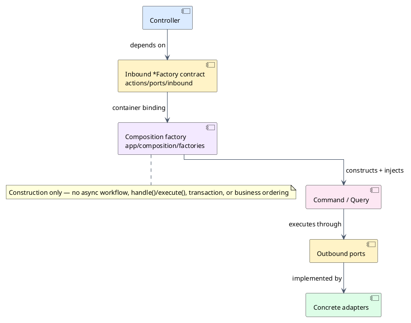
