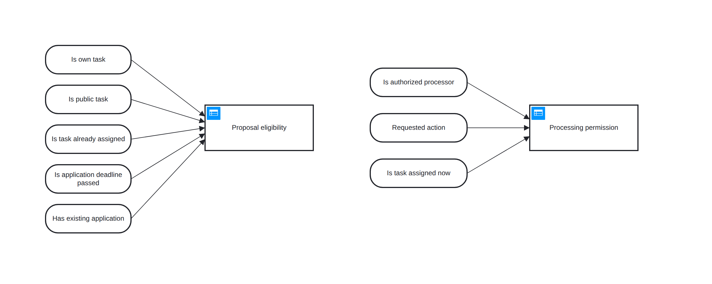
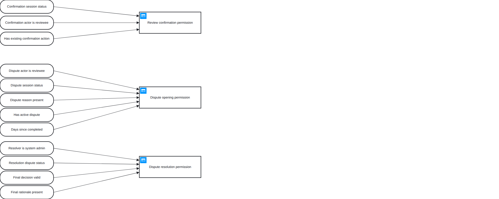

# Decision Model and Notation Gallery

Source of truth là OMG DMN XML `.dmn`; preview `.png` có cùng basename. DMN chỉ được dùng cho business decision có input/output và rule table ổn định, không thay Activity hoặc BPMN bằng decision table.

Family hiện dùng DMN 1.5 namespace và model interchange theo OMG. Rule model mang tính mô tả/kiểm chứng; runtime hiện vẫn thực thi TypeScript policy functions, không nhúng DMN engine.

Canonical source được validate bằng OMG `DMN15.xsd`. Preview hiện dùng `dmn-js 17.8.1`; vì parser này nhận namespace DMN 1.3, render step chỉ ánh xạ namespace 1.5 → 1.3 **trong bộ nhớ** cho các element tương thích rồi chụp DRD. File `.dmn` không bị rewrite và vẫn phải pass DMN 1.5 XSD. Không vẽ PNG thủ công.

Render preview:

```bash
node docs/11-diagrams/DMN/render-preview.mjs \
  docs/11-diagrams/DMN/01-marketplace/high-level/dmn_01_marketplace_application_decisions.dmn \
  docs/11-diagrams/DMN/01-marketplace/high-level/dmn_01_marketplace_application_decisions.png
```

## `dmn_01_marketplace_application_decisions`



## `dmn_02_review_governance_decisions`


