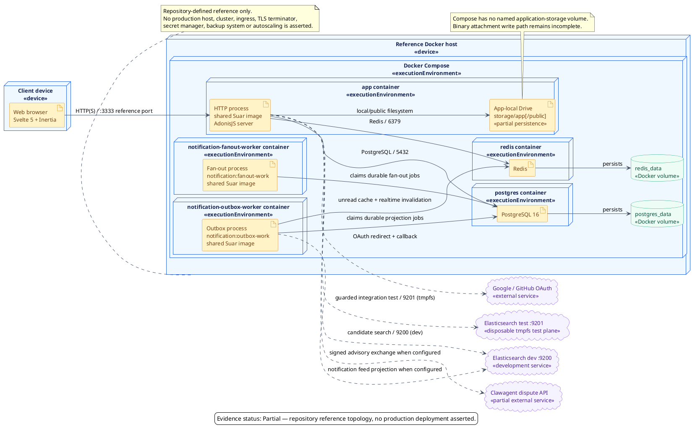

# UML Deployment Diagram Gallery

Source of truth là PlantUML `.puml`; preview `.png` có cùng basename. Family này mô tả artifact, execution environment, node và communication path theo UML Deployment semantics.

Vì Suar chưa có production deployment hoặc real-user traffic, diagram hiện tại chỉ được phép mô tả **repository-defined reference topology**. Nó không phải bằng chứng production readiness, availability, capacity hoặc security hardening.

Render bằng PlantUML `1.2026.3`:

```bash
java -jar /path/to/plantuml-1.2026.3.jar \
  -Djava.awt.headless=true \
  -tpng \
  docs/11-diagrams/Deployment/01-reference-topology/overview/deployment_01_reference_topology.puml
```

## `deployment_01_reference_topology`



