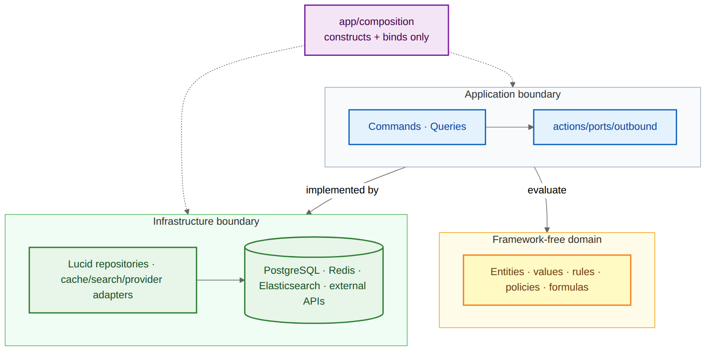
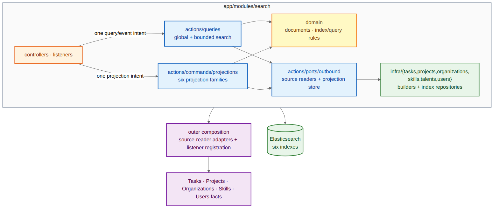

# Domain and Infrastructure Packages

Đọc `pkg_04_domain_infra` trước để hiểu dependency inversion tổng quát. Sau đó dùng `pkg_04a_search_projection_packages` để xem package query/projection hiện thực hóa Elasticsearch cho sáu index hiện tại.





```text
04-domain-infrastructure/
├── overview/    # Chưa cần: package overview chung nằm ở 01
├── high-level/  # Domain ports và infrastructure adapters
└── low-level/   # Search query/projection adapter packages
```

`pkg_04_domain_infra` giữ dependency inversion tổng quát. `pkg_04a` chỉ drill down package search, không lặp class inventory.
