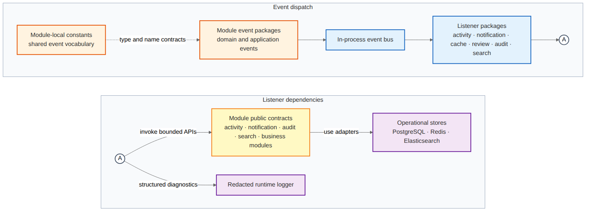
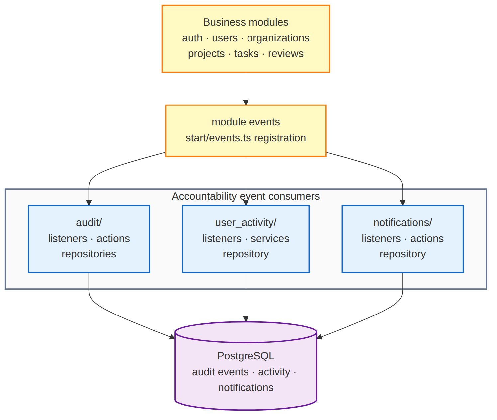
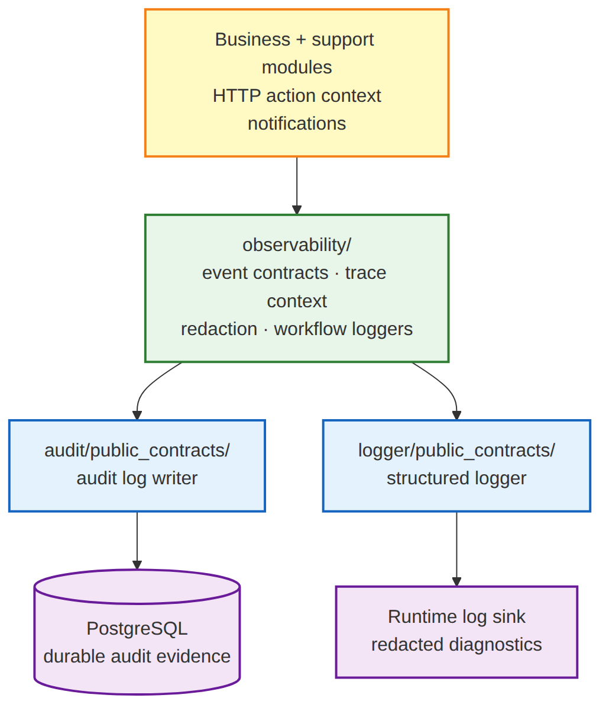

# Cross-Cutting Packages

`pkg_05_crosscutting` là event route tổng quát. `pkg_05a_event_accountability` tách durable event consumers. `pkg_05b_observability_logging` tách telemetry, redaction, audit và logging.







```text
05-crosscutting/
├── overview/    # Nhóm concern dùng chung
├── high-level/  # Runtime accountability packages
└── low-level/   # Observability, audit and logging boundary
```

`pkg_05_crosscutting` là event-route overview; `pkg_05a` cho thấy durable event consumers; `pkg_05b` cho thấy telemetry sinks. Runtime deployment detail vẫn nằm trong Architecture.
