# Package Diagram Gallery

Đọc theo `overview` → `high-level` → `low-level`. Diagram overview định vị package; high-level tách bounded package; low-level chỉ giữ package triển khai cụ thể.

## 01-overview

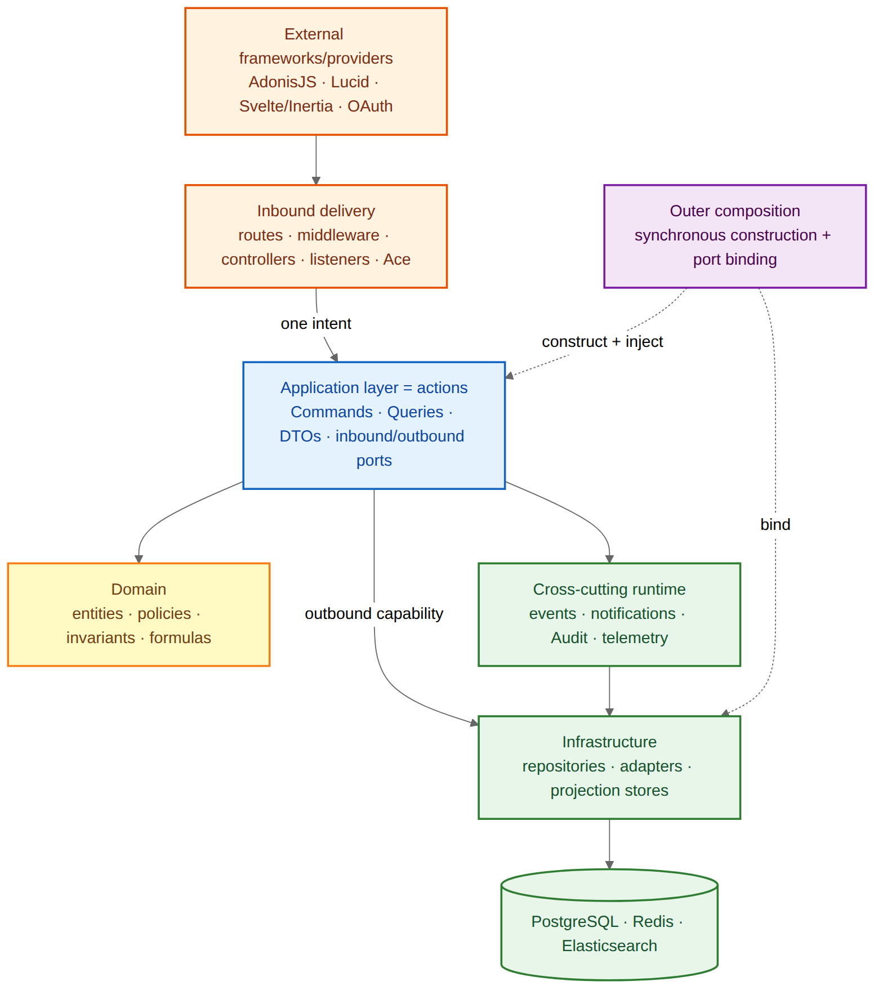

## 02-presentation-application

### Overview

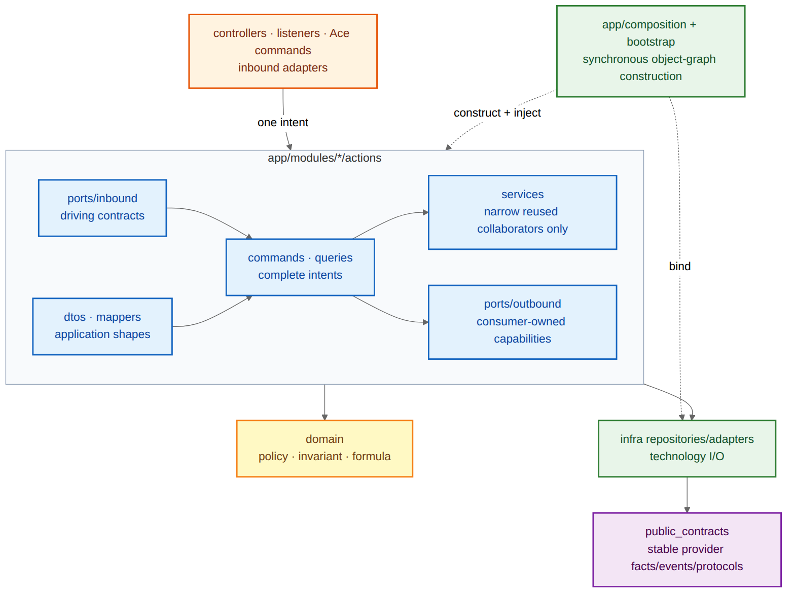

### High level

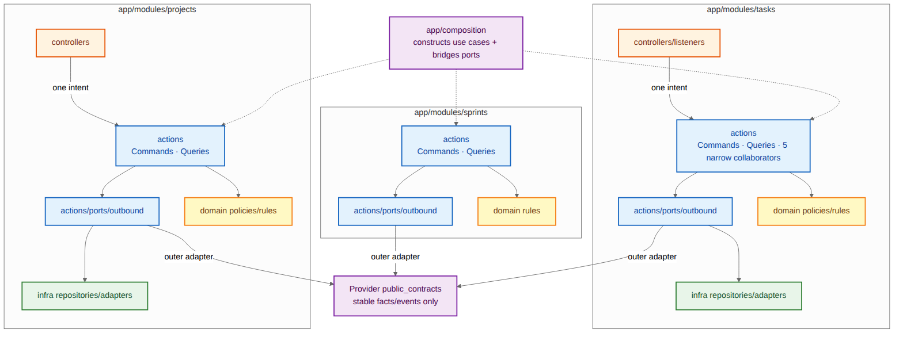

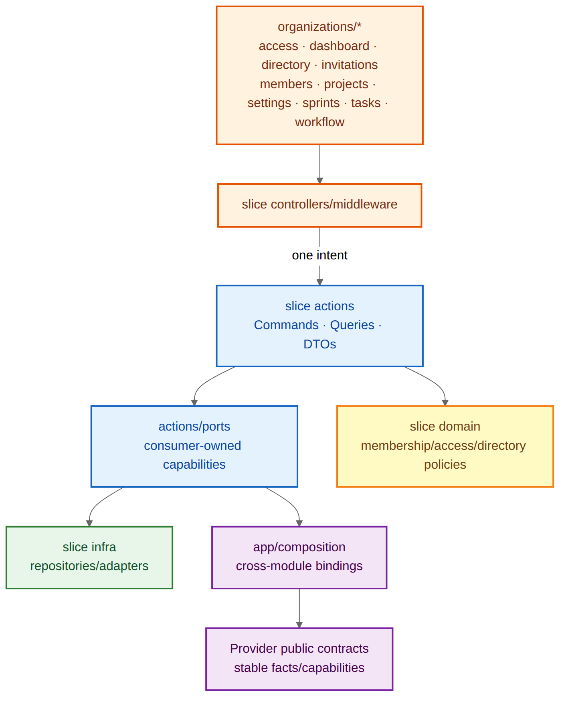

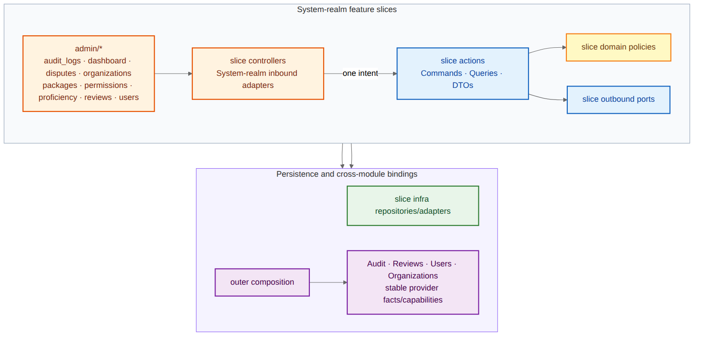

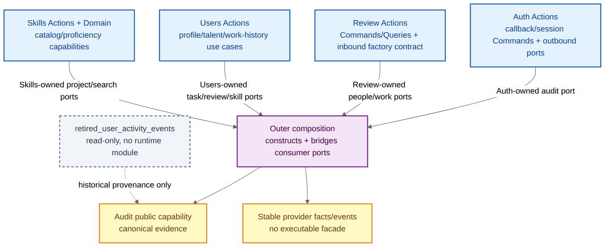

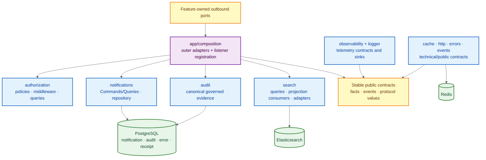

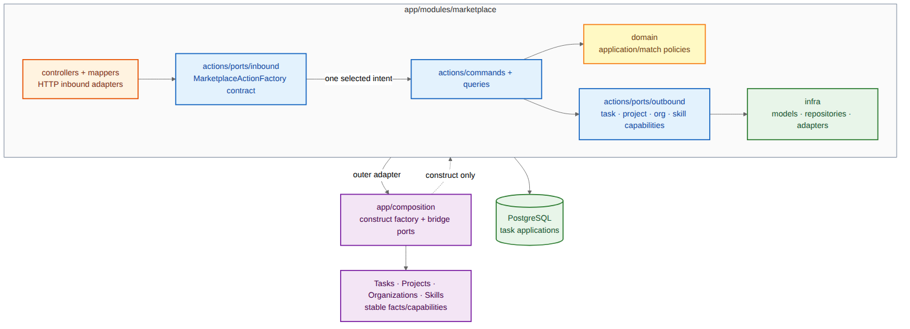

### Low level

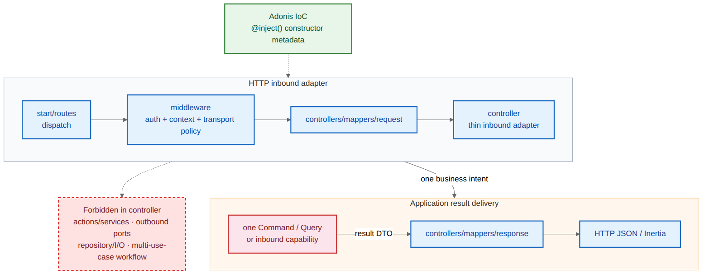

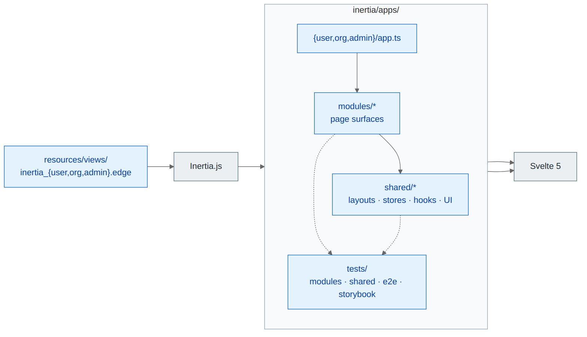

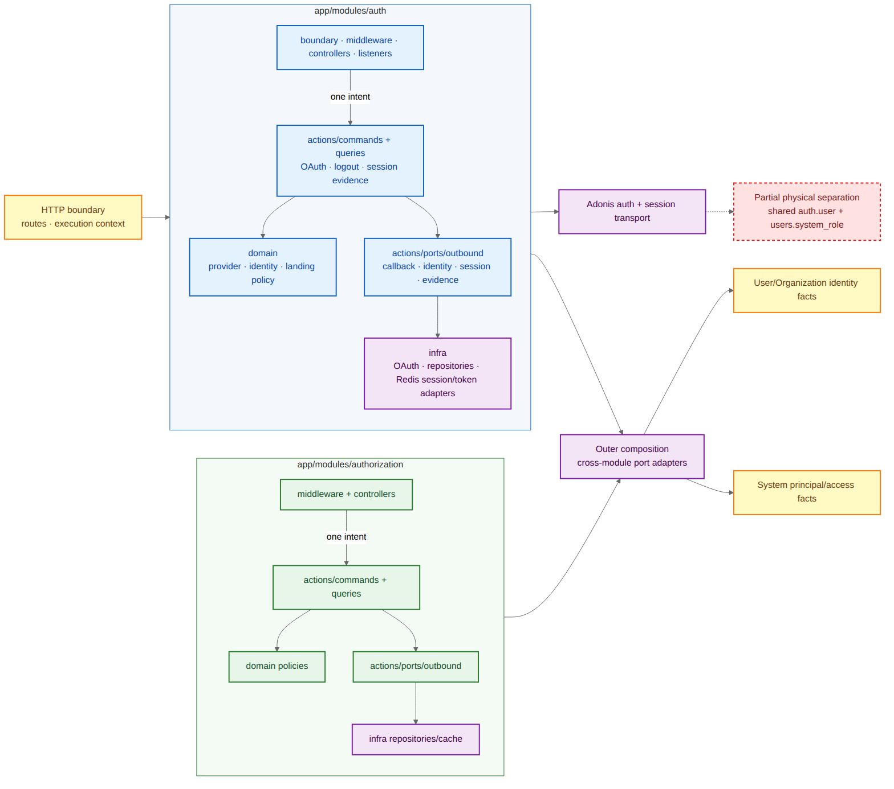

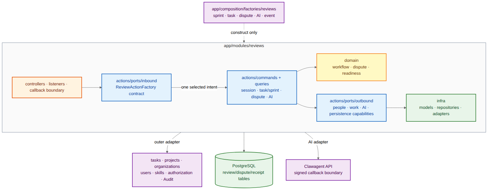

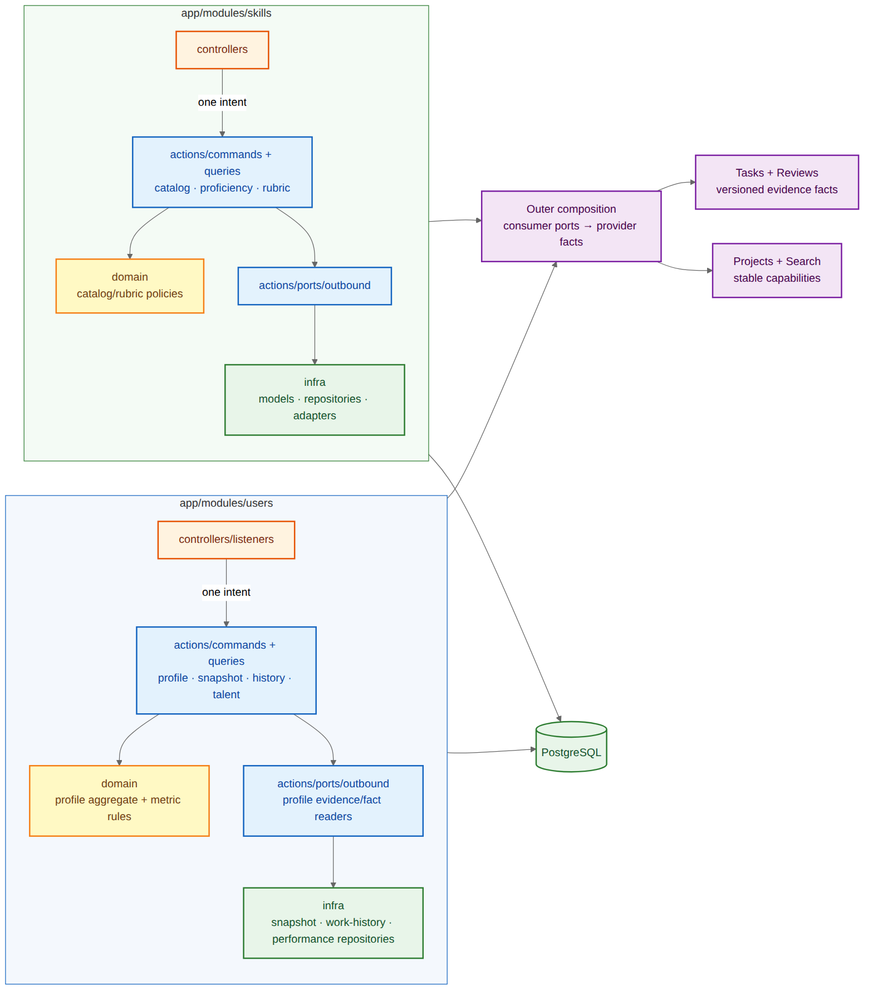

## 03-application-rules

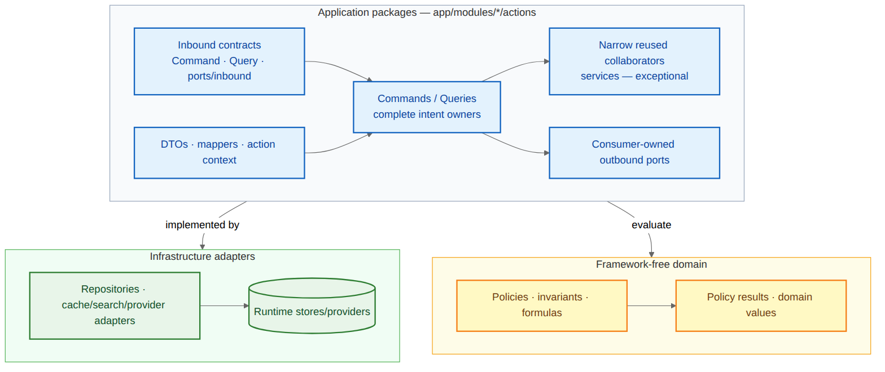

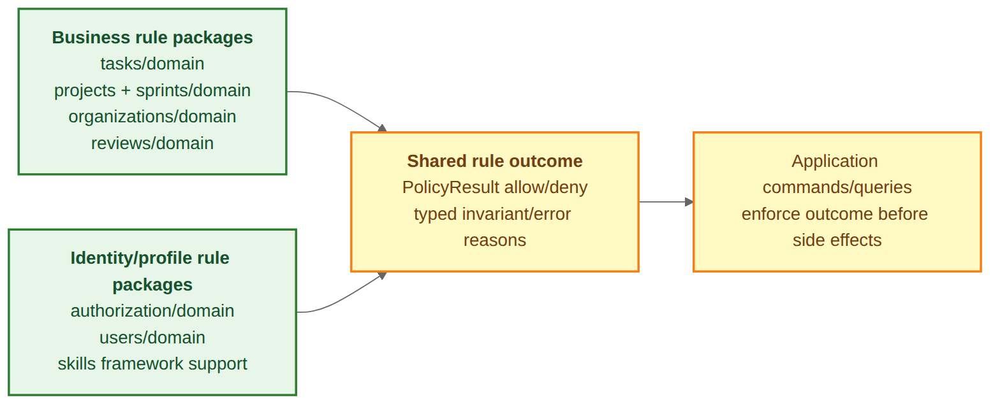

## 04-domain-infrastructure

## 05-crosscutting

