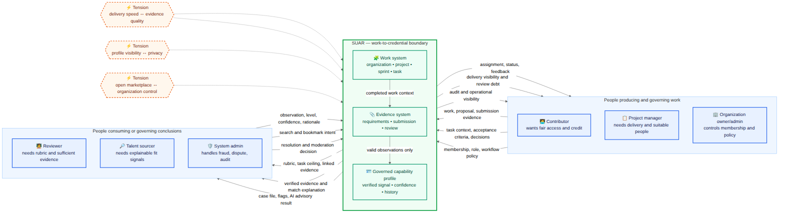
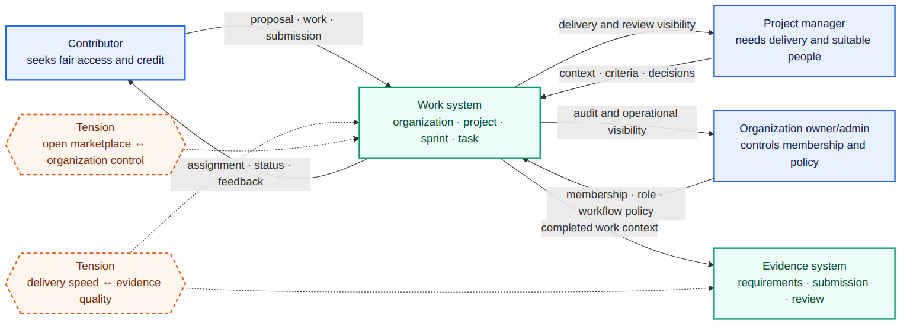
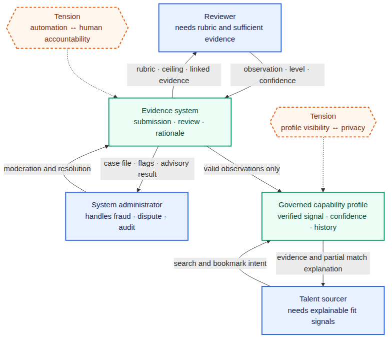
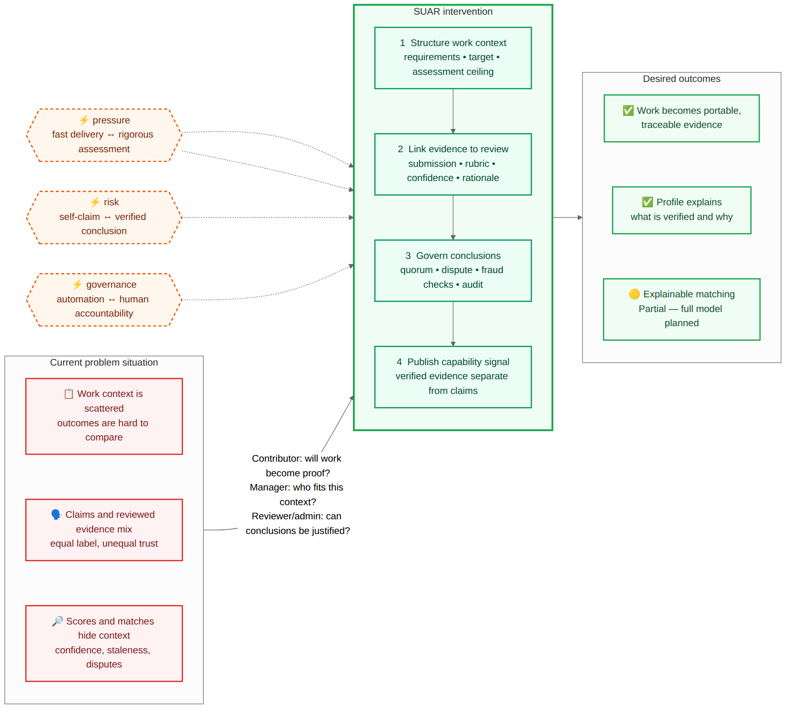
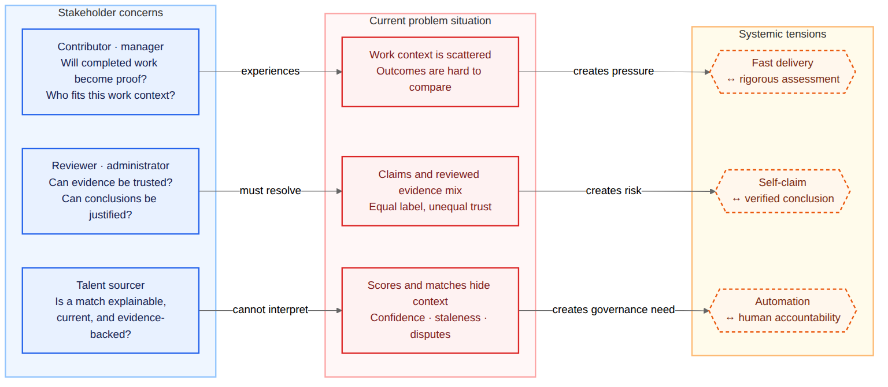
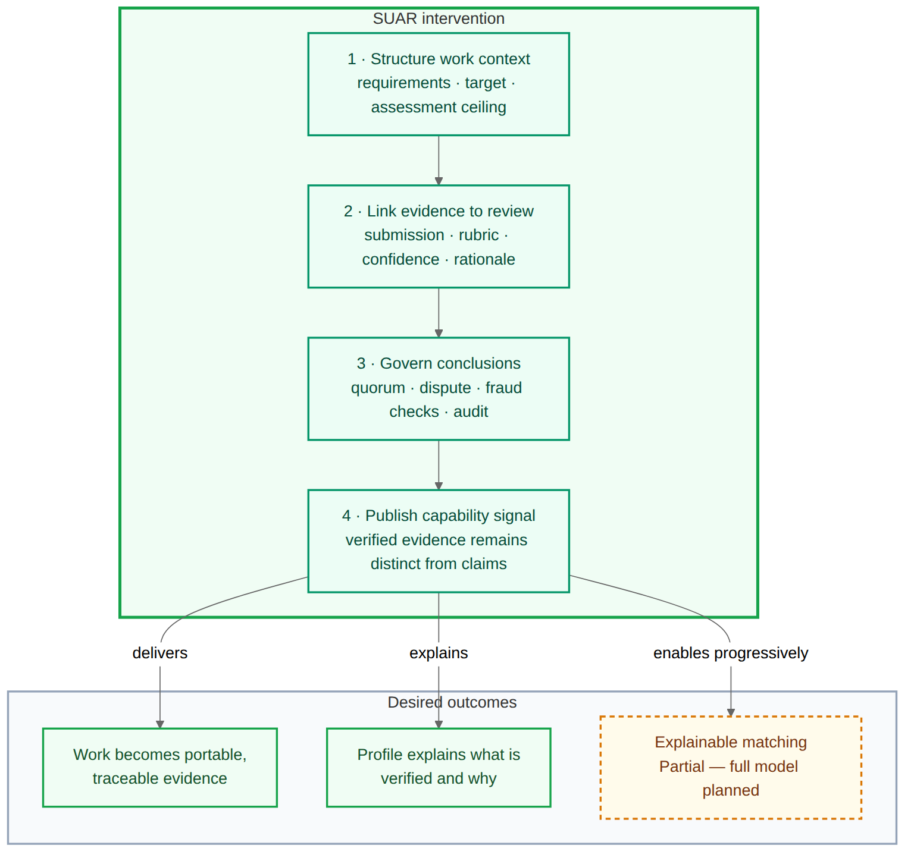
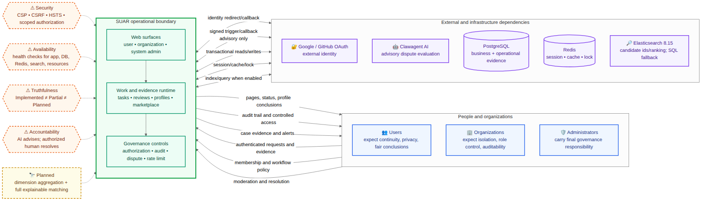

# Rich Picture Diagram Gallery

Mỗi diagram có `.mmd` làm source of truth và `.png` cùng basename để xem trực tiếp.

Rich Picture ở đây dùng visual language tự do: stakeholder, boundary, information exchange, concern, conflict và uncertainty. Đây không còn là mind map phân cấp.

Ảnh được render bằng Mermaid CLI `11.16.0`, theme `neutral`, nền trắng, scale `2`. Không sửa PNG thủ công; sửa MMD rồi render lại.

Phân tầng đọc: `overview/` nhận diện stakeholder và boundary; `high-level/` trình bày vấn đề–đáp ứng; `low-level/` chứa các lát stakeholder và problem-response dành cho A4 cùng constraint và concern vận hành.

Ba view canonical là bộ current-state có chủ ý, không phải coverage thiếu: chúng lần lượt trả lời `ai liên quan`, `vấn đề/đáp ứng là gì`, và `constraint nào chi phối`. `rp_01a`/`rp_01b` và `rp_02a`/`rp_02b` là derived report slices của các view canonical tương ứng, không phải view/capability mới. Không nhân số lượng theo Action/DFD. Chỉ thêm Rich Picture canonical khi có một problem situation hoặc target-state độc lập; target capability v6 bắt buộc ghi `Planned`.

## 01-system-context

### `rp_01_stakeholders`

#### `rp_01a_work_stakeholders`

#### `rp_01b_assurance_stakeholders`

### `rp_02_problems_solutions`

#### `rp_02a_problem_tensions`

#### `rp_02b_intervention_outcomes`

### `rp_03_architecture_constraints`

