# Usecase Diagram Gallery

Mỗi diagram có `.mmd` làm source of truth và `.png` cùng basename để xem trực tiếp.

Ảnh được render bằng Mermaid CLI `11.16.0`, theme `neutral`, nền trắng, scale `2`. Không sửa PNG thủ công; sửa MMD rồi render lại.

Mỗi domain dùng `overview/` cho system boundary tổng quát, `high-level/` cho nhóm mục tiêu nghiệp vụ, `low-level/` cho phạm vi chuyên biệt hơn. README trong từng domain chỉ rõ quan hệ cha–con.

## 01-auth-organization

### `uc_01_auth_org`

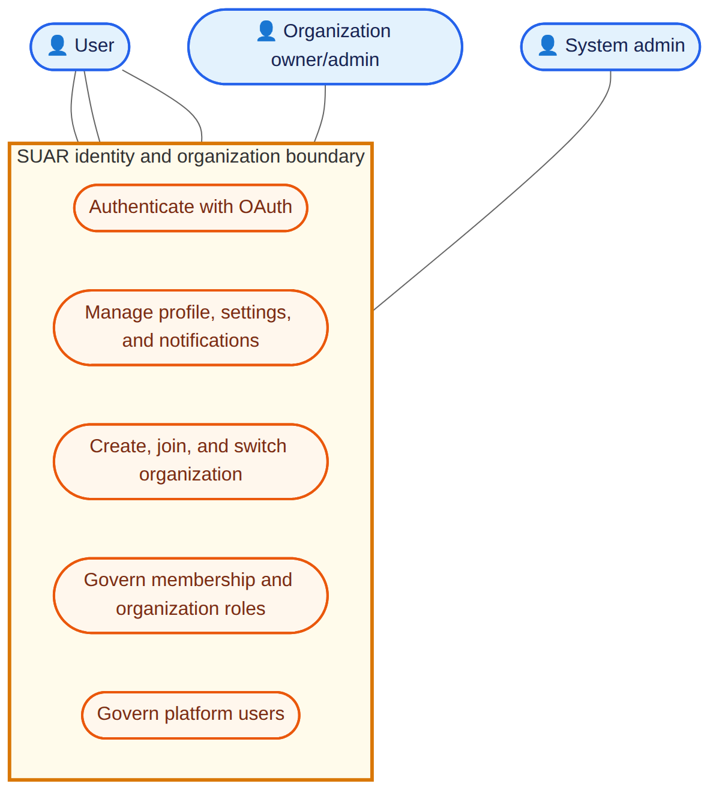

### `uc_01a_auth_account`

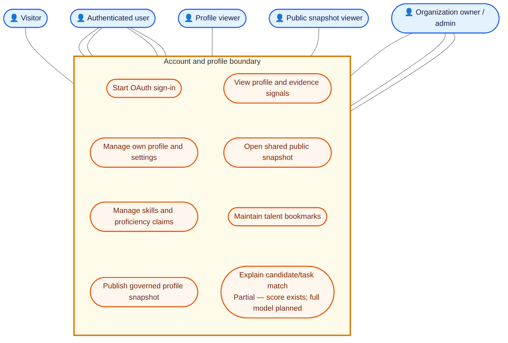

### `uc_01b_organization_membership`

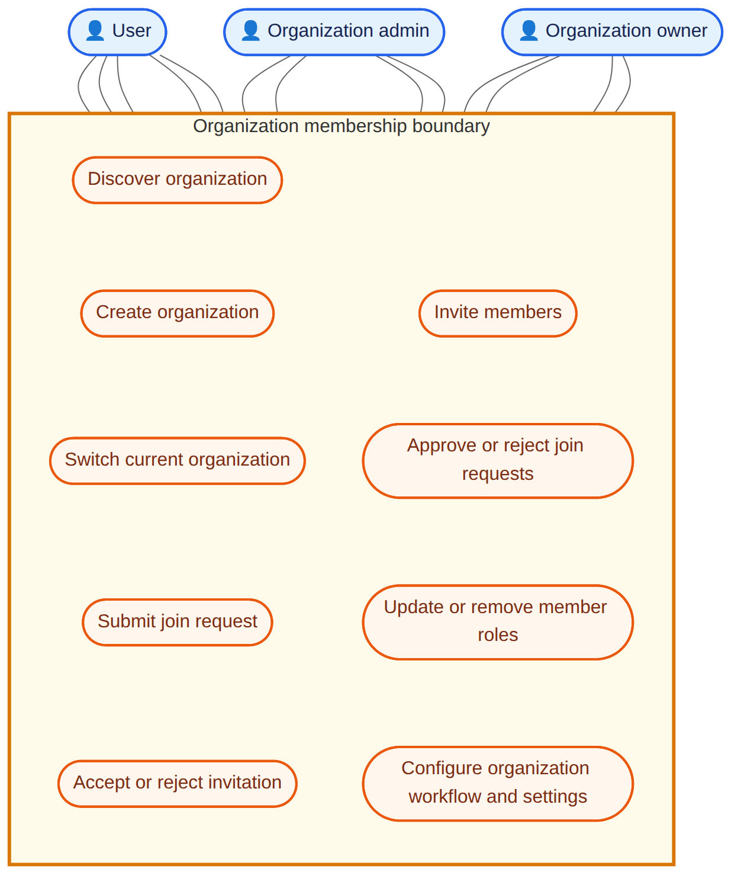

## 02-task-project

### `uc_02_task_project`

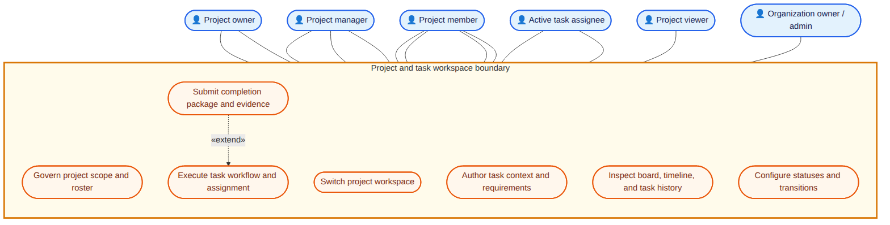

### `uc_02a_project_governance`

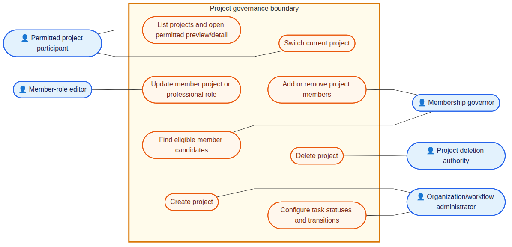

### `uc_02b_task_lifecycle`

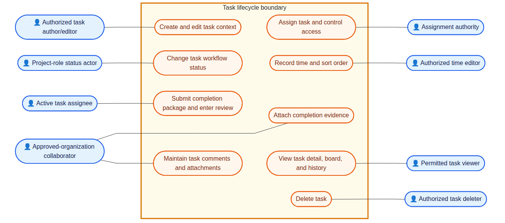

### `uc_02c_sprint_review_governance`

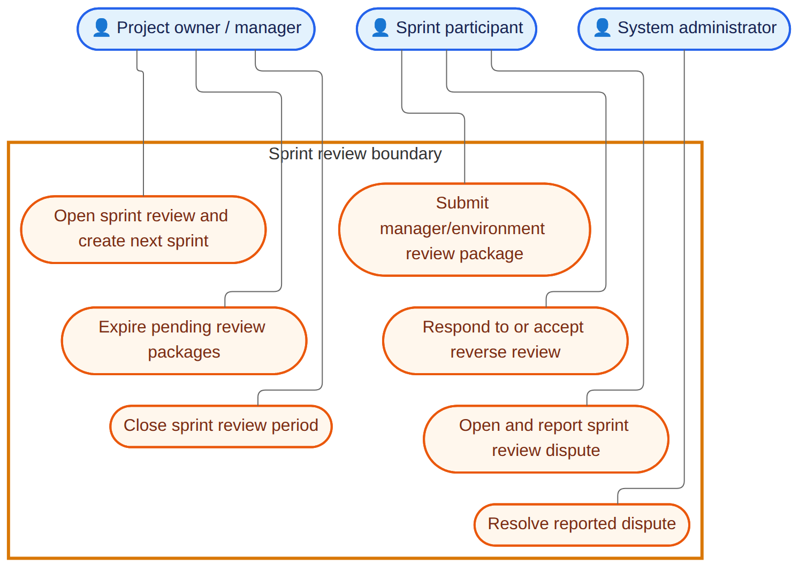

### `uc_02d_project_staffing_competency`

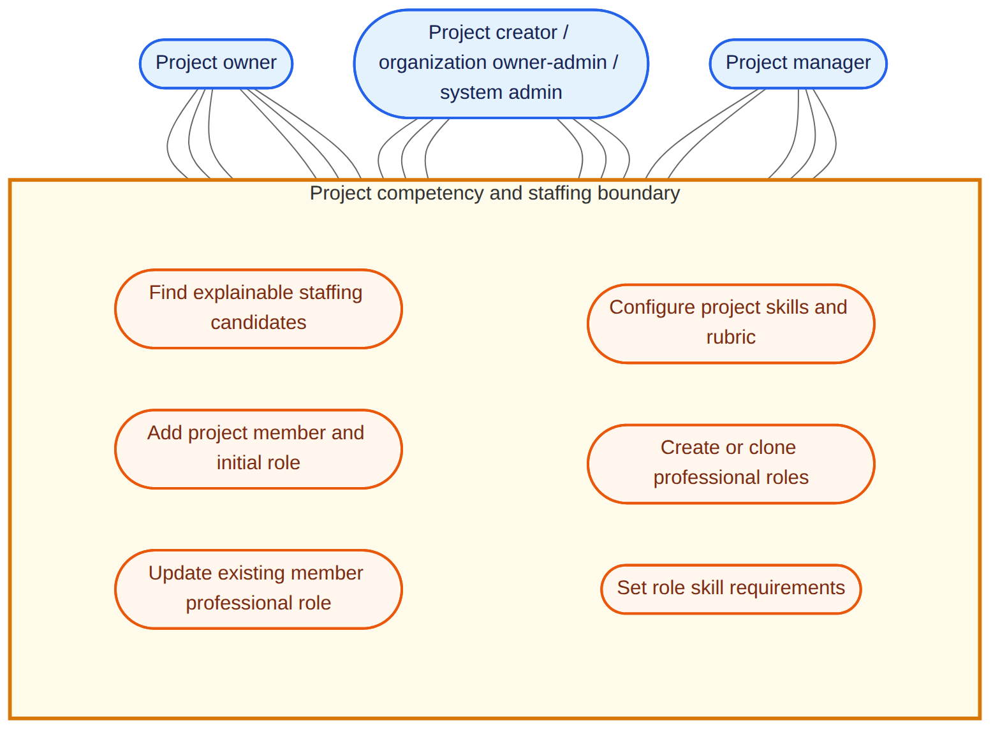

### `uc_02e_sprint_planning`

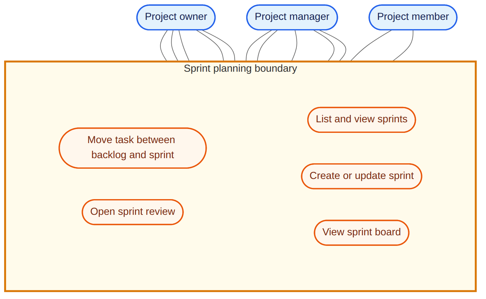

## 03-marketplace-review

### `uc_03_marketplace_review`

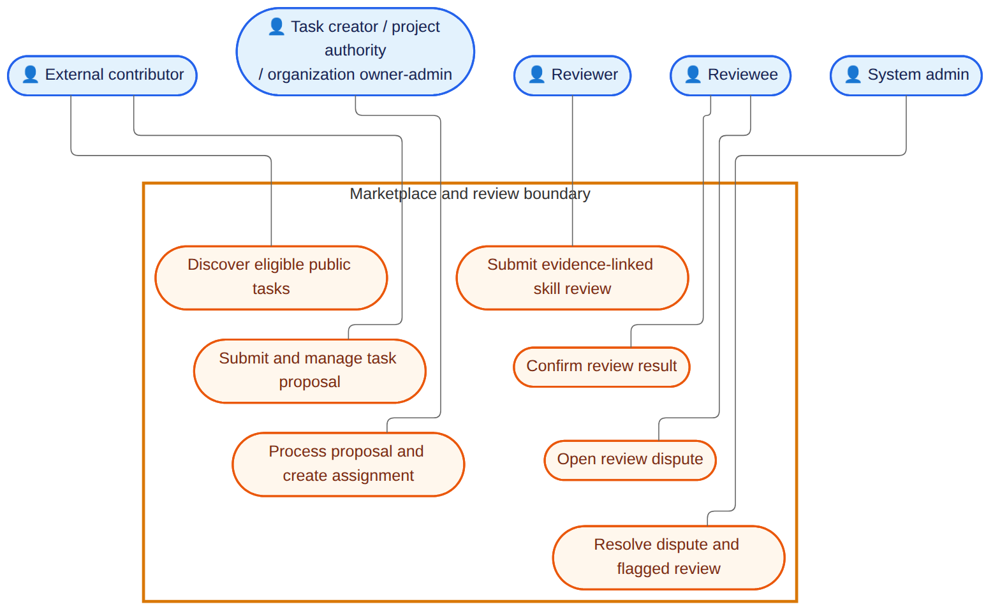

### `uc_03a_marketplace_application`

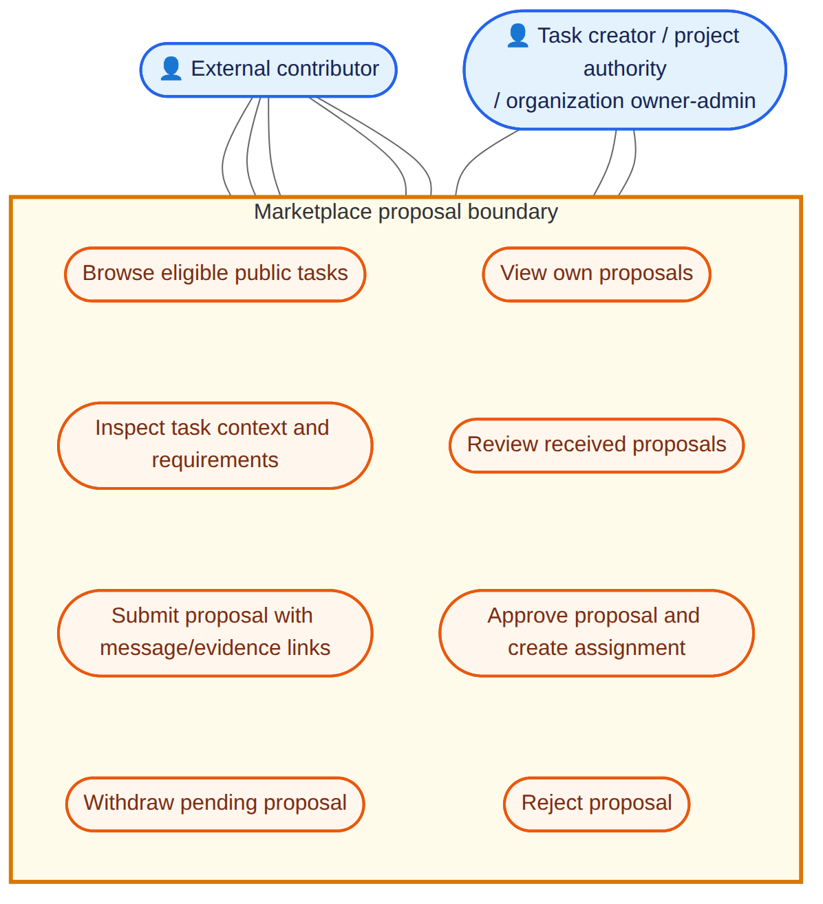

### `uc_03b_review_lifecycle`

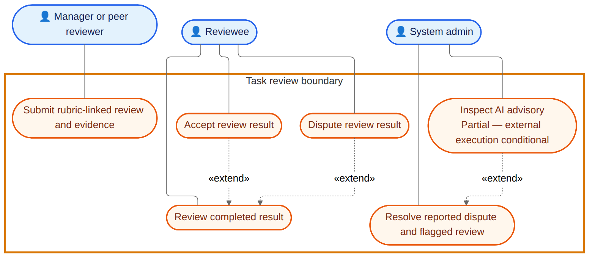

## 04-permissions

### `uc_04_permission_hierarchy`

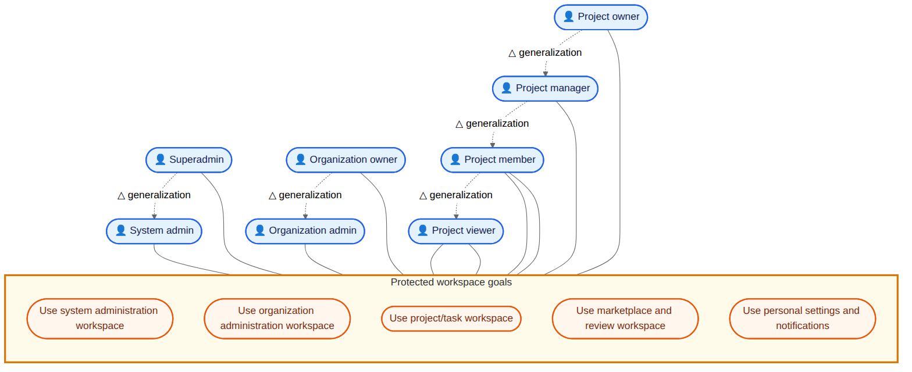

### `uc_04a_system_admin_surface`

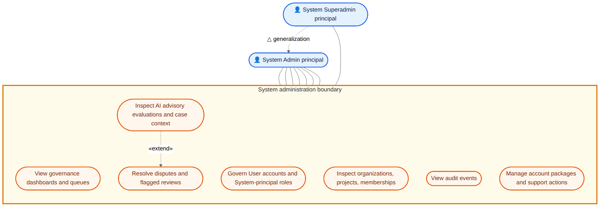

### `uc_04b_org_project_access`

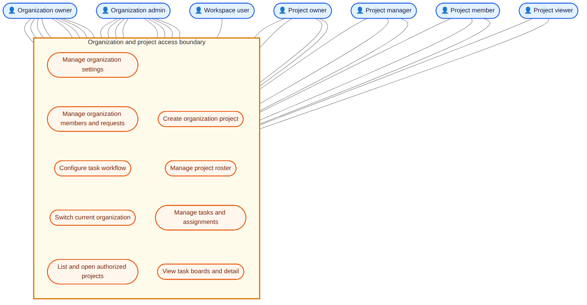

## 05-search-observability

### `uc_05_search_observability`

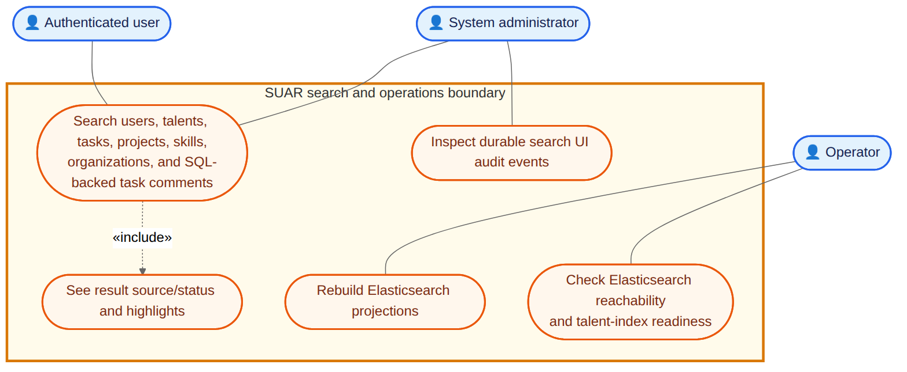
