# UserFlow Diagram Gallery

Mỗi diagram có `.mmd` làm source of truth và `.png` cùng basename để xem trực tiếp.

Ảnh được render bằng Mermaid CLI `11.16.0`, theme `neutral`, nền trắng, scale `2`. Không sửa PNG thủ công; sửa MMD rồi render lại.

Mỗi domain dùng `overview/` cho journey đọc đầu tiên, `high-level/` cho journey bổ sung theo actor/capability, `low-level/` cho nhánh chi tiết khi có. README trong từng domain chỉ rõ thứ tự đọc.

Các phase liên tục trong cùng journey có thể xuống nhiều hàng để giữ chữ đủ lớn, nhưng row layout không có border/title nên không tạo cảm giác nhiều diagram ghép trong một canvas.

## 01-onboarding

### `uf_01_onboarding_org_context`

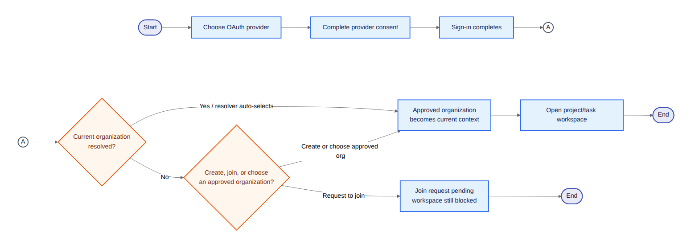

## 02-marketplace

### `uf_02_marketplace_task_application_journey`

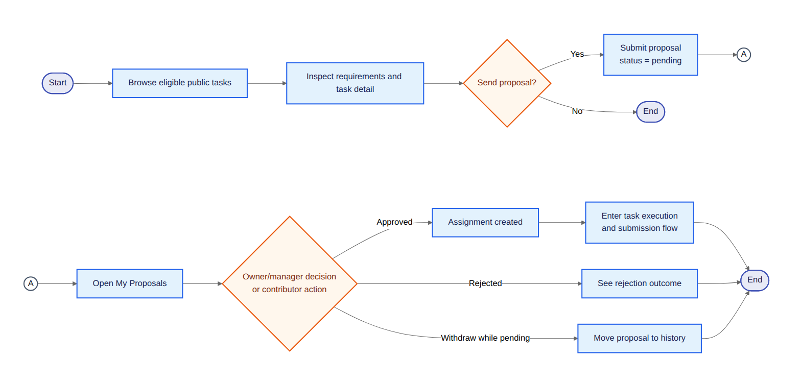

### `uf_02a_marketplace_owner_triage_journey`

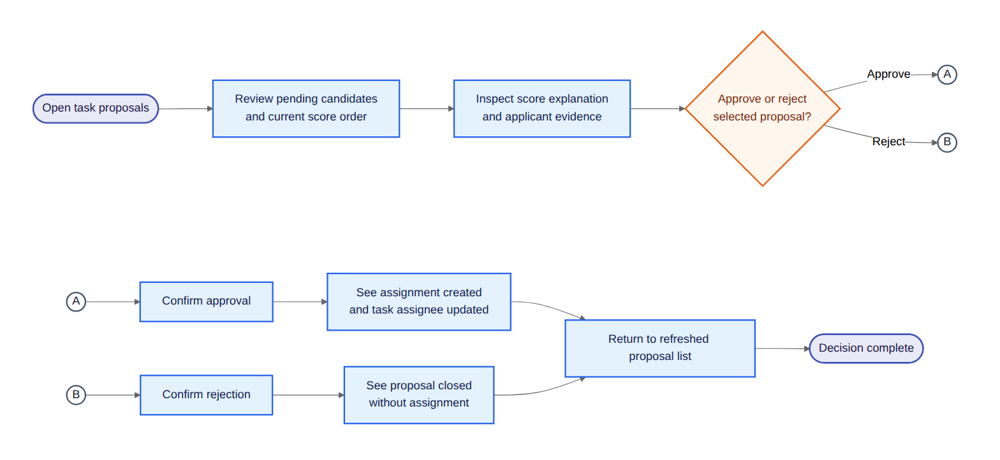

## 03-profile

### `uf_03_profile_snapshot_journey`

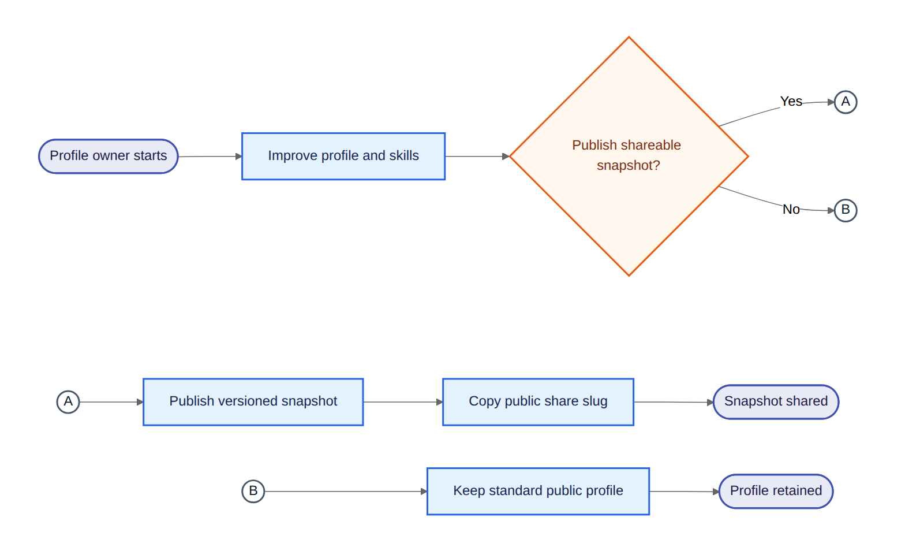

### `uf_03a_talent_bookmark_journey`

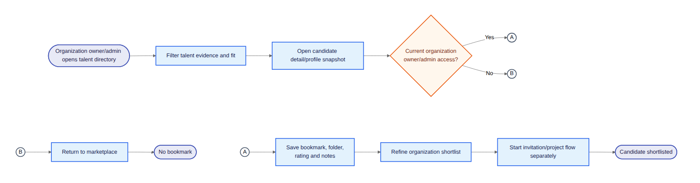

## 04-task-delivery

### `uf_04_assignee_task_delivery_journey`

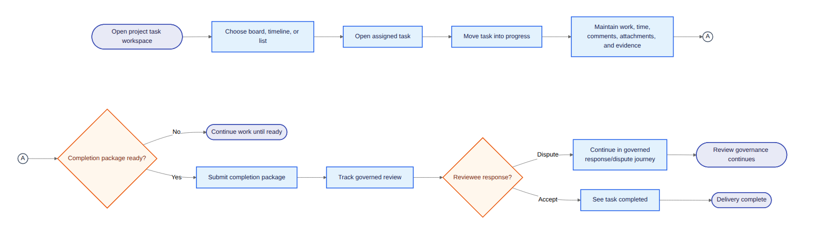

### `uf_04a_task_authoring_versioning_journey`

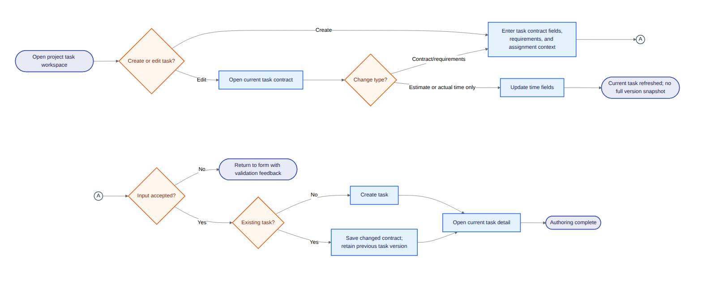

### `uf_04b_my_work_queue`

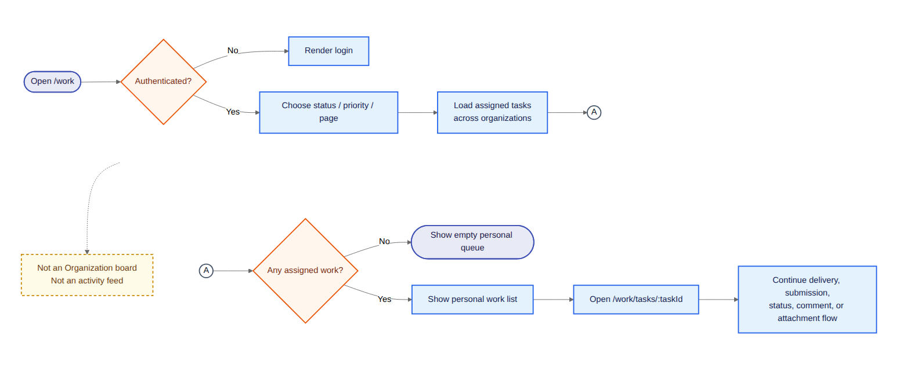

## 05-project-delivery

### `uf_05_project_setup_staffing_journey`

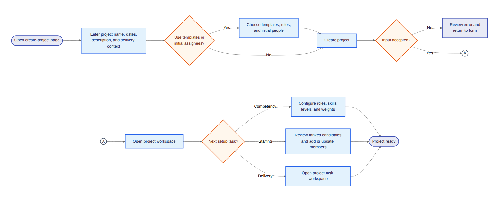

### `uf_05a_sprint_planning_journey`

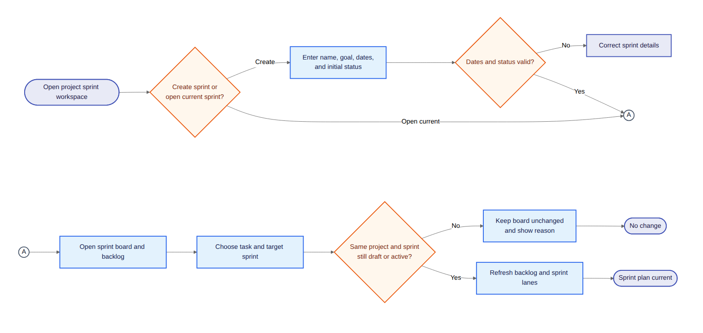

## 06-review

### `uf_06_reviewer_submission_journey`

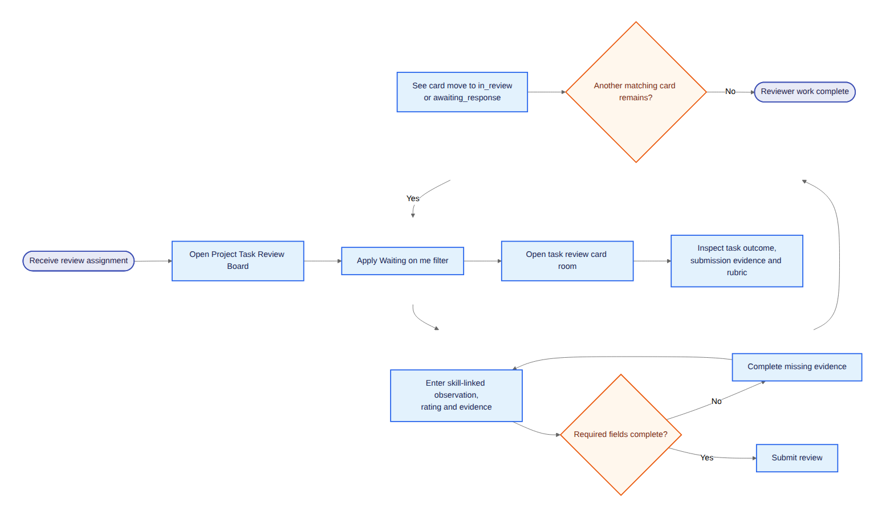

### `uf_06a_reviewee_response_dispute_journey`

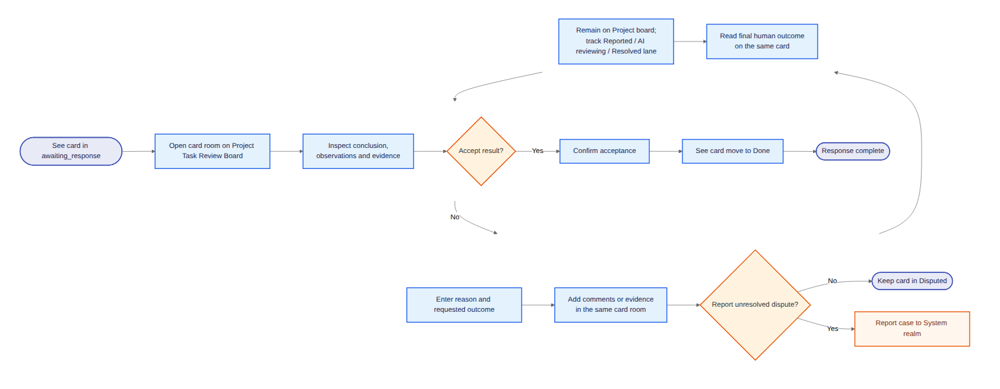

## 07-organization

### `uf_07_invitation_response_journey`

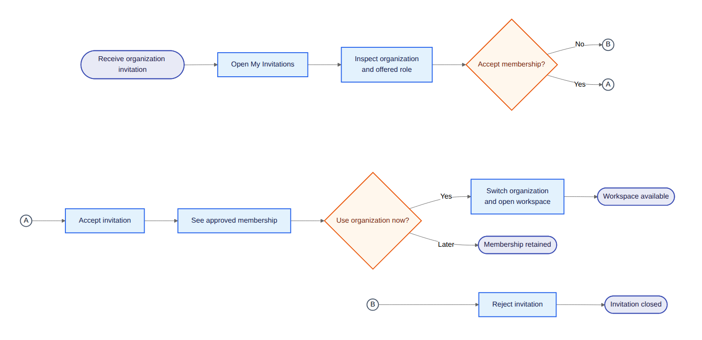

### `uf_07a_join_request_resolution_journey`

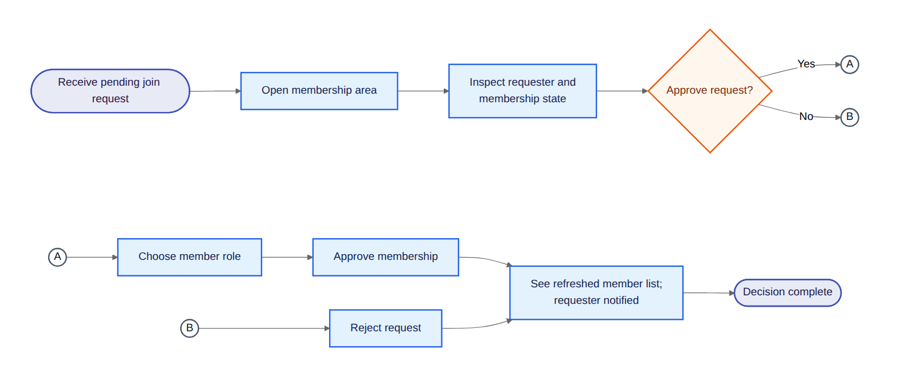

### `uf_07b_member_role_removal_journey`

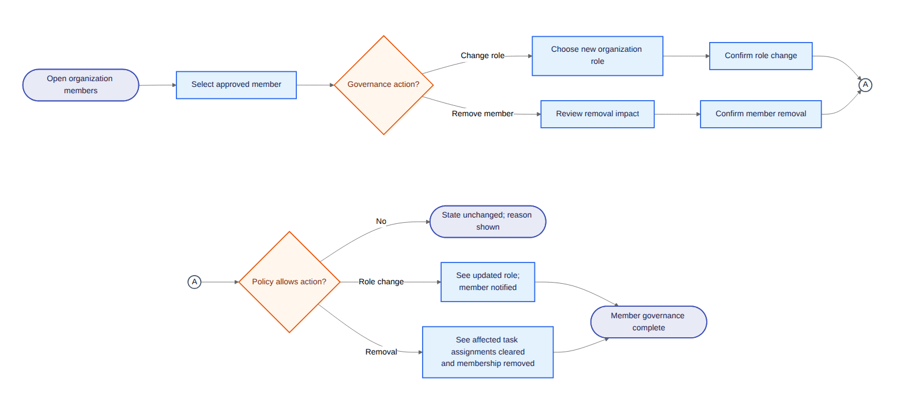

## 08-platform-support

### `uf_08_notification_center_journey`

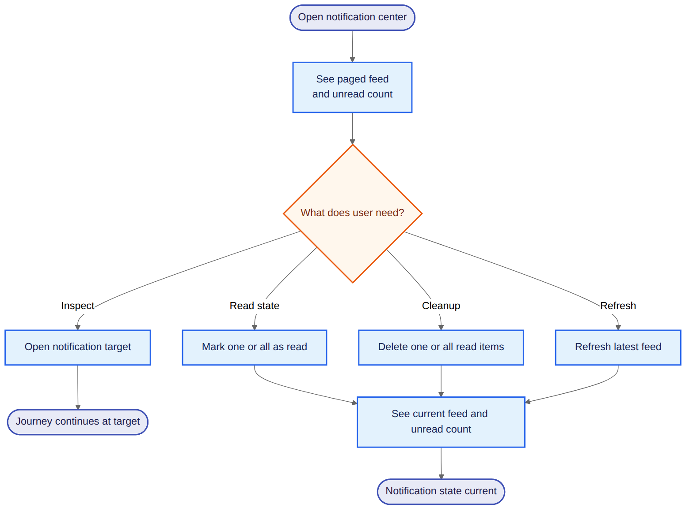

### `uf_08a_settings_preferences_journey`

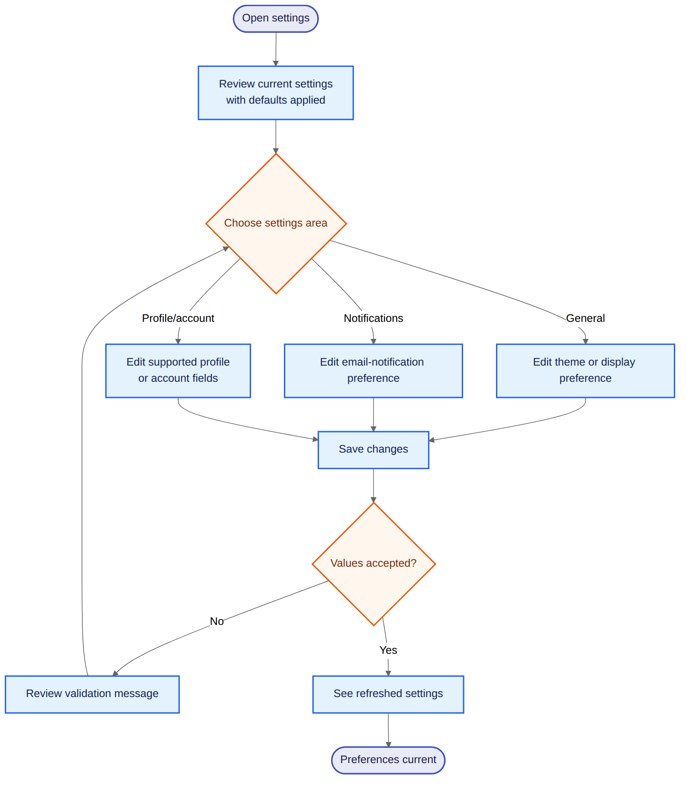

## 09-search

### `uf_09_global_search_journey`

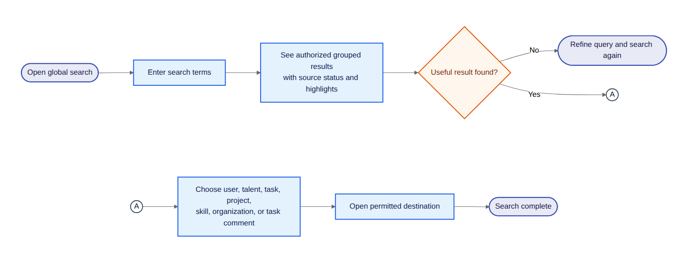

## 10-administration

### `uf_10_admin_governance_journey`

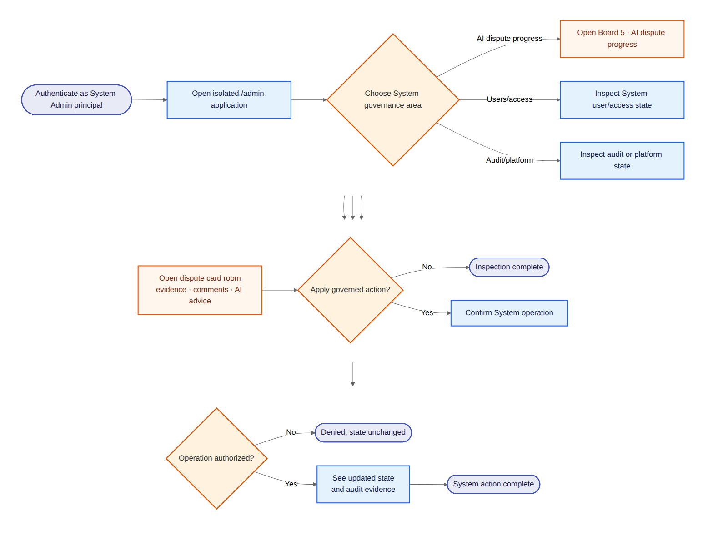

### `uf_10a_admin_access_inspection`

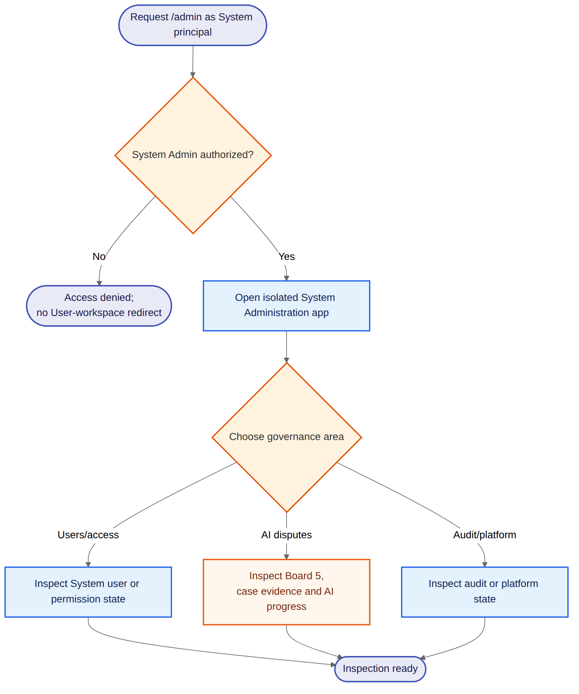

### `uf_10b_governed_action_result`

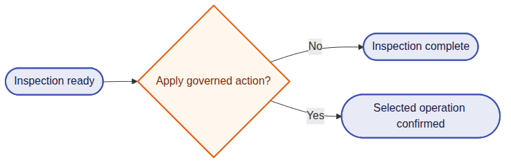

### `uf_10c_admin_action_execution`

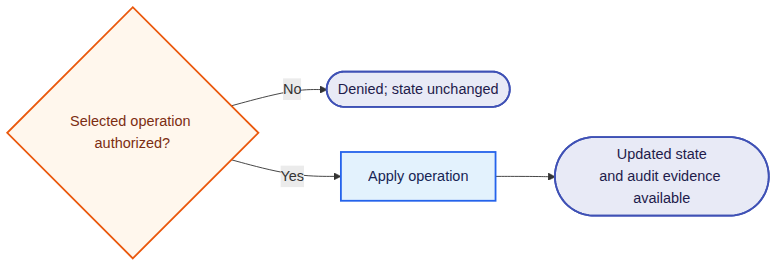
