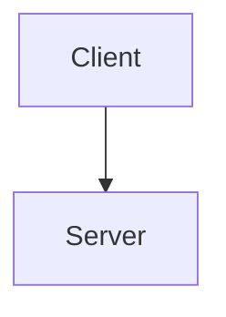

# Documentation Writing Standard For AI Agents

| Field | Value |
|---|---|
| Version | 1.1 |
| Last Updated | 2026-07-09 |
| Language | Tiếng Việt + technical English terms |
| Intended User | AI agent, maintainer, reviewer, student team, engineering team |
| Usage | Copy this file into `docs/` or pass it as a system/context guide to an AI agent. |

> **Purpose:** File này là chuẩn hướng dẫn để giao cho AI agent hoặc thành viên team viết, sửa, audit, và nâng cấp tài liệu dự án.
>
> **Scope:** Áp dụng cho toàn bộ `docs/`, `README.md`, tài liệu API, tài liệu yêu cầu, tài liệu kiến trúc, diagram, testing, security, operations, project management, evidence/audit, và generated documentation.
>
> **Primary Goal:** Tạo bộ docs đạt cả hai chuẩn:
>
> 1. **Chuẩn học thuật / đại học:** formal, traceable, có requirement, use case, diagram, test case, evaluation, limitation, evidence.
> 2. **Chuẩn công nghiệp:** maintainable, source-of-truth rõ, onboarding được, vận hành được, audit được, CI-check được, không bịa, không stale.

> **Writing Spirit:** Rõ, thật, dễ đọc, gần người. Không viết kiểu robot, không khoe chữ, không cứng ngắc vì form.

---

## 0. Non-Negotiable Rules For AI

AI agent phải tuân thủ các quy tắc sau. Không được bỏ qua.

### 0.0 Không được biến docs thành máy móc

Chuẩn này là khung định hướng, không phải cái lồng.

AI phải luôn ưu tiên:

- người đọc hiểu nhanh
- đọc một lần là nắm ý chính
- giọng văn tự nhiên, thân thiện, tôn trọng người đọc
- đúng mức formal cần thiết, không formal quá tay

AI không được:

- nhồi quá nhiều metadata vào file ngắn chỉ để “đúng form”
- biến mọi đoạn văn thành checklist cứng
- viết câu quá dài, nặng mùi báo cáo
- lặp cùng một công thức máy móc ở mọi file

Rule ngắn:

- tài liệu phải tin được
- nhưng vẫn phải đọc được

### 0.1 Không được bịa tài liệu

AI **MUST NOT** viết claim kiểu “hệ thống có X” nếu chưa có bằng chứng từ:

- source code
- route file
- test file
- database schema / migration / schema evidence
- config file
- existing docs đáng tin cậy
- runtime evidence
- issue/decision được cung cấp
- yêu cầu rõ ràng từ người dùng

Nếu chưa chắc, ghi rõ:

```md
Status: Unverified
Evidence: Not found in current repository snapshot
Action Needed: Confirm with maintainer or inspect runtime
```

### 0.2 Phải phân biệt fact, inference, assumption, recommendation

Mọi nội dung quan trọng phải thuộc một trong bốn nhóm:

| Loại | Ý nghĩa | Cách ghi |
|---|---|---|
| Fact | Đã có bằng chứng | `Evidence: start/routes/tasks.ts` |
| Inference | Suy luận từ bằng chứng | `Inference based on route/controller naming` |
| Assumption | Giả định tạm thời | `Assumption: pending maintainer confirmation` |
| Recommendation | Đề xuất cải thiện | `Recommendation: add OpenAPI contract` |

AI không được biến assumption thành fact.

### 0.3 Mỗi document phải có mục đích rõ

Không viết file chỉ vì “có vẻ cần”. Trước khi tạo/sửa document, AI phải trả lời:

```md
Why does this document exist?
Who reads it?
What decision or action does it support?
What is the source of truth?
How will it be verified?
When should it be updated?
```

Không nhất thiết phải in nguyên sáu câu hỏi này vào mọi file nếu làm file bị cứng. Nhưng AI phải tự trả lời được trước khi viết.

### 0.4 Không trộn nhiều loại docs vào một file

Một file chỉ nên có một vai trò chính:

- Tutorial
- How-to guide
- Reference
- Explanation
- Specification
- Decision record
- Evidence/audit
- Runbook
- Generated inventory

Không trộn API reference, business requirement, incident runbook, và audit report vào cùng một file.

### 0.5 Phải viết để người mới đọc được

Tài liệu tốt không phải để tác giả thấy thông minh, mà để người mới:

- hiểu được hệ thống
- chạy được dự án
- sửa được lỗi
- thêm được feature
- kiểm thử được
- deploy/rollback được
- review/audit được

Nếu người mới không biết bắt đầu từ đâu, docs chưa đạt.

### 0.5.1 Phải viết để người ngoài dự án đọc độc lập được

AI phải giả định có lúc toàn bộ `docs/` và diagram sẽ được tách riêng khỏi repository và gửi cho:

- giảng viên
- người viết report đồ án
- reviewer bên ngoài
- stakeholder không có quyền xem source code

Vì vậy, docs không được phụ thuộc vào việc “đọc code là sẽ hiểu”.

### 0.5.2 Phải giúp người đọc biết lúc nào đã đủ

AI nên ưu tiên viết sao cho người đọc biết:

- nên bắt đầu từ đâu
- đọc tới đoạn nào là đủ cho mục tiêu hiện tại
- lúc nào mới cần sang file khác, diagram khác, hay code để verify sâu hơn

Nếu một file buộc reader tiếp tục đọc lan man chỉ vì không biết “đã đủ chưa”, file đó chưa thân thiện đủ.

Rule bắt buộc:

- docs phải đủ context để người không có code vẫn hiểu ý chính
- docs phải giải thích thuật ngữ nội bộ, boundary, actor, flow, và caveat quan trọng
- docs có thể dẫn code như evidence, nhưng không được cần code để hiểu narrative chính
- nếu một đoạn chỉ có ý nghĩa khi mở code bên cạnh, phải viết lại

Mục tiêu:

- `docs/` phải gần như đóng vai trò “bản mô hình hóa có chú thích” của hệ thống
- đủ giàu thông tin để người ngoài dựa vào đó viết report học thuật hoặc báo cáo kỹ thuật
- vẫn trung thực về những gì chưa thể khẳng định

### 0.9 Ưu tiên rõ ràng hơn “đúng mẫu”

Nếu template và khả năng hiểu nhanh xung đột, ưu tiên khả năng hiểu nhanh.

Ví dụ:

- file overview có thể mở đầu bằng mental model ngắn thay vì lao ngay vào định nghĩa hàn lâm
- file runbook có thể ưu tiên “làm gì trước” thay vì phần bối cảnh dài
- file reference có thể liệt kê chặt chẽ, nhưng file explanation phải có nhịp đọc tự nhiên hơn

Chuẩn tốt là chuẩn giúp người đọc hành động đúng, không phải chuẩn làm file nhìn rất nghiêm túc nhưng khó dùng.

### 0.6 Không được tạo diagram nếu không có mục đích

Mỗi diagram phải có:

```md
Purpose:
Audience:
Scope:
Source of truth:
Last verified:
Related docs:
```

Diagram phải trả lời một câu hỏi cụ thể. Không tạo diagram chỉ để “cho đủ”.

Diagram cũng phải tuân thủ ba rule bắt buộc:

- `one level`: một file không được trộn overview level cao với implementation detail level thấp
- `one concern`: một file chỉ nên giải thích đúng một concern hoặc một scenario chính
- `one screen`: người đọc phải nhìn và hiểu ý chính trong một khung hình, không phải kéo/zoom liên tục

Nếu một diagram không còn giữ được ba rule này, phải tách file thay vì nhồi thêm.

### 0.7 Generated docs không được sửa tay

Nếu file được sinh tự động, phải ghi rõ:

```md
Generated: Yes
Generator: scripts/docs/generate-xxx.ts
Do Not Edit Manually: Yes
Source of Truth: tests/**, app/modules/**/tests/**
```

### 0.8 Tài liệu phải có lifecycle

Mỗi file quan trọng phải có:

- owner
- status
- last updated
- review cycle
- source of truth
- related requirements/tests
- stale risk

---

## 1. Documentation Philosophy

Docs chuẩn không phải là “nhiều file”. Docs chuẩn là một **hệ thống tri thức có điều hướng, có bằng chứng, có vòng đời, và có khả năng vận hành**.

Docs tốt cũng không nên nghe như văn bản hành chính kéo dài. Càng là tài liệu để cứu người lúc production lỗi, càng phải dễ quét, dễ tin, dễ làm theo.

Một bộ docs tốt phải đạt năm mục tiêu:

1. **Discoverability:** người đọc biết bắt đầu từ đâu.
2. **Correctness:** thông tin đúng với code/runtime hiện tại.
3. **Traceability:** requirement liên kết được tới design, API, database, test, và evidence.
4. **Maintainability:** khi code đổi, biết docs nào phải đổi.
5. **Operability:** team có thể setup, debug, deploy, monitor, rollback, và xử lý incident.

### 1.1 Clarity over ceremony

Khi viết docs, luôn ưu tiên thứ tự này:

1. hiểu nhanh
2. đúng sự thật
3. đủ chiều sâu để hành động
4. traceable
5. đẹp form

Nếu tài liệu rất đúng form nhưng người đọc vẫn mơ hồ, tài liệu đó thất bại.

### 1.2 Formal đúng chỗ, mềm đúng chỗ

Không phải file nào cũng cần giọng văn giống nhau.

Gợi ý:

- Requirement, audit, evidence, matrix: formal hơn
- Overview, onboarding, explanation, guide: tự nhiên hơn
- Runbook, incident doc: ngắn, dứt khoát, ưu tiên hành động
- User/admin guide: gần người, ít biệt ngữ hơn, giải thích theo vai trò

Mục tiêu là giúp đúng người đọc đúng cách, không ép mọi tài liệu vào cùng một giọng.

---

## 2. Two Standards To Satisfy

### 2.1 Academic / University Standard

Docs phải chứng minh được rằng dự án được phân tích, thiết kế, triển khai, kiểm thử, và đánh giá theo phương pháp kỹ thuật phần mềm.

Các artifact học thuật thường cần:

| Nhóm | Artifact nên có |
|---|---|
| Business analysis | BRD, PRD, scope, stakeholder analysis |
| Requirements engineering | SRS, functional requirements, non-functional requirements, business rules |
| System analysis | use case diagram, use case specifications, activity/state diagrams, DFD |
| Design | architecture document, SDD, class diagram, sequence diagram, ERD, database design |
| Implementation evidence | source map, module map, API catalog |
| Testing | test plan, test case specification, test case matrix, test execution report |
| Project management | project plan, roadmap, risk log, change request register, meeting minutes |
| Evaluation | limitations, future work, lessons learned, quality evaluation |

Academic docs phải có tính formal:

- ID cho requirement: `FR-TASK-001`, `NFR-SEC-001`
- ID cho use case: `UC-TASK-001`
- ID cho business rule: `BR-TASK-001`
- ID cho test case: `TC-TASK-001`
- Requirement Traceability Matrix: `Requirement → Use Case → Design → API/Code → Test → Evidence`

### 2.2 Industry Standard

Docs công nghiệp phải giúp team thật làm việc được, không chỉ để nộp.

Các artifact công nghiệp nên có:

| Nhóm | Artifact nên có |
|---|---|
| Onboarding | documentation portal, setup local, environment guide |
| Architecture | C4 views, ADRs, quality attributes, module boundaries |
| API contract | OpenAPI, endpoint catalog, error code reference, versioning policy |
| Security | threat model, access-control matrix, data classification, privacy, audit logging, OWASP ASVS mapping |
| Operations | deployment, runbook, monitoring, alerting, incident response, backup/restore, rollback, SLO/SLA |
| Quality | test strategy, CI gates, lint/link/Mermaid/OpenAPI validation |
| Governance | ownership, review cadence, change policy, generated docs policy, archive policy |
| Decision memory | ADRs, change request register, risk register |

Industry docs phải answer được:

- Ai sở hữu file này?
- Khi nào nó stale?
- CI có kiểm tra được không?
- Nếu production lỗi thì làm gì?
- Nếu feature đổi thì docs nào phải sửa?
- Contract giữa frontend/backend/QA là file nào?

---

## 3. Documentation Frameworks To Apply

Framework là công cụ hỗ trợ suy nghĩ, không phải khuôn bắt buộc copy nguyên xi.

Nếu bê nguyên framework vào file làm giảm khả năng đọc nhanh, AI phải rút gọn về đúng mức cần thiết.

### 3.1 Diátaxis: classify docs by user need

Mỗi tài liệu nên thuộc một trong bốn loại sau:

| Type | User need | Example |
|---|---|---|
| Tutorial | học bằng cách làm từ đầu | `getting-started.md` |
| How-to guide | hoàn thành một task cụ thể | `deploy-staging.md`, `add-new-route.md` |
| Reference | tra cứu chính xác | `openapi.yaml`, `env-vars.md`, `error-codes.md` |
| Explanation | hiểu lý do, mô hình, concept | `architecture-overview.md`, `domain-model.md` |

Rule:

- Tutorial không nên quá nhiều lý thuyết.
- How-to phải có step-by-step.
- Reference phải chính xác, đầy đủ, ít văn chương.
- Explanation phải giải thích “vì sao”, không phải checklist thao tác.
- Một file có thể nghiêng mạnh về một loại mà không cần cố gắn nhãn lộ liễu trong nội dung nếu làm file mất tự nhiên.

### 3.2 C4 Model: architecture by zoom level

Dùng C4 để vẽ kiến trúc theo cấp độ:

| Level | Purpose | File gợi ý |
|---|---|---|
| Context | hệ thống nằm trong môi trường nào | `c4-context.mmd` |
| Container | app/server/db/cache/external systems | `c4-container.mmd` |
| Component | module/service/component bên trong container | `c4-component-*.mmd` |
| Code | chi tiết class/function khi thật sự cần | hạn chế, dùng cho phần phức tạp |

Rule:

- Không nhảy vào class diagram trước khi có context/container.
- Mỗi diagram phải có text giải thích bên cạnh.
- Diagram phải chỉ rõ boundary và external dependency.
- Diagram level cao phải bao quát nhưng không quá đơn giản.
- Diagram level thấp phải cụ thể hơn, nhưng vẫn không được nhồi quá nhiều thứ vào cùng một file.

### 3.3 arc42-style architecture documentation

Dùng arc42 làm khung cho architecture docs:

1. Introduction and goals
2. Constraints
3. Context and scope
4. Solution strategy
5. Building block view
6. Runtime view
7. Deployment view
8. Cross-cutting concepts
9. Architecture decisions
10. Quality requirements
11. Risks and technical debt
12. Glossary

Không cần copy máy móc, nhưng architecture docs nên có đủ các view quan trọng.

### 3.4 Requirements Engineering

Requirement tốt phải có:

- unique ID
- clear statement
- source
- priority
- rationale
- acceptance criteria
- verification method
- trace links
- status

Format chuẩn:

```md
## FR-TASK-001 — Create Task

| Field | Value |
|---|---|
| Type | Functional Requirement |
| Priority | Must |
| Source | BRD-SCOPE-003 |
| Actor | Organization Member |
| Status | Approved |
| Verification | Integration Test + E2E |
| Related Use Case | UC-TASK-001 |
| Related API | POST /tasks |
| Related Test | TC-TASK-001, TC-TASK-002 |

### Requirement Statement

The system shall allow an authorized organization member to create a task inside a project.

### Acceptance Criteria

- Given the user is authenticated
- And the user belongs to the current organization
- And the project exists in the organization
- When the user submits valid task data
- Then the system creates the task
- And the task is visible in the project task list
- And an audit event is recorded if audit logging exists for this flow

### Evidence

- `start/routes/tasks.ts`
- `app/modules/tasks/...`
- `app/modules/tasks/tests/...`
```

### 3.5 API contract standard

For HTTP APIs, prefer machine-readable contract:

```txt
openapi.yaml
```

Every endpoint should document:

- method
- path
- purpose
- auth requirement
- permission requirement
- request parameters
- request body schema
- response schema
- error cases
- rate limiting / throttling
- examples
- related requirement
- related test
- owner
- status

### 3.6 Security documentation standard

Security docs must include:

- threat model
- trust boundaries
- assets
- attackers/abuse cases
- authentication/session model
- authorization/access-control matrix
- data classification
- privacy and retention
- audit logging
- security test plan
- OWASP ASVS mapping for web apps

---

## 4. Recommended Folder Structure

Use this as target structure. Existing repos may migrate gradually.

```txt
docs/
  README.md

  00-overview/
    product-overview.md
    documentation-map.md
    glossary.md

  01-business/
    brd.md
    prd.md
    scope.md
    stakeholders.md
    business-rules.md

  02-requirements/
    srs.md
    functional-requirements.md
    non-functional-requirements.md
    use-case-specifications.md
    requirements-traceability-matrix.md

  03-architecture/
    architecture-overview.md
    quality-attributes.md
    runtime-view.md
    deployment-view.md
    module-boundaries.md
    adr/
      ADR-0001-example.md

  04-design/
    information-architecture.md
    navigation-structure.md
    screen-inventory.md
    screen-specifications.md
    design-system.md
    wireframes/
    prototypes/

  05-api/
    README.md
    openapi.yaml
    endpoint-catalog.md
    error-codes.md
    versioning-policy.md

  06-data/
    database-design.md
    erd.md
    data-dictionary.md
    migration-policy.md
    retention-policy.md

  07-security/
    security-overview.md
    threat-model.md
    access-control-matrix.md
    data-classification.md
    privacy.md
    audit-logging.md
    owasp-asvs-mapping.md

  08-testing/
    test-strategy.md
    test-plan.md
    test-case-specification.md
    test-case-matrix.md
    test-execution-report.md
    regression-strategy.md
    performance-test-plan.md
    security-test-plan.md
    generated/

  09-operations/
    deployment.md
    environment.md
    runbook.md
    monitoring.md
    alerting.md
    incident-response.md
    backup-restore.md
    rollback.md
    slo-sla.md

  10-project-management/
    project-plan.md
    roadmap.md
    risk-register.md
    change-request-register.md
    meeting-minutes.md

  11-diagrams/
    README.md
    canonical/
    detailed/
    generated/

  12-evidence/
    source-register.md
    coverage-matrix.md
    drift-register.md
    audits/

  templates/
    document-template.md
    requirement-template.md
    use-case-template.md
    test-case-template.md
    adr-template.md
    runbook-template.md
```

Đây là target structure, không phải mệnh lệnh phải đủ mọi file ngay lập tức.

AI không được tạo thêm file chỉ để “đủ bộ” nếu:

- chưa có source of truth đủ mạnh
- nội dung sẽ trùng file khác
- file mới làm navigation rối hơn
- người đọc không thực sự cần file đó để hiểu hoặc hành động

---

## 5. Document Classes

Every file must have a class.

| Class | Meaning | Edit policy |
|---|---|---|
| Canonical | official source for a domain | update when domain changes |
| Reference | lookup material | keep exact and complete |
| Guide | task-oriented instructions | test steps regularly |
| Explanation | conceptual understanding | update when model changes |
| Decision | records decision and rationale | append new ADR, do not rewrite history casually |
| Evidence | audit/output proving current state | timestamp and archive old audits |
| Generated | produced from code/scripts | do not edit manually |
| Archive | historical, no longer active | mark as archived |

Recommended metadata:

```md
---
title: Example Document
doc_type: canonical
status: draft
owner: backend-team
reviewers:
  - qa
  - architect
last_updated: 2026-07-08
review_cycle: monthly
source_of_truth:
  - start/routes/*.ts
  - app/modules/**
related_requirements:
  - FR-EXAMPLE-001
related_tests:
  - tests/example.spec.ts
generated: false
stale_risk: medium
---
```

If frontmatter is not used, use a Markdown table:

```md
| Field | Value |
|---|---|
| Document Type | Canonical |
| Status | Draft |
| Owner | Backend Team |
| Last Updated | 2026-07-08 |
| Review Cycle | Monthly |
| Source of Truth | `start/routes/*.ts`, `app/modules/**` |
| Generated | No |
| Stale Risk | Medium |
```

---

## 6. Writing Process For AI

AI must follow this process for every docs task.

### Step 1 — Understand the request

Classify the task:

| User request | Action |
|---|---|
| “Viết docs cho feature X” | create/update feature spec + requirement/test links |
| “Chuẩn hoá folder docs” | audit structure + propose migration + update portal |
| “Tạo API docs” | inspect routes/controllers + generate endpoint catalog/OpenAPI draft |
| “Vẽ diagram” | identify purpose + choose diagram type + cite source |
| “Bổ sung chuẩn đại học” | add formal SRS/use case/test case/RTM |
| “Bổ sung chuẩn công nghiệp” | add ADR/OpenAPI/runbook/security/ops/governance |

### Step 2 — Locate sources

Before writing, inspect:

```txt
README.md
package.json
start/routes/**
app/modules/**
config/**
database/migrations/**
database/schema/**
tests/**
inertia/**
docs/**
```

For each claim, record evidence.

### Step 3 — Decide the document type

Choose one primary type:

- tutorial
- how-to
- reference
- explanation
- specification
- decision record
- evidence/audit
- runbook

Do not mix unless necessary.

### Step 4 — Choose template

Use the correct template from this file.

### Step 5 — Write with traceability

For every major section, add:

```md
Evidence:
- `path/to/file.ts`
- `path/to/test.spec.ts`

Related:
- Requirement: `FR-...`
- Test: `TC-...`
- Diagram: `docs/11-diagrams/...`
```

### Step 6 — Mark gaps honestly

Use:

```md
## Known Gaps

| Gap | Impact | Recommendation | Priority |
|---|---|---|---|
| OpenAPI contract missing | Frontend/QA cannot rely on machine-readable API contract | Add `docs/api/openapi.yaml` | High |
```

### Step 7 — Validate output

Before final output, check:

- links are valid relative paths
- headings are consistent
- diagram filenames exist or are clearly proposed
- generated files are marked generated
- source-of-truth is clear
- no unsupported claim exists
- document has owner/status/date/audience
- document has next actions if incomplete

---

## 7. Writing Style Rules

### 7.1 Tone

Use professional, direct Vietnamese.

Good:

```md
Tài liệu này mô tả contract hiện tại của Task API dựa trên route files và controller implementation.
```

Bad:

```md
Tài liệu này sẽ giúp bạn hiểu tất cả mọi thứ một cách hoàn hảo.
```

### 7.2 Sentence style

Prefer:

- short sentences
- clear tables
- explicit status
- evidence after claims
- examples when useful

Avoid:

- vague words: “có vẻ”, “rất xịn”, “chuẩn chỉnh” without criteria
- unsupported claims: “production-ready” if no deployment/monitoring/incident docs exist
- motivational filler
- long paragraphs without structure

### 7.3 Headings

Use numbered sections for long canonical docs:

```md
# Software Requirements Specification

## 1. Introduction
## 2. System Context
## 3. Functional Requirements
## 4. Non-Functional Requirements
## 5. External Interface Requirements
## 6. Traceability
## 7. Known Gaps
```

Use action headings for how-to guides:

```md
# How To Deploy Staging

## Prerequisites
## Step 1 — Pull latest code
## Step 2 — Configure runtime configs
## Step 3 — Run migrations
## Step 4 — Smoke test
## Rollback
## Troubleshooting
```

### 7.4 Tables

Use tables for comparison, traceability, status, and mapping.

Do not use tables for long prose.

### 7.5 Code blocks

Use language tags:

```bash
pnpm install
pnpm run test
```

```env
DATABASE_CONNECTION_PLACEHOLDER=
REDIS_URL=
```



---

## 8. Documentation Portal Standard

Root `docs/README.md` is mandatory.

It must answer:

- What is this docs system?
- Who should read what?
- What are canonical documents?
- What is generated?
- What is archived?
- How to update docs?
- What quality gates exist?

Template:

```md
# Documentation Portal

## Read By Role

### New Developer
1. `00-overview/product-overview.md`
2. `development/setup-local.md`
3. `03-architecture/architecture-overview.md`
4. `05-api/endpoint-catalog.md`
5. `08-testing/test-strategy.md`

### QA Engineer
1. `02-requirements/requirements-traceability-matrix.md`
2. `08-testing/test-plan.md`
3. `08-testing/test-case-matrix.md`
4. `08-testing/test-execution-report.md`

### University Reviewer
1. `01-business/brd.md`
2. `02-requirements/srs.md`
3. `02-requirements/use-case-specifications.md`
4. `03-architecture/architecture-overview.md`
5. `06-data/database-design.md`
6. `08-testing/test-case-specification.md`

### Operator / Maintainer
1. `09-operations/deployment.md`
2. `09-operations/runbook.md`
3. `09-operations/incident-response.md`
4. `09-operations/backup-restore.md`
5. `09-operations/rollback.md`

## Canonical Source Of Truth

| Area | Canonical Document | Source Evidence |
|---|---|---|
| Requirements | `02-requirements/srs.md` | business docs, route/code/test evidence |
| Architecture | `03-architecture/architecture-overview.md` | code layout, config, diagrams |
| API | `05-api/openapi.yaml` | route files, controllers, tests |
| Database | `06-data/database-design.md` | migrations/schema/models |
| Testing | `08-testing/test-strategy.md` | test files, CI commands |
| Security | `07-security/security-overview.md` | auth/config/middleware/tests |
| Operations | `09-operations/runbook.md` | deployment scripts/config/runtime |

## Document Classes

- Canonical
- Reference
- Guide
- Explanation
- Decision
- Evidence
- Generated
- Archive

## How To Update Docs

1. Identify changed source.
2. Identify impacted docs.
3. Update canonical doc first.
4. Update diagrams and reference docs.
5. Update traceability matrix.
6. Run docs quality checks.
```

---

## 9. Business / Product Documentation

### 9.1 BRD Template

```md
# Business Requirements Document

| Field | Value |
|---|---|
| Document Type | BRD |
| Status | Draft / Approved |
| Owner | Product Owner |
| Audience | Stakeholders, reviewers, product team |
| Last Updated | YYYY-MM-DD |

## 1. Business Context

Why does this product/project exist?

## 2. Problem Statement

What problem is being solved?

## 3. Goals

| Goal ID | Goal | Success Metric |
|---|---|---|
| BG-001 | ... | ... |

## 4. Stakeholders

| Stakeholder | Need | Concern |
|---|---|---|

## 5. Scope

### In Scope

- ...

### Out Of Scope

- ...

## 6. Business Requirements

| ID | Requirement | Priority | Source |
|---|---|---|---|
| BR-001 | ... | Must | stakeholder interview |

## 7. Business Rules

| ID | Rule | Applies To | Evidence |
|---|---|---|---|

## 8. Risks

| Risk | Impact | Mitigation |
|---|---|---|

## 9. Related Documents

- SRS
- PRD
- Roadmap
```

### 9.2 PRD Template

```md
# Product Requirements Document

## 1. Product Summary

## 2. Personas

| Persona | Goal | Pain Point |
|---|---|---|

## 3. User Problems

## 4. User Stories

| ID | User Story | Acceptance Criteria | Priority |
|---|---|---|---|
| US-001 | As a ..., I want ..., so that ... | ... | Must |

## 5. Feature Scope

## 6. UX / Screen Impact

## 7. API / Data Impact

## 8. Analytics / Metrics

## 9. Launch Criteria

## 10. Open Questions
```

---

## 10. Requirements Documentation

### 10.1 SRS Minimum Structure

```md
# Software Requirements Specification

## 1. Introduction

### 1.1 Purpose
### 1.2 Scope
### 1.3 Definitions
### 1.4 References

## 2. Overall Description

### 2.1 Product Perspective
### 2.2 User Classes
### 2.3 Operating Environment
### 2.4 Constraints
### 2.5 Assumptions and Dependencies

## 3. Functional Requirements

## 4. Non-Functional Requirements

## 5. External Interface Requirements

### 5.1 User Interfaces
### 5.2 API Interfaces
### 5.3 Software Interfaces
### 5.4 Communication Interfaces

## 6. Data Requirements

## 7. Security Requirements

## 8. Traceability Matrix

## 9. Known Gaps
```

### 10.2 Requirement Quality Checklist

A requirement is acceptable only if it is:

| Quality | Meaning |
|---|---|
| Necessary | needed by stakeholder/system goal |
| Unambiguous | one clear interpretation |
| Feasible | implementable within constraints |
| Verifiable | can be tested/reviewed |
| Traceable | links to source and tests |
| Atomic | not multiple requirements mixed together |
| Consistent | does not conflict with other requirements |

### 10.3 Functional Requirement Template

```md
## FR-AREA-001 — Short Name

| Field | Value |
|---|---|
| Type | Functional Requirement |
| Priority | Must / Should / Could |
| Source | BR-... / PRD-... / Stakeholder / Code evidence |
| Actor | ... |
| Status | Draft / Approved / Deprecated |
| Verification | Unit / Integration / E2E / Review |
| Related Use Case | UC-... |
| Related API | METHOD /path |
| Related Test | TC-... |

### Statement

The system shall ...

### Acceptance Criteria

- Given ...
- When ...
- Then ...

### Evidence

- `path/to/source`

### Notes

...
```

### 10.4 Non-Functional Requirement Template

```md
## NFR-PERF-001 — Page Response Time

| Field | Value |
|---|---|
| Quality Attribute | Performance |
| Priority | Must |
| Measurement | p95 response time |
| Target | <= 500ms under defined load |
| Verification | Performance test |
| Status | Draft |

### Requirement

The system shall return the task list page within 500ms at p95 under 100 concurrent users in staging-like environment.

### Measurement Method

Describe how to measure.

### Evidence

- test result path
- monitoring dashboard
```

### 10.5 Requirement Traceability Matrix Template

```md
# Requirements Traceability Matrix

| Requirement ID | Requirement | Use Case | Design | API / UI | Data | Test Case | Evidence | Status |
|---|---|---|---|---|---|---|---|---|
| FR-TASK-001 | Create task | UC-TASK-001 | Task workflow | POST /tasks | tasks table | TC-TASK-001 | create_task.spec.ts | Covered |
```

Status values:

- `Covered`
- `Partially Covered`
- `Not Covered`
- `Unverified`
- `Deprecated`

---

## 11. Use Case Documentation

### 11.1 Use Case Specification Template

```md
# UC-TASK-001 — Create Task

| Field | Value |
|---|---|
| Primary Actor | Organization Member |
| Supporting Actors | Project Manager |
| Goal | Create a task in a project |
| Related Requirements | FR-TASK-001 |
| Priority | Must |
| Status | Approved |

## Preconditions

- User is authenticated.
- User belongs to the current organization.
- User has permission to create task.
- Project exists.

## Trigger

User chooses to create a new task.

## Main Success Scenario

1. User opens task creation screen.
2. System displays task form.
3. User enters valid task information.
4. User submits the form.
5. System validates input.
6. System creates task.
7. System redirects user to task detail or task list.

## Alternative Flows

### A1 — Invalid Input

1. User submits missing/invalid fields.
2. System shows validation errors.
3. Task is not created.

### A2 — Unauthorized User

1. User without permission submits task.
2. System denies the request.

## Postconditions

- Task exists in database.
- Task appears in project context.
- Audit/log event is recorded if implemented.

## Related Tests

- TC-TASK-001
- TC-TASK-002

## Evidence

- `start/routes/tasks.ts`
- `app/modules/tasks/...`
```

### 11.2 Use Case Diagram Rules

Use case diagrams must show:

- actors
- system boundary
- use cases
- include/extend only when meaningful
- permission boundaries if important

Do not overload one diagram with every feature. Split by domain.

---

## 12. Architecture Documentation

### 12.1 Architecture Overview Template

```md
# Architecture Overview

| Field | Value |
|---|---|
| Document Type | Architecture Canonical |
| Status | Draft / Approved |
| Owner | Architecture / Tech Lead |
| Last Updated | YYYY-MM-DD |
| Source of Truth | code layout, configs, deployment files |

## 1. Introduction And Goals

## 2. Constraints

| Constraint | Impact |
|---|---|

## 3. Context And Scope

### Business Context

### Technical Context

## 4. Solution Strategy

## 5. Building Block View

### Level 1 — System
### Level 2 — Containers
### Level 3 — Components / Modules

## 6. Runtime View

Important runtime scenarios:

- login flow
- create task flow
- review submission flow
- notification flow

## 7. Deployment View

## 8. Cross-Cutting Concepts

- authentication
- authorization
- validation
- error handling
- logging/audit
- caching
- transactions

## 9. Architecture Decisions

Link to ADRs.

## 10. Quality Attributes

| Attribute | Requirement | Tactic | Evidence |
|---|---|---|---|

## 11. Risks And Technical Debt

## 12. Glossary
```

### 12.2 ADR Template

```md
# ADR-0001: Use Modular Monolith Architecture

| Field | Value |
|---|---|
| Status | Proposed / Accepted / Deprecated / Superseded |
| Date | YYYY-MM-DD |
| Decision Owner | Tech Lead |
| Related Requirements | NFR-MAINT-001 |
| Supersedes | None |

## Context

What problem or force led to this decision?

## Decision

What has been decided?

## Alternatives Considered

| Alternative | Pros | Cons | Reason Rejected |
|---|---|---|---|

## Consequences

### Positive

- ...

### Negative

- ...

### Neutral / Trade-offs

- ...

## Evidence

- `app/modules/**`
- `docs/11-diagrams/Package/...`

## Review Trigger

Revisit this ADR if deployment scaling requirements change.
```

### 12.3 Architecture Diagram Rules

Each architecture diagram must include:

````md
# Diagram: C4 Container

## Purpose

## Audience

## Scope

## Source Of Truth

## Diagram

```mermaid
...
```

## Explanation

## Related Docs
````

Mermaid `.mmd` files should have a companion catalog entry explaining purpose and source.

---

## 13. API Documentation

### 13.1 API Folder Standard

Recommended files:

```txt
docs/api/
  README.md
  openapi.yaml
  endpoint-catalog.md
  error-codes.md
  auth-and-permissions.md
  versioning-policy.md
  examples/
```

### 13.2 Endpoint Template

````md
## POST /tasks

| Field | Value |
|---|---|
| Purpose | Create a task |
| Auth | Required |
| Permission | Organization member with task create permission |
| Requirement | FR-TASK-001 |
| Use Case | UC-TASK-001 |
| Controller | `...` |
| Test | `...` |
| Status | Confirmed / Draft / Deprecated |

### Request

#### Headers

| Name | Required | Description |
|---|---|---|
| Cookie / Authorization | Yes | Session/auth context |

#### Body

```json
{
  "project_id": "uuid",
  "title": "Example task",
  "description": "..."
}
```

### Response

#### 201 Created

```json
{
  "id": "uuid",
  "title": "Example task"
}
```

### Errors

| Status | Code | Meaning |
|---|---|---|
| 400 | VALIDATION_ERROR | Invalid input |
| 401 | UNAUTHENTICATED | Missing auth |
| 403 | FORBIDDEN | No permission |

### Side Effects

- Task row created
- Audit event emitted if implemented

### Evidence

- `start/routes/tasks.ts`
- `app/modules/tasks/controllers/...`
- `app/modules/tasks/tests/...`
````

### 13.3 OpenAPI Rules

If route surface is stable, create/update `openapi.yaml`.

Minimum quality:

- valid OpenAPI version
- servers
- tags
- paths
- parameters
- requestBodies
- responses
- schemas
- securitySchemes
- reusable error schema

Do not write OpenAPI payload schemas unless confirmed from validators/controllers/models or maintainer instructions.

---

## 14. Database And Data Documentation

### 14.1 Database Design Template

```md
# Database Design And Data Dictionary

## 1. Overview

## 2. ERD

Link to ERD diagrams.

## 3. Tables

### users

| Column | Type | Nullable | Default | Description | Source |
|---|---|---|---|---|---|
| id | uuid | no | generated | primary identifier | migration |

## 4. Relationships

| From | To | Type | Enforced By | Notes |
|---|---|---|---|---|

## 5. Indexes And Constraints

## 6. Data Lifecycle

## 7. Data Classification

## 8. Migration Policy

## 9. Known Gaps
```

### 14.2 ERD Rules

- Draw physical FK only if DB constraint exists.
- If relationship is enforced by application logic, label it as app-level relation.
- Keep large ERD split by domain.
- Maintain one canonical ERD index.
- ERD nên đọc theo ba level:
  - conceptual: entity/domain lớn
  - logical: structure và quan hệ chính
  - physical: table/column/constraint thực lưu
- Không gộp toàn bộ hệ thống vào một ERD detail duy nhất.
- Nếu người đọc không xem được gần trọn diagram trong một khung hình, phải tách tiếp theo domain slice.

### 14.3 Legacy Narrative Retirement Rules

Khi repository có tài liệu narrative cũ ở root hoặc ở taxonomy cũ:

- không được tiếp tục xem chúng là source of truth chính
- phải audit chúng với code/tests/schema hiện tại
- chỉ hấp thụ phần còn đúng vào `docs/`
- phải tạo note hoặc audit file chỉ rõ:
  - phần nào đã được hấp thụ
  - phần nào bị loại vì stale hoặc chưa đủ bằng chứng
  - xóa file cũ có an toàn chưa

Nguyên tắc:

- legacy file là input để đối chiếu
- `docs/` hiện hành mới là nơi người đọc cuối phải tin

---

## 15. Security Documentation

### 15.1 Security Overview Template

```md
# Security Overview

## 1. Scope

## 2. Security Goals

| Goal | Description |
|---|---|

## 3. Assets

| Asset | Sensitivity | Protection Needed |
|---|---|---|

## 4. Trust Boundaries

## 5. Authentication

## 6. Authorization

## 7. Session Management

## 8. Input Validation

## 9. Error Handling

## 10. Data Protection

## 11. Audit Logging

## 12. Threat Model

## 13. Security Test Evidence

## 14. Known Risks
```

### 15.2 Threat Model Template

```md
# Threat Model

## System Scope

## Assets

| Asset | Description | Sensitivity |
|---|---|---|

## Actors

| Actor | Capability | Trust Level |
|---|---|---|

## Trust Boundaries

| Boundary | Description | Risk |
|---|---|---|

## Threats

| ID | Threat | Scenario | Control | Verification | Residual Risk |
|---|---|---|---|---|---|
| TH-001 | Unauthorized organization access | User attempts to access another org's project | org resolver + permission middleware | integration test | Medium |

## Abuse Cases

## Security Requirements Mapping

## Open Risks
```

### 15.3 Access Control Matrix Template

```md
# Access Control Matrix

| Resource | Action | Anonymous | Authenticated User | Org Member | Org Admin | System Admin | Evidence |
|---|---|---|---|---|---|---|
| Task | Create | No | No | Yes | Yes | Yes | routes + middleware |
```

### 15.4 Data Classification Template

```md
# Data Classification

| Data | Classification | Examples | Storage | Retention | Access Control | Notes |
|---|---|---|---|---|---|---|
| User email | Personal Data | email address | users table | account lifetime | owner/admin | privacy concern |
```

---

## 16. Testing Documentation

### 16.1 Test Strategy Template

```md
# Test Strategy

## 1. Purpose

## 2. Test Levels

| Level | Purpose | Tool | Scope |
|---|---|---|---|
| Unit | function/module behavior | ... | isolated logic |
| Integration | module + DB/API behavior | ... | core backend flows |
| Contract | API/schema/contract | ... | frontend-backend boundary |
| E2E | user journeys | ... | browser workflows |
| Security | security controls | ... | auth/access/input |
| Performance | non-functional performance | ... | response time/load |

## 3. Test Environments

## 4. Test Data Strategy

## 5. Automation Strategy

## 6. Manual Testing Strategy

## 7. CI Quality Gates

## 8. Risk-Based Testing

## 9. Traceability
```

### 16.2 Test Case Template

```md
# TC-TASK-001 — Create Task Successfully

| Field | Value |
|---|---|
| Requirement | FR-TASK-001 |
| Use Case | UC-TASK-001 |
| Test Level | Integration / E2E |
| Priority | High |
| Automation | Automated / Manual |
| Status | Active |

## Preconditions

- User exists.
- User is authenticated.
- Organization exists.
- Project exists.

## Test Data

| Field | Value |
|---|---|
| title | Example task |

## Steps

1. Open task creation page.
2. Fill required fields.
3. Submit form.

## Expected Result

- Task is created.
- User sees task detail or task list.
- Database contains new task.

## Actual Result

Pending / Passed / Failed.

## Evidence

- `app/modules/tasks/tests/backend/integration/create_task.spec.ts`
```

### 16.3 Test Execution Report Template

```md
# Test Execution Report

| Field | Value |
|---|---|
| Date | YYYY-MM-DD |
| Commit | ... |
| Environment | local/staging/CI |
| Tester | ... |

## Summary

| Suite | Total | Passed | Failed | Skipped | Duration |
|---|---:|---:|---:|---:|---:|

## Failed Tests

| Test | Failure | Impact | Owner | Fix Status |
|---|---|---|---|---|

## Coverage Notes

## Risks

## Sign-off
```

---

## 17. Operations Documentation

### 17.1 Operations Folder Standard

```txt
docs/operations/
  deployment.md
  environment.md
  runbook.md
  monitoring.md
  alerting.md
  incident-response.md
  backup-restore.md
  rollback.md
  disaster-recovery.md
  slo-sla.md
```

### 17.2 Deployment Template

```md
# Deployment Guide

## 1. Scope

## 2. Environments

| Environment | Purpose | URL | Database | Owner |
|---|---|---|---|---|

## 3. Prerequisites

## 4. Required Credentials / Environment Variables

| Name | Required | Example | Source | Notes |
|---|---|---|---|---|

## 5. Deployment Steps

## 6. Database Migration Steps

## 7. Smoke Tests

## 8. Rollback

## 9. Troubleshooting

## 10. Evidence
```

### 17.3 Runbook Template

````md
# Runbook

## Service Overview

## Health Checks

| Check | Command / URL | Expected Result |
|---|---|---|

## Common Incidents

### Incident: Database connection failure

#### Symptoms

#### Impact

#### Diagnosis

```bash
...
```

#### Mitigation

#### Escalation

#### Post-Incident Actions
````

### 17.4 Incident Response Template

```md
# Incident Response

## Severity Levels

| Severity | Definition | Response Time | Examples |
|---|---|---|---|
| P0 | full outage/data loss/security breach | immediate | production unavailable |
| P1 | major feature broken | same day | users cannot create tasks |
| P2 | degraded function | next business day | slow dashboard |

## Incident Process

1. Detect
2. Triage
3. Assign owner
4. Communicate
5. Mitigate
6. Resolve
7. Postmortem

## Communication Template

## Postmortem Template
```

### 17.5 Backup / Restore Template

```md
# Backup And Restore

## Backup Scope

| Data | Backup Method | Frequency | Retention | Owner |
|---|---|---|---|---|

## Restore Procedure

## Restore Validation

## Disaster Recovery Notes

## Last Restore Drill
```

---

## 18. Project Management Documentation

### 18.1 Project Plan Template

```md
# Project Plan

## 1. Objectives

## 2. Scope

## 3. Milestones

| Milestone | Date | Deliverable | Status |
|---|---|---|---|

## 4. Roles And Responsibilities

## 5. Timeline

## 6. Risk Management

## 7. Communication Plan

## 8. Change Control
```

### 18.2 Risk Register Template

```md
# Risk Register

| ID | Risk | Probability | Impact | Severity | Mitigation | Owner | Status |
|---|---|---|---|---|---|---|---|
```

### 18.3 Change Request Template

```md
# Change Request Register

| ID | Date | Request | Reason | Impact | Decision | Owner | Status |
|---|---|---|---|---|---|---|---|
```

---

## 19. Evidence And Audit Documentation

### 19.1 Evidence Rules

Evidence docs should answer:

- What was checked?
- When was it checked?
- Against which source snapshot?
- What passed?
- What failed?
- What is uncertain?
- What should be fixed next?

### 19.2 Source Register Template

```md
# Source Register

| Source | Type | Purpose | Used By Docs | Last Verified | Notes |
|---|---|---|---|---|---|
| `start/routes/tasks.ts` | Code | Task route source | API docs, SRS, test matrix | YYYY-MM-DD | Confirmed |
```

### 19.3 Documentation Audit Template

```md
# Documentation Audit — YYYY-MM-DD

## Scope

## Method

## Summary

| Area | Status | Findings | Recommendation |
|---|---|---|---|

## Detailed Findings

## Critical Gaps

## Next Actions

## Evidence
```

---

## 20. Diagram Standards

### 20.1 Diagram Types And When To Use

| Diagram | Use when | Avoid when |
|---|---|---|
| Rich Picture | early problem/stakeholder understanding | technical precision is required |
| Use Case | actor goals and system boundary | showing sequence or data model |
| Activity | workflow and branching | showing object structure |
| Sequence | runtime interaction over time | showing static dependencies |
| State | lifecycle/status transitions | showing normal CRUD list |
| Class | domain object structure | DB schema is the real topic |
| ERD | tables, columns, relationships | domain behavior is the topic |
| DFD | data movement and stores | code module dependencies are the topic |
| C4 Context | external system boundary | detailed module logic |
| C4 Container | runtime deployable units | function-level internals |
| C4 Component | internal components/modules | DB schema or user flow |
| Deployment | infrastructure topology | business process |

### 20.2 Diagram File Naming

Use prefixes:

```txt
c4_context_system.mmd
c4_container_runtime.mmd
seq_task_create.mmd
state_task_lifecycle.mmd
erd_task_marketplace.mmd
uc_org_membership.mmd
dfd_review_pipeline.mmd
```

### 20.3 Diagram Catalog Entry

```md
| Diagram | Type | Purpose | Audience | Source | Status |
|---|---|---|---|---|---|
| `seq_task_create.mmd` | Sequence | Create task runtime flow | Developer/QA | routes + controller + test | Approved |
```

---

## 21. Docs Governance

### 21.1 Ownership

Every canonical document must have an owner.

| Area | Owner |
|---|---|
| Requirements | Product/BA |
| Architecture | Tech Lead/Architect |
| API | Backend Lead |
| Database | Backend/Data Lead |
| Testing | QA Lead |
| Security | Security/Tech Lead |
| Operations | DevOps/Maintainer |
| Project Management | Project Manager |

### 21.2 Status Values

Use consistent statuses:

| Status | Meaning |
|---|---|
| Draft | not yet reviewed |
| Review | ready for review |
| Approved | accepted source of truth |
| Deprecated | replaced but kept for history |
| Archived | historical only |
| Generated | machine generated |
| Unverified | not confirmed against source |

### 21.3 Review Cycle

| Document Type | Review Cycle |
|---|---|
| README / portal | every release |
| SRS / requirements | every feature milestone |
| Architecture | monthly or major architecture change |
| API | every API change |
| Security | monthly or security-sensitive change |
| Operations | every deployment/process change |
| Test docs | every test strategy or major feature change |
| Evidence/audit | per audit run |

### 21.4 Change Policy

When code changes, update docs in this order:

1. Canonical doc
2. API/data/security/ops reference docs
3. Diagrams
4. Test matrix / traceability matrix
5. Evidence/audit docs
6. Documentation portal links

---

## 22. Docs Quality Gates

Recommended CI checks:

```txt
markdown lint
relative link check
Mermaid render validation
OpenAPI validation
JSON/YAML validation
frontmatter schema validation
spell check / terminology check
generated docs freshness check
```

### 22.1 Markdown Quality Checklist

Before approving a Markdown file:

- [ ] Has title
- [ ] Has document type
- [ ] Has status
- [ ] Has audience
- [ ] Has owner or maintainer
- [ ] Has last updated date
- [ ] Has purpose
- [ ] Has scope and out-of-scope when needed
- [ ] Has source-of-truth/evidence
- [ ] Has related docs
- [ ] Has known gaps if incomplete
- [ ] Links work
- [ ] No unsupported claims
- [ ] No stale generated content edited manually

### 22.2 Traceability Checklist

- [ ] Every functional requirement has ID
- [ ] Every requirement links to source/business need
- [ ] Every major requirement has acceptance criteria
- [ ] Every major requirement has verification method
- [ ] Every use case links to requirements
- [ ] Every major API links to requirement/test
- [ ] Every major test links to requirement/use case
- [ ] Every diagram has source and purpose

### 22.3 Industrial Readiness Checklist

- [ ] Root docs portal exists
- [ ] Canonical documents are identified
- [ ] Generated docs are marked
- [ ] ADRs exist for major decisions
- [ ] API contract exists or gap is declared
- [ ] Threat model exists or gap is declared
- [ ] Incident response exists or gap is declared
- [ ] Backup/restore exists or gap is declared
- [ ] Rollback guide exists or gap is declared
- [ ] Docs CI checks exist or gap is declared

### 22.4 Academic Readiness Checklist

- [ ] BRD/PRD/scope exists
- [ ] SRS exists
- [ ] Requirements have IDs
- [ ] Use case specifications exist
- [ ] Business rules exist
- [ ] DFD exists
- [ ] ERD exists
- [ ] UML diagrams exist where useful
- [ ] SDD/architecture docs exist
- [ ] Test plan exists
- [ ] Test case specification exists
- [ ] Test execution report exists
- [ ] RTM exists
- [ ] Risk log exists
- [ ] Evaluation/limitation/future work exists

---

## 23. Migration Rules For Existing Docs

When improving an existing docs folder, do not rewrite everything at once. Apply phased migration.

### Phase 1 — Build the documentation portal

Create/update:

```txt
docs/README.md
```

Include:

- read by role
- canonical source-of-truth table
- folder map
- generated docs policy
- update policy

### Phase 2 — Classify existing docs

For every Markdown file, classify:

| File | Class | Owner | Status | Action |
|---|---|---|---|---|
| `docs/business/srs.md` | Canonical | Product/BA | Needs migration | move to requirements or keep with redirect |

### Phase 3 — Fix folder boundaries

Typical migrations:

```txt
docs/business/srs.md                  -> docs/requirements/srs.md
docs/data/api-specification.md        -> docs/api/endpoint-catalog.md
docs/test/generated/*                 -> docs/testing/generated/*
docs/evidence/documentation-audit-*   -> docs/evidence/audits/*
```

Only move files if links are updated.

### Phase 4 — Add missing industrial docs

Add:

```txt
docs/architecture/adr/
docs/api/openapi.yaml
docs/security/threat-model.md
docs/security/data-classification.md
docs/operations/incident-response.md
docs/operations/backup-restore.md
docs/operations/rollback.md
```

### Phase 5 — Add missing academic docs

Add or strengthen:

```txt
docs/requirements/use-case-specifications.md
docs/requirements/requirements-traceability-matrix.md
docs/testing/test-case-specification.md
docs/testing/test-execution-report.md
docs/design/user-personas.md
docs/design/user-journey-map.md
docs/evaluation/limitations-and-future-work.md
```

---

## 24. AI Agent Operating Prompt

Use this prompt when assigning documentation work to another AI agent.

```md
You are a documentation engineering agent. Your task is to write, repair, or audit project documentation to meet both academic software-engineering standards and industry documentation standards.

Follow these rules strictly:

1. Do not invent facts. Every claim about the system must be supported by source code, existing docs, config, database schema, tests, runtime evidence, or explicit user instruction.
2. Distinguish Fact, Inference, Assumption, and Recommendation.
3. Identify the document class: Canonical, Reference, Guide, Explanation, Decision, Evidence, Generated, or Archive.
4. For every document, include title, document type, status, audience, owner/maintainer, last updated date, purpose, scope, source of truth, related docs, and known gaps.
5. Use requirement IDs, use case IDs, business rule IDs, and test case IDs where applicable.
6. Maintain traceability: Requirement → Use Case → Design/Architecture → API/UI/Data → Test → Evidence.
7. Do not mix tutorial, how-to, reference, and explanation in the same file unless explicitly justified.
8. Mark generated docs as generated and do not manually edit generated outputs.
9. Prefer concise professional Vietnamese. Use tables for mappings and traceability.
10. Before final output, run a mental quality gate: links, headings, evidence, stale risk, unsupported claims, and missing owner/status.

When creating or modifying docs, output:

- files created/modified
- rationale for changes
- source evidence used
- unresolved gaps
- recommended next actions
```

---

## 25. AI Output Format For Docs Tasks

When AI completes a docs task, it should respond in this structure:

```md
## Files Created / Modified

| File | Action | Purpose |
|---|---|---|

## What Changed

- ...

## Evidence Used

- `path/to/source`
- `path/to/test`

## Gaps / Assumptions

| Gap | Impact | Recommended Action |
|---|---|---|

## Quality Checks

- [ ] Links checked
- [ ] Source-of-truth declared
- [ ] Generated docs policy respected
- [ ] Requirements/tests traced
- [ ] Unsupported claims removed

## Next Recommended Step

...
```

---

## 26. Common Mistakes AI Must Avoid

### Mistake 1 — Writing generic docs

Bad:

```md
The system provides user management, authentication, and task management.
```

Better:

```md
The system exposes authentication through `GET /auth/:provider/redirect`, `GET /auth/:provider/callback`, `POST /logout`, and `GET /logout` according to `start/routes/auth.ts`.
```

### Mistake 2 — Saying “production-ready” without ops docs

Do not say production-ready unless docs include at minimum:

- deployment guide
- environment guide
- monitoring
- incident response
- backup/restore
- rollback
- security controls

### Mistake 3 — Creating duplicate sources of truth

Do not create two competing API specs.

Choose one canonical:

```txt
docs/api/openapi.yaml
```

Then make other docs reference it.

### Mistake 4 — Too many diagrams with no catalog

If many diagrams exist, create:

```txt
docs/diagrams/README.md
```

with canonical/detailed/generated classification.

### Mistake 5 — Requirements without verification

Every requirement should have verification method:

```md
Verification: Unit test / Integration test / E2E / Manual review / Static analysis
```

### Mistake 6 — Test matrix without formal test cases

A test matrix maps coverage. A test case specification explains steps, preconditions, expected result, and evidence. Both are needed for academic readiness.

---

## 27. Definition Of Done By Document Type

### 27.1 README / Portal Done

- [ ] role-based reading paths
- [ ] canonical source-of-truth table
- [ ] folder map
- [ ] generated docs policy
- [ ] update policy
- [ ] links to major docs

### 27.2 SRS Done

- [ ] system context
- [ ] actors/user classes
- [ ] functional requirements with IDs
- [ ] non-functional requirements with measurable targets
- [ ] external interface requirements
- [ ] data/security requirements
- [ ] acceptance criteria
- [ ] traceability matrix
- [ ] known gaps

### 27.3 Architecture Done

- [ ] context view
- [ ] container/runtime view
- [ ] module/component view
- [ ] deployment view
- [ ] runtime scenarios
- [ ] cross-cutting concepts
- [ ] quality attributes
- [ ] ADR links
- [ ] risks/technical debt

### 27.4 API Docs Done

- [ ] endpoint catalog
- [ ] OpenAPI or declared gap
- [ ] auth/permission per endpoint
- [ ] request/response schema
- [ ] error codes
- [ ] examples
- [ ] related requirements/tests

### 27.5 Security Docs Done

- [ ] assets
- [ ] threat model
- [ ] trust boundaries
- [ ] auth/session model
- [ ] access-control matrix
- [ ] data classification
- [ ] privacy/retention
- [ ] audit logging
- [ ] ASVS mapping or declared gap

### 27.6 Testing Docs Done

- [ ] test strategy
- [ ] test plan
- [ ] formal test cases
- [ ] test matrix
- [ ] test execution report
- [ ] CI commands
- [ ] risk-based coverage notes

### 27.7 Operations Docs Done

- [ ] deployment
- [ ] runtime configs
- [ ] health checks
- [ ] monitoring/alerts
- [ ] runbook
- [ ] incident response
- [ ] backup/restore
- [ ] rollback
- [ ] SLO/SLA or declared gap

---

## 28. Project-Specific Recommendations For Current Docs Folder

Based on the observed current docs layout, the following improvements should be prioritized.

### 28.1 Add root documentation portal

Create:

```txt
docs/README.md
```

This should be the official entrypoint.

### 28.2 Separate canonical docs from evidence

Keep evidence useful, but do not force new readers to start there.

Recommended classification:

```txt
docs/evidence/         -> audit, coverage, source register, drift register
docs/requirements/     -> SRS, requirements, RTM, use cases
docs/api/              -> API contract and endpoint catalog
docs/testing/          -> test strategy, test cases, generated test inventory
docs/architecture/     -> architecture overview, ADRs, views
docs/operations/       -> deploy/runbook/monitoring/incident/rollback
```

### 28.3 Fix likely misplaced docs

Recommended migration:

```txt
docs/business/srs.md           -> docs/requirements/srs.md
docs/data/api-specification.md -> docs/api/endpoint-catalog.md
docs/test/generated/*          -> docs/testing/generated/*
```

Only migrate after updating links.

### 28.4 Add ADRs

Create:

```txt
docs/architecture/adr/ADR-0001-modular-monolith.md
docs/architecture/adr/ADR-0002-session-auth.md
docs/architecture/adr/ADR-0003-postgresql-primary-store.md
docs/architecture/adr/ADR-0004-redis-runtime-support.md
docs/architecture/adr/ADR-0005-docs-as-code-mermaid.md
```

### 28.5 Add missing industrial operations docs

Create:

```txt
docs/operations/deployment.md
docs/operations/incident-response.md
docs/operations/backup-restore.md
docs/operations/rollback.md
docs/operations/slo-sla.md
```

### 28.6 Add missing formal academic docs

Create or strengthen:

```txt
docs/requirements/use-case-specifications.md
docs/requirements/requirements-traceability-matrix.md
docs/testing/test-case-specification.md
docs/testing/test-execution-report.md
docs/design/user-personas.md
docs/design/user-journey-map.md
docs/evaluation/limitations-and-future-work.md
```

---

## 29. Suggested Documentation Backlog

| Priority | Task | Reason |
|---|---|---|
| P0 | Create `docs/README.md` portal | fixes navigation and source-of-truth problem |
| P0 | Classify docs as canonical/reference/evidence/generated/archive | prevents documentation sprawl |
| P0 | Move SRS/API/test generated docs to correct folders | fixes folder semantics |
| P1 | Add ADRs | preserves architecture decisions |
| P1 | Add OpenAPI contract | improves API reliability and QA/frontend collaboration |
| P1 | Add threat model and data classification | improves security maturity |
| P1 | Add incident/backup/rollback docs | improves operational readiness |
| P2 | Add formal use case specs | improves academic quality |
| P2 | Add formal test case specification and execution report | improves academic and QA quality |
| P2 | Add docs CI checks | improves maintainability |
| P3 | Add evaluation/limitations/future work | improves thesis/capstone readiness |

---

## 30. References And Standards To Align With

Use these as conceptual references. Do not copy them blindly; adapt them to the project.

| Standard / Framework | What To Use It For | Official / Primary Reference |
|---|---|---|
| Diátaxis | Classify docs into tutorials, how-to guides, reference, and explanation | https://diataxis.fr/ |
| C4 Model | Visualise software architecture by Context, Container, Component, and Code views | https://c4model.com/ |
| arc42 | Structure architecture documentation and communication | https://arc42.org/ |
| OpenAPI Specification | Create formal, machine-readable HTTP API contracts | https://www.openapis.org/ and https://spec.openapis.org/ |
| ISO/IEC/IEEE 29148 | Requirements engineering processes, requirement attributes, and requirement quality | https://www.iso.org/standard/45171.html and https://standards.ieee.org/ieee/29148/12262 |
| IEEE 1016 | Software Design Description information content and organization | https://standards.ieee.org/ieee/1016/4502/ |
| OWASP ASVS | Security verification requirements for web applications and services | https://owasp.org/www-project-application-security-verification-standard/ |

---

## 31. Final Principle

A good documentation system is not measured by the number of files.

It is measured by whether a new person can answer these questions quickly:

1. What is the product?
2. What problem does it solve?
3. What are the approved requirements?
4. How is the system designed?
5. What are the critical decisions and trade-offs?
6. What APIs and data contracts exist?
7. How is security handled?
8. How is the system tested?
9. How is it deployed and operated?
10. What is known, what is uncertain, and what must be improved next?

If the docs answer these questions with evidence, traceability, and clear ownership, the docs are both academically strong and industrially usable.

## Khi Nào Dừng Ở File Này

Mục này tồn tại để chính file tiêu chuẩn cũng tuân thủ điều nó yêu cầu.

Bạn có thể dừng ở file này khi đã:

- hiểu chuẩn viết docs độc lập cho Suar
- nắm nguyên tắc làm docs cho người mới, manager, dev, QA, DevOps, và người viết report bên ngoài
- biết tiêu chuẩn chia level cho diagram
- biết tiêu chí đánh giá một file docs đã đủ rõ hay chưa

Bạn chỉ cần mở tiếp các file docs cụ thể khi bắt đầu áp dụng chuẩn này vào từng domain.

## 33. Khi Nào Một File Docs Được Coi Là Đã Đủ

Một file docs chỉ được coi là đủ khi người đọc mục tiêu có thể:

1. hiểu file này dùng để làm gì
2. biết file này trả lời được câu hỏi nào
3. biết file này không trả lời câu hỏi nào
4. biết khi nào dừng ở file này mà không cần bị đẩy sang thêm 5 file khác
5. hành động tiếp được ngay nếu đang viết report, onboarding, audit, hoặc xử lý sự cố

Nếu một file bắt người đọc phải:

- đọc xong vẫn không biết mình đã hiểu đúng chưa
- phải dò thêm quá nhiều file chỉ để nắm khái niệm cơ bản
- phải suy luận từ code mới hiểu được business meaning
- phải zoom diagram hoặc ghép nhiều nguồn mới ra được một câu trả lời cơ bản

thì file đó chưa đạt chuẩn này, dù nội dung bên trong có thể đúng về mặt kỹ thuật.
