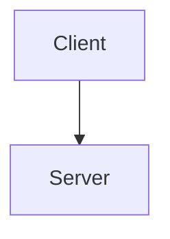

# Documentation Writing Standard For AI Agents

| Field | Value |
|---|---|
| Version | 1.1 |
| Last Updated | 2026-07-09 |
| Language | Tiếng Việt + technical English terms |
| Intended User | AI agent, maintainer, reviewer, student team, engineering team |
| Usage | Copy this file into `docs/` or pass it as a system/context guide to an AI agent. |

> **Purpose:** File này là chuẩn hướng dẫn để giao cho AI agent hoặc thành viên team viết, sửa, audit, và nâng cấp tài liệu dự án.
>
> **Scope:** Áp dụng cho toàn bộ `docs/`, `README.md`, tài liệu API, tài liệu yêu cầu, tài liệu kiến trúc, diagram, testing, security, operations, project management, evidence/audit, và generated documentation.
>
> **Primary Goal:** Tạo bộ docs đạt cả hai chuẩn:
>
> 1. **Chuẩn học thuật / đại học:** formal, traceable, có requirement, use case, diagram, test case, evaluation, limitation, evidence.
> 2. **Chuẩn công nghiệp:** maintainable, source-of-truth rõ, onboarding được, vận hành được, audit được, CI-check được, không bịa, không stale.

> **Writing Spirit:** Rõ, thật, dễ đọc, gần người. Không viết kiểu robot, không khoe chữ, không cứng ngắc vì form.

---

## 0. Non-Negotiable Rules For AI

AI agent phải tuân thủ các quy tắc sau. Không được bỏ qua.

### 0.0 Không được biến docs thành máy móc

Chuẩn này là khung định hướng, không phải cái lồng.

AI phải luôn ưu tiên:

- người đọc hiểu nhanh
- đọc một lần là nắm ý chính
- giọng văn tự nhiên, thân thiện, tôn trọng người đọc
- đúng mức formal cần thiết, không formal quá tay

AI không được:

- nhồi quá nhiều metadata vào file ngắn chỉ để “đúng form”
- biến mọi đoạn văn thành checklist cứng
- viết câu quá dài, nặng mùi báo cáo
- lặp cùng một công thức máy móc ở mọi file

Rule ngắn:

- tài liệu phải tin được
- nhưng vẫn phải đọc được

### 0.1 Không được bịa tài liệu

AI **MUST NOT** viết claim kiểu “hệ thống có X” nếu chưa có bằng chứng từ:

- source code
- route file
- test file
- database schema / migration / schema evidence
- config file
- existing docs đáng tin cậy
- runtime evidence
- issue/decision được cung cấp
- yêu cầu rõ ràng từ người dùng

Nếu chưa chắc, ghi rõ:

```md
Status: Unverified
Evidence: Not found in current repository snapshot
Action Needed: Confirm with maintainer or inspect runtime
```

### 0.2 Phải phân biệt fact, inference, assumption, recommendation

Mọi nội dung quan trọng phải thuộc một trong bốn nhóm:

| Loại | Ý nghĩa | Cách ghi |
|---|---|---|
| Fact | Đã có bằng chứng | `Evidence: start/routes/tasks.ts` |
| Inference | Suy luận từ bằng chứng | `Inference based on route/controller naming` |
| Assumption | Giả định tạm thời | `Assumption: pending maintainer confirmation` |
| Recommendation | Đề xuất cải thiện | `Recommendation: add OpenAPI contract` |

AI không được biến assumption thành fact.

### 0.3 Mỗi document phải có mục đích rõ

Không viết file chỉ vì “có vẻ cần”. Trước khi tạo/sửa document, AI phải trả lời:

```md
Why does this document exist?
Who reads it?
What decision or action does it support?
What is the source of truth?
How will it be verified?
When should it be updated?
```

Không nhất thiết phải in nguyên sáu câu hỏi này vào mọi file nếu làm file bị cứng. Nhưng AI phải tự trả lời được trước khi viết.

### 0.4 Không trộn nhiều loại docs vào một file

Một file chỉ nên có một vai trò chính:

- Tutorial
- How-to guide
- Reference
- Explanation
- Specification
- Decision record
- Evidence/audit
- Runbook
- Generated inventory

Không trộn API reference, business requirement, incident runbook, và audit report vào cùng một file.

### 0.5 Phải viết để người mới đọc được

Tài liệu tốt không phải để tác giả thấy thông minh, mà để người mới:

- hiểu được hệ thống
- chạy được dự án
- sửa được lỗi
- thêm được feature
- kiểm thử được
- deploy/rollback được
- review/audit được

Nếu người mới không biết bắt đầu từ đâu, docs chưa đạt.

### 0.5.1 Phải viết để người ngoài dự án đọc độc lập được

AI phải giả định có lúc toàn bộ `docs/` và diagram sẽ được tách riêng khỏi repository và gửi cho:

- giảng viên
- người viết report đồ án
- reviewer bên ngoài
- stakeholder không có quyền xem source code

Vì vậy, docs không được phụ thuộc vào việc “đọc code là sẽ hiểu”.

### 0.5.2 Phải giúp người đọc biết lúc nào đã đủ

AI nên ưu tiên viết sao cho người đọc biết:

- nên bắt đầu từ đâu
- đọc tới đoạn nào là đủ cho mục tiêu hiện tại
- lúc nào mới cần sang file khác, diagram khác, hay code để verify sâu hơn

Nếu một file buộc reader tiếp tục đọc lan man chỉ vì không biết “đã đủ chưa”, file đó chưa thân thiện đủ.

Rule bắt buộc:

- docs phải đủ context để người không có code vẫn hiểu ý chính
- docs phải giải thích thuật ngữ nội bộ, boundary, actor, flow, và caveat quan trọng
- docs có thể dẫn code như evidence, nhưng không được cần code để hiểu narrative chính
- nếu một đoạn chỉ có ý nghĩa khi mở code bên cạnh, phải viết lại

Mục tiêu:

- `docs/` phải gần như đóng vai trò “bản mô hình hóa có chú thích” của hệ thống
- đủ giàu thông tin để người ngoài dựa vào đó viết report học thuật hoặc báo cáo kỹ thuật
- vẫn trung thực về những gì chưa thể khẳng định

### 0.9 Ưu tiên rõ ràng hơn “đúng mẫu”

Nếu template và khả năng hiểu nhanh xung đột, ưu tiên khả năng hiểu nhanh.

Ví dụ:

- file overview có thể mở đầu bằng mental model ngắn thay vì lao ngay vào định nghĩa hàn lâm
- file runbook có thể ưu tiên “làm gì trước” thay vì phần bối cảnh dài
- file reference có thể liệt kê chặt chẽ, nhưng file explanation phải có nhịp đọc tự nhiên hơn

Chuẩn tốt là chuẩn giúp người đọc hành động đúng, không phải chuẩn làm file nhìn rất nghiêm túc nhưng khó dùng.

### 0.6 Không được tạo diagram nếu không có mục đích

Mỗi diagram phải có:

```md
Purpose:
Audience:
Scope:
Source of truth:
Last verified:
Related docs:
```

Diagram phải trả lời một câu hỏi cụ thể. Không tạo diagram chỉ để “cho đủ”.

Diagram cũng phải tuân thủ ba rule bắt buộc:

- `one level`: một file không được trộn overview level cao với implementation detail level thấp
- `one concern`: một file chỉ nên giải thích đúng một concern hoặc một scenario chính
- `one screen`: người đọc phải nhìn và hiểu ý chính trong một khung hình, không phải kéo/zoom liên tục

Nếu một diagram không còn giữ được ba rule này, phải tách file thay vì nhồi thêm.

### 0.7 Generated docs không được sửa tay

Nếu file được sinh tự động, phải ghi rõ:

```md
Generated: Yes
Generator: scripts/docs/generate-xxx.ts
Do Not Edit Manually: Yes
Source of Truth: tests/**, app/modules/**/tests/**
```

### 0.8 Tài liệu phải có lifecycle

Mỗi file quan trọng phải có:

- owner
- status
- last updated
- review cycle
- source of truth
- related requirements/tests
- stale risk

---

## 1. Documentation Philosophy

Docs chuẩn không phải là “nhiều file”. Docs chuẩn là một **hệ thống tri thức có điều hướng, có bằng chứng, có vòng đời, và có khả năng vận hành**.

Docs tốt cũng không nên nghe như văn bản hành chính kéo dài. Càng là tài liệu để cứu người lúc production lỗi, càng phải dễ quét, dễ tin, dễ làm theo.

Một bộ docs tốt phải đạt năm mục tiêu:

1. **Discoverability:** người đọc biết bắt đầu từ đâu.
2. **Correctness:** thông tin đúng với code/runtime hiện tại.
3. **Traceability:** requirement liên kết được tới design, API, database, test, và evidence.
4. **Maintainability:** khi code đổi, biết docs nào phải đổi.
5. **Operability:** team có thể setup, debug, deploy, monitor, rollback, và xử lý incident.

### 1.1 Clarity over ceremony

Khi viết docs, luôn ưu tiên thứ tự này:

1. hiểu nhanh
2. đúng sự thật
3. đủ chiều sâu để hành động
4. traceable
5. đẹp form

Nếu tài liệu rất đúng form nhưng người đọc vẫn mơ hồ, tài liệu đó thất bại.

### 1.2 Formal đúng chỗ, mềm đúng chỗ

Không phải file nào cũng cần giọng văn giống nhau.

Gợi ý:

- Requirement, audit, evidence, matrix: formal hơn
- Overview, onboarding, explanation, guide: tự nhiên hơn
- Runbook, incident doc: ngắn, dứt khoát, ưu tiên hành động
- User/admin guide: gần người, ít biệt ngữ hơn, giải thích theo vai trò

Mục tiêu là giúp đúng người đọc đúng cách, không ép mọi tài liệu vào cùng một giọng.

---

## 2. Two Standards To Satisfy

### 2.1 Academic / University Standard

Docs phải chứng minh được rằng dự án được phân tích, thiết kế, triển khai, kiểm thử, và đánh giá theo phương pháp kỹ thuật phần mềm.

Các artifact học thuật thường cần:

| Nhóm | Artifact nên có |
|---|---|
| Business analysis | BRD, PRD, scope, stakeholder analysis |
| Requirements engineering | SRS, functional requirements, non-functional requirements, business rules |
| System analysis | use case diagram, use case specifications, activity/state diagrams, DFD |
| Design | architecture document, SDD, class diagram, sequence diagram, ERD, database design |
| Implementation evidence | source map, module map, API catalog |
| Testing | test plan, test case specification, test case matrix, test execution report |
| Project management | project plan, roadmap, risk log, change request register, meeting minutes |
| Evaluation | limitations, future work, lessons learned, quality evaluation |

Academic docs phải có tính formal:

- ID cho requirement: `FR-TASK-001`, `NFR-SEC-001`
- ID cho use case: `UC-TASK-001`
- ID cho business rule: `BR-TASK-001`
- ID cho test case: `TC-TASK-001`
- Requirement Traceability Matrix: `Requirement → Use Case → Design → API/Code → Test → Evidence`

### 2.2 Industry Standard

Docs công nghiệp phải giúp team thật làm việc được, không chỉ để nộp.

Các artifact công nghiệp nên có:

| Nhóm | Artifact nên có |
|---|---|
| Onboarding | documentation portal, setup local, environment guide |
| Architecture | C4 views, ADRs, quality attributes, module boundaries |
| API contract | OpenAPI, endpoint catalog, error code reference, versioning policy |
| Security | threat model, access-control matrix, data classification, privacy, audit logging, OWASP ASVS mapping |
| Operations | deployment, runbook, monitoring, alerting, incident response, backup/restore, rollback, SLO/SLA |
| Quality | test strategy, CI gates, lint/link/Mermaid/OpenAPI validation |
| Governance | ownership, review cadence, change policy, generated docs policy, archive policy |
| Decision memory | ADRs, change request register, risk register |

Industry docs phải answer được:

- Ai sở hữu file này?
- Khi nào nó stale?
- CI có kiểm tra được không?
- Nếu production lỗi thì làm gì?
- Nếu feature đổi thì docs nào phải sửa?
- Contract giữa frontend/backend/QA là file nào?

---

## 3. Documentation Frameworks To Apply

Framework là công cụ hỗ trợ suy nghĩ, không phải khuôn bắt buộc copy nguyên xi.

Nếu bê nguyên framework vào file làm giảm khả năng đọc nhanh, AI phải rút gọn về đúng mức cần thiết.

### 3.1 Diátaxis: classify docs by user need

Mỗi tài liệu nên thuộc một trong bốn loại sau:

| Type | User need | Example |
|---|---|---|
| Tutorial | học bằng cách làm từ đầu | `getting-started.md` |
| How-to guide | hoàn thành một task cụ thể | `deploy-staging.md`, `add-new-route.md` |
| Reference | tra cứu chính xác | `openapi.yaml`, `env-vars.md`, `error-codes.md` |
| Explanation | hiểu lý do, mô hình, concept | `architecture-overview.md`, `domain-model.md` |

Rule:

- Tutorial không nên quá nhiều lý thuyết.
- How-to phải có step-by-step.
- Reference phải chính xác, đầy đủ, ít văn chương.
- Explanation phải giải thích “vì sao”, không phải checklist thao tác.
- Một file có thể nghiêng mạnh về một loại mà không cần cố gắn nhãn lộ liễu trong nội dung nếu làm file mất tự nhiên.

### 3.2 C4 Model: architecture by zoom level

Dùng C4 để vẽ kiến trúc theo cấp độ:

| Level | Purpose | File gợi ý |
|---|---|---|
| Context | hệ thống nằm trong môi trường nào | `c4-context.mmd` |
| Container | app/server/db/cache/external systems | `c4-container.mmd` |
| Component | module/service/component bên trong container | `c4-component-*.mmd` |
| Code | chi tiết class/function khi thật sự cần | hạn chế, dùng cho phần phức tạp |

Rule:

- Không nhảy vào class diagram trước khi có context/container.
- Mỗi diagram phải có text giải thích bên cạnh.
- Diagram phải chỉ rõ boundary và external dependency.
- Diagram level cao phải bao quát nhưng không quá đơn giản.
- Diagram level thấp phải cụ thể hơn, nhưng vẫn không được nhồi quá nhiều thứ vào cùng một file.

### 3.3 arc42-style architecture documentation

Dùng arc42 làm khung cho architecture docs:

1. Introduction and goals
2. Constraints
3. Context and scope
4. Solution strategy
5. Building block view
6. Runtime view
7. Deployment view
8. Cross-cutting concepts
9. Architecture decisions
10. Quality requirements
11. Risks and technical debt
12. Glossary

Không cần copy máy móc, nhưng architecture docs nên có đủ các view quan trọng.

### 3.4 Requirements Engineering

Requirement tốt phải có:

- unique ID
- clear statement
- source
- priority
- rationale
- acceptance criteria
- verification method
- trace links
- status

Format chuẩn:

```md
## FR-TASK-001 — Create Task

| Field | Value |
|---|---|
| Type | Functional Requirement |
| Priority | Must |
| Source | BRD-SCOPE-003 |
| Actor | Organization Member |
| Status | Approved |
| Verification | Integration Test + E2E |
| Related Use Case | UC-TASK-001 |
| Related API | POST /tasks |
| Related Test | TC-TASK-001, TC-TASK-002 |

### Requirement Statement

The system shall allow an authorized organization member to create a task inside a project.

### Acceptance Criteria

- Given the user is authenticated
- And the user belongs to the current organization
- And the project exists in the organization
- When the user submits valid task data
- Then the system creates the task
- And the task is visible in the project task list
- And an audit event is recorded if audit logging exists for this flow

### Evidence

- `start/routes/tasks.ts`
- `app/modules/tasks/...`
- `app/modules/tasks/tests/...`
```

### 3.5 API contract standard

For HTTP APIs, prefer machine-readable contract:

```txt
openapi.yaml
```

Every endpoint should document:

- method
- path
- purpose
- auth requirement
- permission requirement
- request parameters
- request body schema
- response schema
- error cases
- rate limiting / throttling
- examples
- related requirement
- related test
- owner
- status

### 3.6 Security documentation standard

Security docs must include:

- threat model
- trust boundaries
- assets
- attackers/abuse cases
- authentication/session model
- authorization/access-control matrix
- data classification
- privacy and retention
- audit logging
- security test plan
- OWASP ASVS mapping for web apps

---

## 4. Recommended Folder Structure

Use this as target structure. Existing repos may migrate gradually.

```txt
docs/
  README.md

  00-overview/
    product-overview.md
    documentation-map.md
    glossary.md

  01-business/
    brd.md
    prd.md
    scope.md
    stakeholders.md
    business-rules.md

  02-requirements/
    srs.md
    functional-requirements.md
    non-functional-requirements.md
    use-case-specifications.md
    requirements-traceability-matrix.md

  03-architecture/
    architecture-overview.md
    quality-attributes.md
    runtime-view.md
    deployment-view.md
    module-boundaries.md
    adr/
      ADR-0001-example.md

  04-design/
    information-architecture.md
    navigation-structure.md
    screen-inventory.md
    screen-specifications.md
    design-system.md
    wireframes/
    prototypes/

  05-api/
    README.md
    openapi.yaml
    endpoint-catalog.md
    error-codes.md
    versioning-policy.md

  06-data/
    database-design.md
    erd.md
    data-dictionary.md
    migration-policy.md
    retention-policy.md

  07-security/
    security-overview.md
    threat-model.md
    access-control-matrix.md
    data-classification.md
    privacy.md
    audit-logging.md
    owasp-asvs-mapping.md

  08-testing/
    test-strategy.md
    test-plan.md
    test-case-specification.md
    test-case-matrix.md
    test-execution-report.md
    regression-strategy.md
    performance-test-plan.md
    security-test-plan.md
    generated/

  09-operations/
    deployment.md
    environment.md
    runbook.md
    monitoring.md
    alerting.md
    incident-response.md
    backup-restore.md
    rollback.md
    slo-sla.md

  10-project-management/
    project-plan.md
    roadmap.md
    risk-register.md
    change-request-register.md
    meeting-minutes.md

  11-diagrams/
    README.md
    canonical/
    detailed/
    generated/

  12-evidence/
    source-register.md
    coverage-matrix.md
    drift-register.md
    audits/

  templates/
    document-template.md
    requirement-template.md
    use-case-template.md
    test-case-template.md
    adr-template.md
    runbook-template.md
```

Đây là target structure, không phải mệnh lệnh phải đủ mọi file ngay lập tức.

AI không được tạo thêm file chỉ để “đủ bộ” nếu:

- chưa có source of truth đủ mạnh
- nội dung sẽ trùng file khác
- file mới làm navigation rối hơn
- người đọc không thực sự cần file đó để hiểu hoặc hành động

---

## 5. Document Classes

Every file must have a class.

| Class | Meaning | Edit policy |
|---|---|---|
| Canonical | official source for a domain | update when domain changes |
| Reference | lookup material | keep exact and complete |
| Guide | task-oriented instructions | test steps regularly |
| Explanation | conceptual understanding | update when model changes |
| Decision | records decision and rationale | append new ADR, do not rewrite history casually |
| Evidence | audit/output proving current state | timestamp and archive old audits |
| Generated | produced from code/scripts | do not edit manually |
| Archive | historical, no longer active | mark as archived |

Recommended metadata:

```md
---
title: Example Document
doc_type: canonical
status: draft
owner: backend-team
reviewers:
  - qa
  - architect
last_updated: 2026-07-08
review_cycle: monthly
source_of_truth:
  - start/routes/*.ts
  - app/modules/**
related_requirements:
  - FR-EXAMPLE-001
related_tests:
  - tests/example.spec.ts
generated: false
stale_risk: medium
---
```

If frontmatter is not used, use a Markdown table:

```md
| Field | Value |
|---|---|
| Document Type | Canonical |
| Status | Draft |
| Owner | Backend Team |
| Last Updated | 2026-07-08 |
| Review Cycle | Monthly |
| Source of Truth | `start/routes/*.ts`, `app/modules/**` |
| Generated | No |
| Stale Risk | Medium |
```

---

## 6. Writing Process For AI

AI must follow this process for every docs task.

### Step 1 — Understand the request

Classify the task:

| User request | Action |
|---|---|
| “Viết docs cho feature X” | create/update feature spec + requirement/test links |
| “Chuẩn hoá folder docs” | audit structure + propose migration + update portal |
| “Tạo API docs” | inspect routes/controllers + generate endpoint catalog/OpenAPI draft |
| “Vẽ diagram” | identify purpose + choose diagram type + cite source |
| “Bổ sung chuẩn đại học” | add formal SRS/use case/test case/RTM |
| “Bổ sung chuẩn công nghiệp” | add ADR/OpenAPI/runbook/security/ops/governance |

### Step 2 — Locate sources

Before writing, inspect:

```txt
README.md
package.json
start/routes/**
app/modules/**
config/**
database/migrations/**
database/schema/**
tests/**
inertia/**
docs/**
```

For each claim, record evidence.

### Step 3 — Decide the document type

Choose one primary type:

- tutorial
- how-to
- reference
- explanation
- specification
- decision record
- evidence/audit
- runbook

Do not mix unless necessary.

### Step 4 — Choose template

Use the correct template from this file.

### Step 5 — Write with traceability

For every major section, add:

```md
Evidence:
- `path/to/file.ts`
- `path/to/test.spec.ts`

Related:
- Requirement: `FR-...`
- Test: `TC-...`
- Diagram: `docs/11-diagrams/...`
```

### Step 6 — Mark gaps honestly

Use:

```md
## Known Gaps

| Gap | Impact | Recommendation | Priority |
|---|---|---|---|
| OpenAPI contract missing | Frontend/QA cannot rely on machine-readable API contract | Add `docs/api/openapi.yaml` | High |
```

### Step 7 — Validate output

Before final output, check:

- links are valid relative paths
- headings are consistent
- diagram filenames exist or are clearly proposed
- generated files are marked generated
- source-of-truth is clear
- no unsupported claim exists
- document has owner/status/date/audience
- document has next actions if incomplete

---

## 7. Writing Style Rules

### 7.1 Tone

Use professional, direct Vietnamese.

Good:

```md
Tài liệu này mô tả contract hiện tại của Task API dựa trên route files và controller implementation.
```

Bad:

```md
Tài liệu này sẽ giúp bạn hiểu tất cả mọi thứ một cách hoàn hảo.
```

### 7.2 Sentence style

Prefer:

- short sentences
- clear tables
- explicit status
- evidence after claims
- examples when useful

Avoid:

- vague words: “có vẻ”, “rất xịn”, “chuẩn chỉnh” without criteria
- unsupported claims: “production-ready” if no deployment/monitoring/incident docs exist
- motivational filler
- long paragraphs without structure

### 7.3 Headings

Use numbered sections for long canonical docs:

```md
# Software Requirements Specification

## 1. Introduction
## 2. System Context
## 3. Functional Requirements
## 4. Non-Functional Requirements
## 5. External Interface Requirements
## 6. Traceability
## 7. Known Gaps
```

Use action headings for how-to guides:

```md
# How To Deploy Staging

## Prerequisites
## Step 1 — Pull latest code
## Step 2 — Configure runtime configs
## Step 3 — Run migrations
## Step 4 — Smoke test
## Rollback
## Troubleshooting
```

### 7.4 Tables

Use tables for comparison, traceability, status, and mapping.

Do not use tables for long prose.

### 7.5 Code blocks

Use language tags:

```bash
pnpm install
pnpm run test
```

```env
DATABASE_CONNECTION_PLACEHOLDER=
REDIS_URL=
```



---

## 8. Documentation Portal Standard

Root `docs/README.md` is mandatory.

It must answer:

- What is this docs system?
- Who should read what?
- What are canonical documents?
- What is generated?
- What is archived?
- How to update docs?
- What quality gates exist?

Template:

```md
# Documentation Portal

## Read By Role

### New Developer
1. `00-overview/product-overview.md`
2. `development/setup-local.md`
3. `03-architecture/architecture-overview.md`
4. `05-api/endpoint-catalog.md`
5. `08-testing/test-strategy.md`

### QA Engineer
1. `02-requirements/requirements-traceability-matrix.md`
2. `08-testing/test-plan.md`
3. `08-testing/test-case-matrix.md`
4. `08-testing/test-execution-report.md`

### University Reviewer
1. `01-business/brd.md`
2. `02-requirements/srs.md`
3. `02-requirements/use-case-specifications.md`
4. `03-architecture/architecture-overview.md`
5. `06-data/database-design.md`
6. `08-testing/test-case-specification.md`

### Operator / Maintainer
1. `09-operations/deployment.md`
2. `09-operations/runbook.md`
3. `09-operations/incident-response.md`
